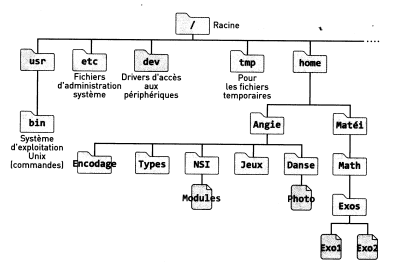

SEQUENCE 2
===========

## ACTIVITE 1 - Interface en ligne de commande d'un sytème d'exploitation libre

### Systèmes d'exploitations

#### Repères historiques

Prendre connaissance des vidéos suivantes:  

* [Histoire des systèmes d'exploitation](https://tube-outremer.beta.education.fr/videos/watch/412ad19b-5bf2-45df-aa13-ed2da7bf312b)
* [Le(s) système(s) de type UNIX](https://tube-outremer.beta.education.fr/videos/watch/4f139750-6c2a-440e-85b2-483f5cf05afa)

#### Systèmes libres ou propriétaires

!!! question "A faire"
    En s'aidant éventuellement de [cette page wikipedia](https://fr.wikipedia.org/wiki/Logiciel_propri%C3%A9taire), rappelez les 4 différences fondamentales entre un logiciel libre et un logiciel propriétaire. Quelles sont les conséquences du statut propriétaire de Microsoft Windows ?

### Le système Linux

[Histoire du système d'exploitation Linux](https://tube-outremer.beta.education.fr/videos/watch/84f7b96e-e4f9-46f5-947a-ae7cc87bb914)

### Système de fichiers de Linux

Pour interagir avec l'utilisateur, les 
systèmes d'exploitation peuvent avoir une 
interface graphique (comme par 
exemple Windows) et très certainement une interface en ligne de commande pour saisir en texte les commandes que le système d'exploitation doit effectuer.  

Avec Linux, comme dans Microsoft Windows, les données sont stockées dans des fichiers, eux-mêmes contenus dans 
des dossiers appelés **répertoires**.  

En revanche, il n'existe pas de notion de « disque `C:\` ou `D:\` ou autre» sous Linux. Un exemple d'organisation des principaux fichiers et 
répertoires appelée **arborescence** est représentée en version simplifiée ci-dessous.

Dans le système de fichiers de Linux, tous les 
répertoires nécessaires au fonctionnement du 
système d'exploitation (`etc`, `dev`, `tmp`, etc.) sont 
accessibles depuis le répertoire racine `/`.  

Les répertoires des utilisateurs d'une machine Linux, sont situés dans le répertoire `home`. Dans notre exemple il s'agit des répertoires `Angie` et `Matei`. Attention, le système d'exploitation Linux est **sensible à la casse**, il faut donc, être vigilant aux éventuelles majuscules.  

Pour naviguer dans le système de fichiers, nous 
devons définir les **chemins absolus** et **relatifs**.  

Un chemin d'accès absolu part toujours du répertoire racine `/` suivi des noms de répertoires rencontrés jusqu'à la destination, séparés par des symboles `/` (slash).  
**Exemple**  

Le chemin absolu vers le répertoire `Exos` de `Matéi` est `/home/Matei/Math/Exos`.  

!!! question "A faire"
    Écrire le chemin absolu vers le répertoire `NSI` d'`Angie`.

Lorsque l'on se déplace dans l'*arborescence de fichiers*, le répertoire dans lequel on se situe s'appelle le **répertoire courant** et est noté `.` (point).  

Un chemin relatif fait référence au répertoire courant et donne la liste des noms du ou des répertoire(s) rencontrés jusqu'à la destination, séparés par des `/`.   
**Exemple**  

Le chemin relatif vers le répertoire `Exos` de `Matei` depuis le répertoire courant `home` est  `./Matei/Math/Exos`.  

!!! question "A faire"
    Écrire le chemin relatif vers le répertoire `NSI` d'`Angie` à partir du répertoire courant `home`.

Pour remonter d'un niveau dans l'arborescence de fichiers, il faut utiliser le **répertoire parent** `..` .  
**Exemple**  

Le chemin relatif depuis le répertoire courant d'Angie (`/home/Angie`) vers le répertoire `Math` de `Matei` est `../Matei/Math`.

!!! question "A faire"
    Écrire le chemin relatif vers le répertoire `Jeux` d'`Angie` à partir du répertoire courant `NSI`

### Structure d'une commande sous Linux

Pour découvrir comment interagir avec le système d'exploitation en ligne de commandes, nous allons utiliser un *système Linux simplifié spécialement adapté pour cette activité*.

!!! question "A faire"
    Lancer un **terminal** sous Ubuntu. A l'intérieur de ce terminal, on saisira la commande:  
    `docker run -it --rm nsilinux:1.1`. Un système Linux démarre dans le terminal et la connexion est automatiquement faite sur le compte d'Angie. Pour quitter, on utilisera la séquence de touches ++ctrl+d++ .
    
!!! hint "Commande"
    La commande `ls` (de l'anglais *list*) permet d'afficher la liste des répertoires et des fichiers dans le répertoire courant.  

!!! question "A faire"
    Saisir la commande `ls`. Commenter.
    
!!! hint "Commande"
    La commande `pwd` (de l'anglais *print working directory*) affiche le répertoire courant. La commande `cd` (de l'anglais *change directory*) permet de changer de répertoire courant.

!!! question "A faire"
    Tester La commande `pwd`, puis écrire et tester les commandes appropriées afin de
    vérifier vos réponses aux questions de la section *Système de fichiers de Linux* précédente.

---

## ACTIVITE 2 - Commandes de base avec arguments

Angie veut mettre de l'ordre dans son repertoire personnel. Son système de fichiers est le même que celui de l'activité précédente.

!!! hint "Commande"
    La commande `cat` suivie d'un `nom_de_fichier` (de l'anglais *catenate*) affiche dans la console le contenu du fichier `nom_de_fichier` donné en argument.

!!! question "A faire"
    Se connecter au système linux précédent (`docker run --rm -it nsilinux:1.1`). A l'aide de la commande `cd`, aller dans le répertoire `NSI` puis afficher le contenu du fichier `Modules`. Écrire les commandes saisies dans la console.

### Créer des répertoires

!!! hint "Commande"
    La commande `mkdir` suivie d'un `nom_de_repertoire` (de l'anglais *make directory*) permet de créer un répertoire nommé `nom_de_repertoire` dans le répertoire courant.

!!! question "A faire"
    Créer le répertoire `OS` dans le répertoire `NSI` à l'aide de la commande `mkdir` et vérifier sa création 
    avec la commande `ls`. Écrire les commandes nécessaires.

On peut également créer un répertoire dans un autre répertoire en précisant le chemin relatif:  

`mkdir chemin_relatif/nom_de_repertoire`.  

!!! question "A faire"
    En restant dans le répertoire `NSI`, créer le répertoire `Linux` dans le répertoire `Angie`. Écrire les commandes nécessaires. 

### Déplacer et copier des fichiers / répertoires

!!! hint "Commande"
    La commande `mv source destination` (de l'anglais *move*) permet de déplacer et/ou de renommer des fichiers et des répertoires. Les arguments `source` et `destination` sont constitués du nom du fichier ou du répertoire, précédés éventuellement du chemin.
    
!!! question "A faire"
    * A l'aide de la commande `cd` aller dans le répertoire `Angie`. Déplacer le répertoire `Types` d'Angie dans le répertoire `NSI` à l'aide de la commande `mv`. Écrire les commandes nécessaires.
    * Quel est le résultat de la commande `mv Encodage NSI/Encodage` ?

!!! hint "Commande"
    La commande `cp source destination` (de l'anglais *copy*) permet de copier des fichiers ou des répertoires `source` vers la `destination`.

!!! question "A faire"
    Sans changer de répertoire courant (`Angie`), créer un répertoire `Programmation` dans le répertoire `NSI`, puis copier le fichier `Modules` dans le répertoire `Programmation`. Écrire les commandes nécessaires.

### Supprimer des fichiers et des répertoires 

!!! hint "Commande"
    La commande `rm chemin/nom_de_fichier` (de l'anglais *remove*) permet de supprimer un ou des fichiers.

!!! question "A faire"
    * Supprimer le fichier `Modules` du répertoire `NSI`. Écrire La commande nécessaire.
    * Tester la commande `rm Danse`. Que remarquez-vous ?Justifier.    

!!! hint "Commande"
    Pour avoir accès à la documentation d'une commande, suffit de saisir `man nom_de_la_commande`.

!!! question "A faire"
    Tester la commande `rm -r Danse`. Après avoir consulter la documentation de `rm` conclure sur l'utilité de l'option `-r`.
