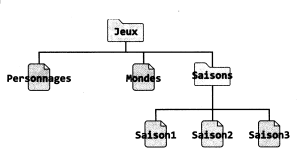

Séquence 2
==========

## ACTIVITE 3 - Etude des droits et permissions

Angie s'intéresse aux droits et aux permissions d'accès à des fichiers contenant des informations sur son jeu vidéo préféré, enregistrées sur l'ordinateur familial, qui a pour système d'exploitation Linux.  

<figure>

<figcaption> Arborescence</figcaption>
</figure>
!!! question "Utiliser le shell"
    Démarrer le système Linux simplifié avec la commande `docker run -it --rm nsilinux:1.6`

Quand on saisit un nom de fichier ou de répertoire, la touche ++tab++ permet de compléter automatiquement son nom.

!!! question "Utiliser les commandes de base du shell Bash"
    À l'aide de la commande `cd`, aller dans le répertoire `Jeux` d'Angie.

Les options `-al` de la commande `ls` permettent d'afficher plus d'informations, comme les droits et les permissions d'accès de **tous**  les fichiers et les répertoires (cachés ou non) contenus dans le répertoire courant.  
Le premier caractère permet de différencier les répertoires des fichiers. Ainsi, le caractère `d` (de l'anglais *directory*) désigne un répertoire et le caractère `-` désigne un fichier ordinaire.

!!! question "Utiliser les commandes de base du shell Bash - Mobiliser des concepts"
    Saisir la commande `ls -al`, puis identifier les répertoires et les fichiers du répertoire d'Angie.

Les caractères ci-dessous correspondent aux droits d'accès et aux permissions.  

<figure>

<figcaption> Droits </figcaption>
</figure>

!!! question "Utiliser les commandes de base du shell Bash"
    Quels sont les dix premiers caractères affichés pour le fichier `Mondes` et pour le répertoire `Saisons`.
    
La présence des lettres `r`, `w` et `x` donne le droit correspondant et `-` l'interdiction.  

| Lettre 	| De l'anglais 	| Pour un fichier          	| Pour un répertoire                              	|
|--------	|--------------	|--------------------------	|-------------------------------------------------	|
| r      	| read         	| lire                     	| afficher la liste des fichiers et répertoires   	|
| w      	| write        	| modifier le contenu      	| créer, supprimer et changer le nom des fichiers 	|
| x      	| execute      	| exécuter (si exécutable) 	| Ouvrir le répertoire                            	|

L'ordinateur familial est configuré pour qu'Angie et son frère Matei soient dans le même groupe d'utilisateurs, appelé `enfants`.  
Leurs parents ont leur propre groupe, différent, appelé `parents`. Sur un fichier ou un répertoire d'Angie, les parents sont considérés comme « autres utilisateurs ».  
Enfin, Angie est également « propriétaire » de ses propres fichiers et répertoires.

!!! question "Mobiliser des concepts"
    Compléter le tableau ci-dessous avec **oui** ou **non** pour les trois utilisateurs: Angie, Matei et Père.

|         	| Lecture 	| Ecriture 	| Exécution 	|
|---------	|---------	|----------	|-----------	|
| Mondes  	|         	|          	|           	|
| Saisons 	|         	|          	|           	|

!!! question "Mobiliser des concepts"
    Quelles actions le père d'Angie peut-il effectuer sur le répertoire `Saisons` ?

