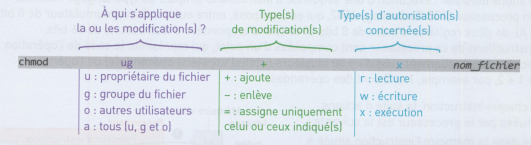

Séquence 2
==========

## ACTIVITE 4 - Modifications des droits

Angie veut donner plus de droits à son petit frère Matéi afin qu'il puisse avoir un accès complet à certains fichiers 
contenant des informations sur son jeu vidéo préféré et les modifier lui-même.  
(*Le système linux simplifié doit être démarré pour cette activité*: `docker run -it --rm nsilinux:1.6`)

!!! hint "Commande"
    La commande `chmod droits nom_fichier_repertoire` (de l'anglais *change mode*) permet de modifier les permissions d'accès à un fichier ou à un répertoire nommé `nom_fichier_repertoire`. La syntaxe de `droits` est détaillée ci-dessous.

**Exemple**  

la commande `chmod ug+x nom_fichier` ajoute le droit d'exécution du fichier `nom_fichier` **au propriétaire** et aux **utilisateurs faisant partie du groupe** du fichier.  

!!! question "Utiliser des commandes du shell Bash"
    * À l'aide de la commande `ls -l`, trouver les droits du fichier `Personnages` puis modifier ses droits afin qu'il soit modifiable par le frère d'Angie, qui est dans le même groupe que le propriétaire. Vérifier enfin que les droits ont bien été changés.
    * Tester la commande `chmod u=rw,go=r Mondes`. Faire une hypothèse sur l'utilité de la virgule.

Au lieu de modifier les fichiers un par un, Angie a découvert, en utilisant la commande `man chmod`, que 
l'option `-R` (de l'anglais *recursive*) modifie les autorisations de tout le contenu d'un répertoire.  

!!! question "Utiliser des commandes du shell Bash"
    Tester, puis écrire la commande qui permet d'ajouter au répertoire `Saisons` et à tout ce qu'il contient les droits en lecture et en écriture au groupe du fichier. Supprimer les droits en lecture aux utilisateurs qui ne font pas partie du groupe.

