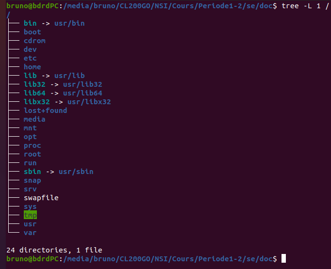
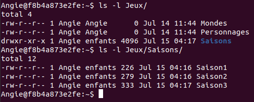

Séquence 2
==========

## COURS - SYSTEME D'EXPLOITATION

### Quel est le rôle d'un système d'exploitation?

Le système d'exploitation permet:  

* l'exécution des applications;
* le partage des ressources entre les utilisateurs, les programmes;
* la gestion:  

    * des périphériques;
    * des fichiers;
    * des erreurs;
    * des performances.

### Les différents types de système d'exploitation

On distingue deux grandes familles de système d'exploitation:  

* les dérivés d'UNIX (GNU/Linux, BSD, iOS, MacOS, Android, etc.);
* les systèmes Microsoft Windows.  

Certains sont **libres** (c-à-d ne nécessitant pas le paiement d'une licence d'utilisation, code source disponible, entre autres), d'autres non (on les qualifie de **systèmes propriétaires**).  
Conformément au programme, on utilisera un système d'exploitation libre en NSI: GNU/Linux.  

L'interaction avec le système d'exploitation peut se faire de deux manières:  

* par le biais d'une interface graphique (GUI: Graphical User Interface);
* par le biais d'une interface en ligne de commande (CLI: Command Line Interface).  

On privilégiera ici l'utilisation de la **ligne de commande**.

### Découvrir la ligne de commande

#### Un interpréteur de commande : Bash ou shell Bash

On a accès à la **ligne de commande** en ouvrant un **terminal** avec le raccourci clavier ++ctrl+alt+t++ . 
Il s'agit d'un programme appelé *Bash* qui est présent par défaut sur la majorité des sytèmes UNIX.

#### Les commandes de base

Une fois le terminal démarré, chaque utilisateur se trouve par défaut dans son dossier personnel (en anglais *home directory* ou plus simplement *HOME*) et le *shell Bash* est en attente de commande en affichant une série d'informations: `nom_utilisateur@nom_machine:~$`  


Le caractère `~` (prononcez tilde, touche ++altgr+2++) correspond au **chemin du répertoire personnel de l'utilisateur**. Le caractère `$` signifie que l'on a affaire à un utilisateur *normal* c-à-d avec des **droits** limités.  

Toutes les commandes acceptent de nombreuses options. Pour avoir un inventaire complet des options on doit taper: `man xxx` où xxx est la commande.  

Quelques commandes à connaître (liste non exhaustive)

| Commande 	| Description                          	|
|----------	|--------------------------------------	|
| ls       	| lister le contenu du dossier courant 	|
| mkdir    	| créer un dossier                     	|
| cd       	| se déplacer dans un dossier          	|
| cp       	| copier des fichiers ou dossiers      	|
| rm       	| supprimer des fichiers ou dossiers   	|
| cat      	| afficher le contenu d'un fichier     	|
| touch    	| crée un fichier vide                 	|
| clear    	| efface l'écran                       	|  


#### Aborescence d'un système Linux

Les dossiers du systèmes sont organisés selon une **arborescence** dont la racine est `/`.  

  

Un utilisateur normal n'a pas les droits suffisants pour écrire dans les dossiers systèmes ou y effacer des fichiers. Seul le **superutilisateur** nommé **root** peut tout faire (et même détruire le système) et n'importe où !  

Les changements de dossier se font naturellement avec la commande `cd` qui peut prendre comme paramètre:  

* un **chemin absolu**, c-à-d **complètement** qualifié depuis racine `/` (par exemple `/home/bruno/Documents`);
* un **chemin relatif**, c-à-d par rapport au dossier où on se trouve qui est noté avec le raccourci `.` (point); le dossier parent est noté avec le raccourci `..` (point point). Ainsi, si on est dans `/home/bruno/Documents` et qu'on veut se rendre dans `/home/bruno/Téléchargements` on tapera: 

```bash
cd ../Téléchargements
```

### Gestion des droits

Qui peut faire quoi et où ? Pour répondre à cette question, les environnements UNIX divisent le monde en trois parties:  

* le propriétaire ou utilisateur (**u**ser);
* le groupe (**g**roup);
* les autres (**o**thers).  

Par ailleurs, les **fichiers** peuvent être manipulés en:  

* lecture (**r**ead);
* écriture (**w**rite);
* exécution (e**x**ecute).  

Considérons la sortie de la commande `ls -l` sur un répertoire donné.  

  

Les colonnes n° 1, 3 et 4 sont utiles à la gestion des droits.  

   * La colonne 3 indique le nom du propriétaire;
   * la colonne 4 indique le nom du groupe;
   * la colonne 1 qui contient 10 caractères doit être décomposé en quatre parties. Par exemple `-rwx r-- r--`  (**attention il n'y a pas d'espaces en réalité, ils ont été rajoutés ici pour une meilleure lisibilité**) !  

Les indications de la 1re colonne peuvent être interprétées de la manière suivante:

* le 1er caractère: un `-` correspond à un fichier et un `d` à un répertoire;
* un groupe de 3 caractères associés aux **droits du propriétaire**;
* un groupe de 3 caractères associés aux **droits du groupe**;
* un groupe de 3 caractères associés aux **droits des autres**;  

Dans l'exemple de la capture ci-dessus, `Saison1` est un *fichier ordinaire* dont le propriétaire est `Angie` qui dispose des droits en lecture et écriture alors que le groupe `enfants` et les `autres` n'ont que le droit en lecture.  

Un `x` signifie **droit de traverser** pour un répertoire. 

Enfin, seuls le propriétaire ou bien `root` peuvent changer les droits sur un fichier ou répertoire. La commande `chmod` est prévue à cet effet. Voir des exemples de syntaxe dans le tableau ci-dessous.  

| Accorder les droits de:  	| Syntaxe             	|
|--------------------------	|---------------------	|
| lecture au groupe        	| chmod g+r fichier   	|
| écriture au propriétaire 	| chmod u+w fichier   	|
| exécution aux autres     	| chmod o+x fichier   	|
| exécution à tous         	| chmod ugo+r fichier 	|

!!! info "Remarque"
    Pour supprimer un droit, on utilise le signe `-`; par exemple, pour supprimer le droit d'écriture au groupe sur un fichier, on utilisera la commande `chmod g-w fichier`

