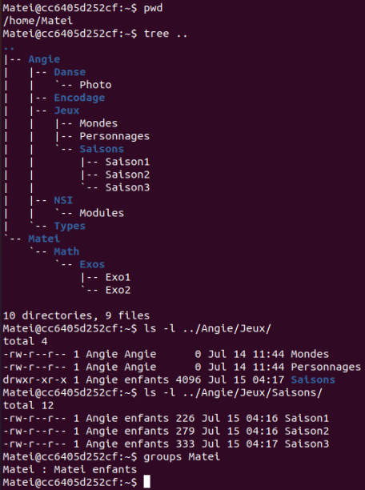

Séquence 2
==========

## EXERCICES

### Révision: Cocher la ou les bonnes réponses

* La commande `ls -al` :

   * [ ] permet de lister les fichiers du répertoire courant sans détail.
   * [ ] permet de lister les fichiers standards et cachés du répertoire courant.
   * [ ] permet d’afficher des détails sur un fichier comme son propriétaire ou ses droits.
   * [ ] n’existe pas en Bash.

* La commande `mv` :

   * [ ] sert à copier des fichiers ou répertoires.
   * [ ] sert à déplacer des fichiers ou répertoires.
   * [ ] peut servir à renommer un fichier ou un répertoire.
   * [ ] n’existe pas en Bash.

* La commande `ls -l toto.sh` affiche `-r-xr--r-- 1 john staff 128 18 mai 11:56 toto.sh`.  

   * [ ] toto.sh appartient à john.
   * [ ] toto.sh appartient à staff du groupe john.
   * [ ] Personne n’a le droit d’écriture sur toto.sh.
   * [ ] Personne n’a le droit de lire toto.sh.

* Dans un terminal, on tape `cd` (sans arguments) pour se placer dans son répertoire personnel, noté parfois `HOME`. Quelle commande doit-on ensuite taper pour déplacer dans le répertoire courant le fichier `exo1.py` qui se trouve dans `Documents/python/` en sachant que `Documents` est dans `HOME`?

   * [ ] `cp Documents/python/exo1.py`
   * [ ] `mv /Documents/python/exo1.py`
   * [ ] `mv ./Documents/python/exo1.py .`
   * [ ] `rm Documents/python/exo1.py`

!!! warning "Indication pour les exercices" 
    👉 On utilisera la machine Linux simplifiée. On se connectera avec le compte de `Matei` en saisissant la commande `su Matei` (son mot de passe est `eleve`). Puis on se déplace dans son répertoire personnel avec `cd ~`.

### Exercice 1 - Trouver son chemin

Observer l’arborescence suivante :  

1. Proposer une commande qui permette de se déplacer du répertoire `HOME` de Alice à celui de Bob :

    * en utilisant un chemin relatif ;
    * en utilisant un chemin absolu.

2. Alice est à la racine `/` . Proposer deux commandes qui peuvent lui permettre de se déplacer dans son répertoire personnel (`HOME`).

3. Bob est dans son `HOME`. Aidez-le à :

    * lister le contenu de son `HOME`;
    * lister le contenu de son `HOME` y compris les fichiers et répertoires cachés ;
    * lister le contenu du répertoire `share` sans quitter son `HOME`.

### Exercice 2 - Créer une arborescence et se déplacer dedans

1. Créer dans le répertoire personnel de `Matei` l’arborescence ci-dessus dans laquelle A, B, C, D, E, F et G sont des répertoires.

2. La commande du shell `touch nom_fichier` permet de créer un fichier vide. Créer deux fichiers vides appelés `un` et `deux` dans le répertoire d’accueil.

3. Quelle commande permet de copier des fichiers ou répertoires ? Copier le fichier `un` dans le répertoire `A` en lui donnant le nom `trois`.

4. Comment réaliser la copie précédente en utilisant un chemin relatif si vous êtes :

    * dans le répertoire A ?
    * dans le répertoire B ?
    
5. Si votre nom d’utilisateur est `Angie`, comment réaliser cette copie en utilisant un chemin absolu ?

6. Comment renommer le fichier `trois` en `quatre`?

### Exercice 3 - Utiliser les pages du manuel d'une commande

1. Quelle option de la commande `echo` faut-il utiliser pour *rester sur la même ligne* ?
2. Comment faut-il faire pour afficher un message sur plusieurs lignes avec cette même commande ?
3. La commande `cat nom_fichier` permet d'afficher son contenu dans le terminale. Comment peut-on afficher le contenu avec les numéros de lignes? Tester.

### Exercice 4 - Avez-vous les droits ? 

On considère le système étudié dans les activités préparatoires. L'utilisateur `Matei` est connecté et a obtenu les informations suivantes:  

**Commandes utilisées**: `tree repertoire` affiche l'arborescence des fichiers depuis `repertoire` et `groups utilisateur` permet de connaitre les groupes auxquels appartient `utilisateur`.

  
1. Matei souhaite ajouter un fichier `Saison4` dans le dossier `Saisons` d'Angie. Peut-il le faire directement ? Justifier la réponse.
2. Proposer une stratégie pour résoudre le problème.

