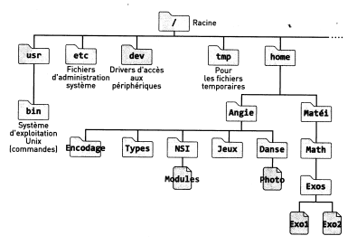
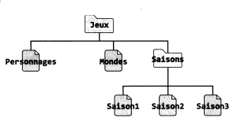
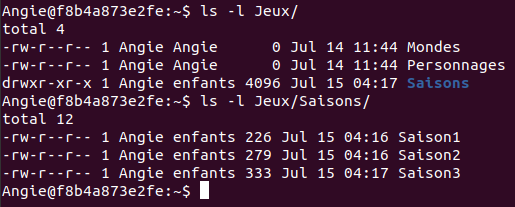
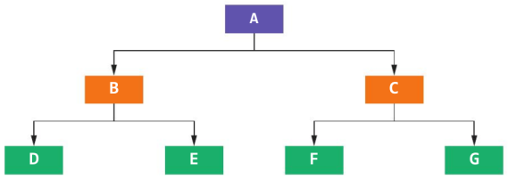

SEQUENCE 2
===========

## ACTIVITE 1 - Interface en ligne de commande d'un sytème d'exploitation libre

### Systèmes d'exploitations

#### Repères historiques

Prendre connaissance des vidéos suivantes:  

* [Histoire des systèmes d'exploitation](https://tube-outremer.beta.education.fr/videos/watch/412ad19b-5bf2-45df-aa13-ed2da7bf312b)
* [Le(s) système(s) de type UNIX](https://tube-outremer.beta.education.fr/videos/watch/4f139750-6c2a-440e-85b2-483f5cf05afa)

!!! question "A faire"
    Résumer en une phrase courte le rôle d'un système d'exploitation. Vers quelle période sont nés les systèmes d'exploitation ?

#### Systèmes libres ou propriétaires

!!! question "A faire"
    A l'aide de [cette page wikipedia](https://fr.wikipedia.org/wiki/Logiciel_propri%C3%A9taire), rappelez les 4 différences fondamentales entre un logiciel libre et un logiciel propriétaire. Quelles sont les conséquences du statut propriétaire de Microsoft Windows ?

### Le système Linux

[Histoire du système d'exploitation Linux](https://tube-outremer.beta.education.fr/videos/watch/84f7b96e-e4f9-46f5-947a-ae7cc87bb914)

!!! question "A faire"
    Qui a créé Linux ?

### Système de fichiers de Linux

Avec Linux, comme dans Microsoft Windows, les données sont stockées dans des fichiers, eux-mêmes contenus dans 
des dossiers appelés **répertoires**.  

En revanche, il n'existe pas de notion de « disque `C:\` ou `D:\` ou autre» sous Linux. Un exemple d'organisation des principaux fichiers et 
répertoires appelée **arborescence** est représentée en version simplifiée ci-dessous.



Dans le système de fichiers de Linux, tous les 
répertoires nécessaires au fonctionnement du 
système d'exploitation (`usr`, `bin`, `etc`, `dev`, `tmp`, ...) sont 
accessibles depuis le répertoire racine `/`.  

Les répertoires des utilisateurs d'une machine Linux, sont situés dans le répertoire `home`. Dans l'exemple ci-dessus il s'agit des répertoires `Angie` et `Matei`. Attention, le système d'exploitation Linux est **sensible à la casse**, il faut donc être vigilant et distinguer les majuscules des minuscules.  

Pour naviguer dans le système de fichiers, nous 
devons définir les **chemins absolus** et **relatifs**.  

Un chemin d'accès absolu part toujours du répertoire racine `/` suivi des noms de répertoires rencontrés jusqu'à la destination, séparés par des symboles `/` (slash).  
**Exemple**  

Le chemin absolu vers le répertoire `Exos` de `Matéi` est `/home/Matei/Math/Exos`.  

!!! question "A faire"
    Écrire le chemin absolu vers le répertoire `NSI` d'`Angie`.

Lorsque l'on se déplace dans l'*arborescence de fichiers*, le répertoire dans lequel on se situe s'appelle le **répertoire courant** et est noté `.` (point).  

Un chemin relatif fait référence au répertoire courant et donne la liste des noms du ou des répertoire(s) rencontrés jusqu'à la destination, séparés par des `/`.   
**Exemple**  

Le chemin relatif vers le répertoire `Exos` de `Matei` depuis le répertoire courant `home` est  `./Matei/Math/Exos`.  

!!! question "A faire"
    Écrire le chemin relatif vers le répertoire `NSI` d'`Angie` à partir du répertoire courant `home`.

Pour remonter d'un niveau dans l'arborescence de fichiers, il faut utiliser le **répertoire parent** `..` .  
**Exemple**  

Le chemin relatif depuis le répertoire courant d'Angie (`/home/Angie`) vers le répertoire `Math` de `Matei` est `../Matei/Math`.

!!! question "A faire"
    Écrire le chemin relatif vers le répertoire `Jeux` d'`Angie` à partir du répertoire courant `NSI`

Le chemin vers le répertoire personnel d'un utilisateur est un cas particulier. Il possède un raccourci `~`, que l'on prononce *tilde*. Ainsi, si Angie souhaite rejoindre son répertoire personnel, il lui suffira de taper `cd ~`.

### Structure d'une commande sous Linux

Pour interagir avec l'utilisateur, les systèmes d'exploitation (SE) peuvent avoir une interface graphique, où les manipulations se font essentiellement à la souris dans des fenêtres. Il existe une autre possibilité d'interaction: l'**interface en ligne de commande**. Il s'agit d'un programme qui permet de saisir les commandes que le système d'exploitation doit effectuer, **en mode texte**.  

Pour découvrir comment interagir avec le système d'exploitation en ligne de commandes, nous allons utiliser un *système Linux simplifié spécialement adapté pour cette activité*.

!!! question "A faire"
    Lancer un **terminal** sous Ubuntu avec la séquence de touche ++ctrl+alt+t++. A l'intérieur de ce terminal, on saisira la commande:  
    `docker run -it --rm nsilinux:1.6`. Un système Linux démarre. La connexion est automatiquement faite sur le compte d'Angie et un programme interpréteur de commande (ici le *shell Bash*) est en attente. Pour quitter, on utilisera la séquence de touches ++ctrl+d++ .
    
!!! hint "Commande"
    La commande `ls` (de l'anglais *list*) permet d'afficher la liste des répertoires et des fichiers dans le répertoire courant.  

!!! question "A faire"
    Saisir la commande `ls`. Commenter.
    
!!! hint "Commande"
    La commande `pwd` (de l'anglais *print working directory*) affiche le répertoire courant. La commande `cd` (de l'anglais *change directory*) permet de changer de répertoire courant.

!!! question "A faire"
    Tester La commande `pwd`, puis écrire et tester les commandes appropriées afin de
    vérifier vos réponses aux questions de la section *Système de fichiers de Linux* précédente.

---

## ACTIVITE 2 - Commandes de base avec arguments

Angie veut mettre de l'ordre dans son repertoire personnel. Son système de fichiers est le même que celui de l'activité précédente.

!!! hint "Commande"
    La commande `cat` suivie d'un `nom_de_fichier` (de l'anglais *catenate*) affiche dans la console le contenu du fichier `nom_de_fichier` passé en argument.

!!! question "A faire"
    Se connecter au système linux précédent (`docker run --rm -it nsilinux:1.6`). A l'aide de la commande `cd`, aller dans le répertoire `NSI` puis afficher le contenu du fichier `Modules`. Écrire les commandes saisies dans la console.

### Créer des répertoires

!!! hint "Commande"
    La commande `mkdir` suivie d'un `nom_de_repertoire` (de l'anglais *make directory*) permet de créer un répertoire nommé `nom_de_repertoire` dans le répertoire courant.

!!! question "A faire"
    Créer le répertoire `OS` dans le répertoire `NSI` à l'aide de la commande `mkdir` et vérifier sa création 
    avec la commande `ls`. Écrire les commandes nécessaires.

On peut également créer un répertoire dans un autre répertoire en précisant le chemin relatif:  

`mkdir chemin_relatif/nom_de_repertoire`.  

!!! question "A faire"
    En restant dans le répertoire `NSI`, créer le répertoire `Linux` dans le répertoire `Angie`. Écrire les commandes nécessaires. 

### Déplacer et copier des fichiers / répertoires

!!! hint "Commande"
    La commande `mv source destination` (de l'anglais *move*) permet de déplacer et/ou de renommer des fichiers et des répertoires. Les arguments `source` et `destination` sont constitués du nom du fichier ou du répertoire, précédés éventuellement du chemin.
    
!!! question "A faire"
    * A l'aide de la commande `cd` aller dans le répertoire `Angie`. Déplacer le répertoire `Types` d'Angie dans le répertoire `NSI` à l'aide de la commande `mv`. Écrire les commandes nécessaires.
    * Quel est le résultat de la commande `mv Encodage NSI/Encodage` ?

!!! hint "Commande"
    La commande `cp source destination` (de l'anglais *copy*) permet de copier des fichiers ou des répertoires `source` vers la `destination`.

!!! question "A faire"
    Sans changer de répertoire courant (`Angie`), créer un répertoire `Programmation` dans le répertoire `NSI`, puis copier le fichier `Modules` dans le répertoire `Programmation`. Écrire les commandes nécessaires.

### Supprimer des fichiers et des répertoires 

!!! hint "Commande"
    La commande `rm chemin/nom_de_fichier` (de l'anglais *remove*) permet de supprimer **définitivement** un ou des fichiers.

!!! question "A faire"
    * Supprimer le fichier `Modules` du répertoire `NSI`. Écrire La commande nécessaire.
    * Tester la commande `rm Danse`. Que remarquez-vous ?Justifier.    

!!! hint "Commande"
    Pour avoir accès à la documentation d'une commande, suffit de saisir `man nom_de_la_commande`.

!!! question "A faire"
    Tester la commande `rm -r Danse`. Après avoir consulter la documentation de `rm` conclure sur l'utilité de l'option `-r`.

---

## ACTIVITE 3 - Etude des droits et permissions

Angie s'intéresse aux droits et aux permissions d'accès à des fichiers contenant des informations sur son jeu vidéo préféré, enregistrées sur l'ordinateur familial, qui a pour système d'exploitation Linux.  



!!! question "A faire"
    Démarrer le système Linux simplifié avec la commande `docker run -it --rm nsilinux:1.6`

Quand on saisit un nom de fichier ou de répertoire, la touche ++tab++ permet de compléter automatiquement son nom.

!!! question "A faire"
    À l'aide de la commande `cd`, aller dans le répertoire `Jeux` d'Angie.

Les options `-al` de la commande `ls` permettent d'afficher plus d'informations, comme les droits et les permissions d'accès de **tous**  les fichiers et les répertoires (cachés ou non) contenus dans le répertoire courant.  
Le premier caractère permet de différencier les répertoires des fichiers. Ainsi, le caractère `d` (de l'anglais *directory*) désigne un répertoire et le caractère `-` désigne un fichier ordinaire.

!!! question "A faire"
    Saisir la commande `ls -al`, puis identifier les répertoires et les fichiers du répertoire d'Angie.

Les caractères ci-dessous correspondent aux droits d'accès et aux permissions.  


!!! question "A faire"
    Quels sont les dix premiers caractères affichés pour le fichier `Mondes` et pour le répertoire `Saisons`.
    
La présence des lettres `r`, `w` et `x` donne le droit correspondant et `-` l'interdiction.  

| Lettre 	| De l'anglais 	| Pour un fichier          	| Pour un répertoire                              	|
|--------	|--------------	|--------------------------	|-------------------------------------------------	|
| r      	| read         	| lire                     	| afficher la liste des fichiers et répertoires   	|
| w      	| write        	| modifier le contenu      	| créer, supprimer et changer le nom des fichiers 	|
| x      	| execute      	| exécuter (si exécutable) 	| Ouvrir le répertoire                            	|

L'ordinateur familial est configuré pour qu'Angie et son frère Matei soient dans le même groupe d'utilisateurs, appelé `enfants`.  
Leurs parents ont leur propre groupe, différent, appelé `parents`. Sur un fichier ou un répertoire d'Angie, les parents sont considérés comme « autres utilisateurs ».  
Enfin, Angie est également « propriétaire » de ses propres fichiers et répertoires.

!!! question "A faire"
    Compléter le tableau ci-dessous avec **oui** ou **non** pour les trois utilisateurs: Angie, Matei et Père.

|         	| Lecture 	| Ecriture 	| Exécution 	|
|---------	|---------	|----------	|-----------	|
| Mondes  	|         	|          	|           	|
| Saisons 	|         	|          	|           	|

!!! question "A faire"
    Quelles actions le père d'Angie peut-il effectuer sur le répertoire `Saisons` ?

---

## ACTIVITE 4 - Modifications des droits

Angie veut donner plus de droits à son petit frère Matéi afin qu'il puisse avoir un accès complet à certains fichiers 
contenant des informations sur son jeu vidéo préféré et les modifier lui-même.  
(*Le système linux simplifié doit être démarré pour cette activité*: `docker run -it --rm nsilinux:1.6`)

!!! hint "Commande"
    La commande `chmod droits nom_fichier_repertoire` (de l'anglais *change mode*) permet de modifier les permissions d'accès à un fichier ou à un répertoire nommé `nom_fichier_repertoire`. La syntaxe de `droits` est détaillée ci-dessous.

**Exemple**  

la commande `chmod ug+x nom_fichier` ajoute le droit d'exécution du fichier `nom_fichier` **au propriétaire** et aux **utilisateurs faisant partie du groupe** du fichier.  


!!! question "A faire"
    * À l'aide de la commande `ls -l`, trouver les droits du fichier `Personnages` puis modifier ses droits afin qu'il soit modifiable par le frère d'Angie, qui est dans le même groupe que le propriétaire. Vérifier enfin que les droits ont bien été changés.
    * Tester la commande `chmod u=rw,go=r Mondes`. Faire une hypothèse sur l'utilité de la virgule.

Au lieu de modifier les fichiers un par un, Angie a découvert, en utilisant la commande `man chmod`, que 
l'option `-R` (de l'anglais *recursive*) modifie les autorisations de tout le contenu d'un répertoire.  

!!! question "A faire"
    Tester, puis écrire la commande qui permet d'ajouter au répertoire `Saisons` et à tout ce qu'il contient les droits en lecture et en écriture au groupe du fichier. Supprimer les droits en lecture aux utilisateurs qui ne font pas partie du groupe.

---

## COURS - SYSTEME D'EXPLOITATION

### Quel est le rôle d'un système d'exploitation?

Le système d'exploitation permet:  

* l'exécution des applications;
* le partage des ressources entre les utilisateurs, les programmes;
* la gestion:  

    * des périphériques;
    * des fichiers;
    * des erreurs;
    * des performances.

### Les différents types de système d'exploitation

On distingue deux grandes familles de système d'exploitation:  

* les dérivés d'UNIX (GNU/Linux, BSD, iOS, MacOS, Android, etc.);
* les systèmes Microsoft Windows.  

Certains sont **libres** (c-à-d ne nécessitant pas le paiement d'une licence d'utilisation, code source disponible, entre autres), d'autres non (on les qualifie de **systèmes propriétaires**).  
Conformément au programme, on utilisera un système d'exploitation libre en NSI: GNU/Linux.  

L'interaction avec le système d'exploitation peut se faire de deux manières:  

* par le biais d'une interface graphique (GUI: Graphical User Interface);
* par le biais d'une interface en ligne de commande (CLI: Command Line Interface).  

On privilégiera ici l'utilisation de la **ligne de commande**.

### Découvrir la ligne de commande

#### Un interpréteur de commande : Bash ou shell Bash

On a accès à la **ligne de commande** en ouvrant un **terminal** avec le raccourci clavier ++ctrl+alt+t++ . 
Il s'agit d'un programme appelé *Bash* qui est présent par défaut sur la majorité des sytèmes UNIX.

#### Les commandes de base

Une fois le terminal démarré, chaque utilisateur se trouve par défaut dans son dossier personnel (en anglais *home directory* ou plus simplement *HOME*) et le *shell Bash* est en attente de commande en affichant une série d'informations: `nom_utilisateur@nom_machine:~$`  


Le caractère `~` (prononcez tilde, touche ++altgr+2++) correspond au **chemin du répertoire personnel de l'utilisateur**. Le caractère `$` signifie que l'on a affaire à un utilisateur *normal* c-à-d avec des **droits** limités.  

Toutes les commandes acceptent de nombreuses options. Pour avoir un inventaire complet des options on doit taper: `man xxx` où xxx est la commande.  

Quelques commandes à connaître (liste non exhaustive)

| Commande 	| Description                          	|
|----------	|--------------------------------------	|
| ls       	| lister le contenu du dossier courant 	|
| mkdir    	| créer un dossier                     	|
| cd       	| se déplacer dans un dossier          	|
| cp       	| copier des fichiers ou dossiers      	|
| rm       	| supprimer des fichiers ou dossiers   	|
| cat      	| afficher le contenu d'un fichier     	|
| touch    	| crée un fichier vide                 	|
| clear    	| efface l'écran                       	|  


#### Aborescence d'un système Linux

Les dossiers du systèmes sont organisés selon une **arborescence** dont la racine est `/`.  

  

Un utilisateur normal n'a pas les droits suffisants pour écrire dans les dossiers systèmes ou y effacer des fichiers. Seul le **superutilisateur** nommé **root** peut tout faire (et même détruire le système) et n'importe où !  

Les changements de dossier se font naturellement avec la commande `cd` qui peut prendre comme paramètre:  

* un **chemin absolu**, c-à-d **complètement** qualifié depuis racine `/` (par exemple `/home/bruno/Documents`);
* un **chemin relatif**, c-à-d par rapport au dossier où on se trouve qui est noté avec le raccourci `.` (point); le dossier parent est noté avec le raccourci `..` (point point). Ainsi, si on est dans `/home/bruno/Documents` et qu'on veut se rendre dans `/home/bruno/Téléchargements` on tapera: 

```bash
cd ../Téléchargements
```

### Gestion des droits

Qui peut faire quoi et où ? Pour répondre à cette question, les environnements UNIX divisent le monde en trois parties:  

* le propriétaire ou utilisateur (**u**ser);
* le groupe (**g**roup);
* les autres (**o**thers).  

Par ailleurs, les **fichiers** peuvent être manipulés en:  

* lecture (**r**ead);
* écriture (**w**rite);
* exécution (e**x**ecute).  

Considérons la sortie de la commande `ls -l` sur un répertoire donné.  

  

Les colonnes n° 1, 3 et 4 sont utiles à la gestion des droits.  

   * La colonne 3 indique le nom du propriétaire;
   * la colonne 4 indique le nom du groupe;
   * la colonne 1 qui contient 10 caractères doit être décomposé en quatre parties. Par exemple `-rwx r-- r--`  (**attention il n'y a pas d'espaces en réalité, ils ont été rajoutés ici pour une meilleure lisibilité**) !  

Les indications de la 1re colonne peuvent être interprétées de la manière suivante:

* le 1er caractère: un `-` correspond à un fichier et un `d` à un répertoire;
* un groupe de 3 caractères associés aux **droits du propriétaire**;
* un groupe de 3 caractères associés aux **droits du groupe**;
* un groupe de 3 caractères associés aux **droits des autres**;  

Dans l'exemple de la capture ci-dessus, `Saison1` est un *fichier ordinaire* dont le propriétaire est `Angie` qui dispose des droits en lecture et écriture alors que le groupe `enfants` et les `autres` n'ont que le droit en lecture.  

Un `x` signifie **droit de traverser** pour un répertoire. 

Enfin, seuls le propriétaire ou bien `root` peuvent changer les droits sur un fichier ou répertoire. La commande `chmod` est prévue à cet effet. Voir des exemples de syntaxe dans le tableau ci-dessous.  

| Accorder les droits de:  	| Syntaxe             	|
|--------------------------	|---------------------	|
| lecture au groupe        	| chmod g+r fichier   	|
| écriture au propriétaire 	| chmod u+w fichier   	|
| exécution aux autres     	| chmod o+x fichier   	|
| exécution à tous         	| chmod ugo+r fichier 	|

!!! info "Remarque"
    Pour supprimer un droit, on utilise le signe `-`; par exemple, pour supprimer le droit d'écriture au groupe sur un fichier, on utilisera la commande `chmod g-w fichier`

---

## EXERCICES - Séquence 2

### Cocher la ou les bonnes réponses

* La commande `ls -al` :

   * [ ] permet de lister les fichiers du répertoire courant sans détail.
   * [ ] permet de lister les fichiers standards et cachés du répertoire courant.
   * [ ] permet d’afficher des détails sur un fichier comme son propriétaire ou ses droits.
   * [ ] n’existe pas en Bash.


* La commande `mv` :

   * [ ] sert à copier des fichiers ou répertoires.
   * [ ] sert à déplacer des fichiers ou répertoires.
   * [ ] peut servir à renommer un fichier ou un répertoire.
   * [ ] n’existe pas en Bash.


* La commande `ls -l toto.sh` affiche `-r-xr--r-- 1 john staff 128 18 mai 11:56 toto.sh`.  

   * [ ] toto.sh appartient à john.
   * [ ] toto.sh appartient à staff du groupe john.
   * [ ] Personne n’a le droit d’écriture sur toto.sh.
   * [ ] Personne n’a le droit de lire toto.sh.


* Dans un terminal, on tape `cd` (sans arguments) pour se placer dans son répertoire personnel, noté parfois `HOME`. Quelle commande doit-on ensuite taper pour déplacer dans le répertoire courant le fichier `exo1.py` qui se trouve dans `Documents/python/` en sachant que `Documents` est dans `HOME`?

   * [ ] `cp Documents/python/exo1.py`
   * [ ] `mv /Documents/python/exo1.py`
   * [ ] `mv ./Documents/python/exo1.py .`
   * [ ] `rm Documents/python/exo1.py`


!!! warning "Indication pour les exercices" 
    👉 On utilisera la machine Linux simplifiée. On se connectera avec le compte de `Matei` en saisissant la commande `su Matei` (son mot de passe est `eleve`). Puis on se déplace dans son répertoire personnel avec `cd ~`.

### Exercice 1 - Trouver son chemin

Observer l’arborescence suivante :  


1. Proposer une commande qui permette de se déplacer du répertoire `HOME` de Alice à celui de Bob :

    * en utilisant un chemin relatif ;
    * en utilisant un chemin absolu.

2. Alice est à la racine `/` . Proposer deux commandes qui peuvent lui permettre de se déplacer dans son répertoire personnel (`HOME`).


3. Bob est dans son `HOME`. Aidez-le à :

    * lister le contenu de son `HOME`;
    * lister le contenu de son `HOME` y compris les fichiers et répertoires cachés ;
    * lister le contenu du répertoire `share` sans quitter son `HOME`.

### Exercice 2 - Créer une arborescence et se déplacer dedans



1. Créer dans le répertoire personnel de `Matei` l’arborescence ci-dessus dans laquelle A, B, C, D, E, F et G sont des répertoires.

2. La commande du shell `touch nom_fichier` permet de créer un fichier vide. Créer deux fichiers vides appelés `un` et `deux` dans le répertoire d’accueil.

3. Quelle commande permet de copier des fichiers ou répertoires ? Copier le fichier `un` dans le répertoire `A` en lui donnant le nom `trois`.

4. Comment réaliser la copie précédente en utilisant un chemin relatif si vous êtes :

    * dans le répertoire A ?
    * dans le répertoire B ?
    
5. Si votre nom d’utilisateur est `Angie`, comment réaliser cette copie en utilisant un chemin absolu ?

6. Comment renommer le fichier `trois` en `quatre`?

### Exercice 3 - Utiliser les pages du manuel d'une commande

1. Quelle option de la commande `echo` faut-il utiliser pour *rester sur la même ligne* ?
2. Comment faut-il faire pour afficher un message sur plusieurs lignes avec cette même commande ?
3. La commande `cat nom_fichier` permet d'afficher son contenu dans le terminale. Comment peut-on afficher le contenu avec les numéros de lignes? Tester.

### Exercice 4 - Avez-vous les droits ? 

On considère le système étudié dans les activités préparatoires. L'utilisateur `Matei` est connecté et a obtenu les informations suivantes:  


**Commandes utilisées**: `tree repertoire` affiche l'arborescence des fichiers depuis `repertoire` et `groups utilisateur` permet de connaitre les groupes auxquels appartient l'utilisateur.

  
1. Matei souhaite ajouter un fichier `Saison4` dans le dossier `Saisons` d'Angie. Peut-il le faire directement ? Justifier la réponse.
2. Proposer une stratégie pour résoudre le problème.
