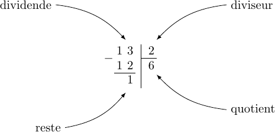
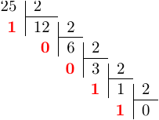

Compter en base 2, 10 et 16
=======================

## Base 10 (décimale)

De façon naturelle, on travaille avec des nombres écrits le plus souvent en base 10, avec ses 10 chiffres de 0 à 9 (à cause de nos 10 doigts ?). 
Ainsi, chaque nombre est décomposé suivant des *unités* (rang 0), *dizaines* (rang 1), *centaines* (rang 2), etc. 
On peut aussi utiliser les puissances de 10.  
**Exemple**  
Le nombre 125 est égal une centaine plus deux dizaines plus cinq unités, ce qui 
peut être écrit aussi:  
$125=1\times 10^2+2\times 10^1+5\times 10^0$

!!! question "A faire"
    Décomposer 63 en base 10.


## Base 2 (binaire)
Dans un ordinateur, la base naturelle est la base 2 ou **binaire** (l'état d'un composé électronique ne prend que deux valeurs: allumé ou éteint).  Deux chiffres seulement sont nécessaires: le zéro et le un. Comme en base 10, un nombre peut être décomposé en *unité* (rang 0), *deuzaine* (rang 1), *quatraine* (rang 2), *huitaine* (rang 3) etc.  

??? info
    Le nom des adjectifs numéraux peut être consulté sur [cette page wikipedia](https://fr.wikipedia.org/wiki/Nom_num%C3%A9ral).
    
Comme en base 10 encore, on peut utiliser les puissances de la base, ici 2.  
**Exemple**  
Le nombre 17 peut être décomposé en une seizaine plus une unité:  

| seizaine 	| huitaine 	| quatraine 	| deuzaine 	| unité 	|
|----------	|----------	|-----------	|----------	|-------	|
| 2^4=16   	| 2^3=8    	| 2^2=4     	| 2^1=2    	| 2^0=1 	|
| 1        	| 0        	| 0         	| 0        	| 1     	|

De ce fait, 17 s'écrit $10001_2$ en base 2 (le deux en indice indique la base et évite les ambiguités).


!!! question "A faire"
    Le nombre 14 est égal à une huitaine plus une quatraine plus une deuzaine. Décomposer 14 sur la base 2. 


```python

```

Techniquement, la décomposition en puissance de 2 peut se faire en réalisant des divisions euclidienne par 2.  

!!! important "Rappel important"
    Le vocabulaire employé lorsqu'on *pose* une division (avec la potence):  
    

Il s'agit de **réaliser des divisions successives par 2 du quotient, tant que  celui-ci n'est pas nul**.  

**Exemple**
Soit à convertir 25 en binaire en utilisant les divisions successives par 2.  

  

Le résultat est obtenu en faisant une lecture des **restes de bas en haut**: $11001_2$.

!!! question "A faire"
    Ecrire le nombre 19 en binaire en utilisant la technique des divisions successives par 2.


Pour connaître la valeur d'un nombre écrit en binaire, en base 10, il suffit de faire la somme de sa décomposition en puissances de deux.  

**Exemple**  
$1101_2=1\times 2^3+1\times 2^2+1\times 2^0=8+4+1=13$

| $2^3$ 	| $2^2$ 	| $2^1$ 	| $2^0$ 	|
|-------	|-------	|-------	|-------	|
| 1     	| 1     	| 0     	| 1     	|

!!! question "A faire"
    Convertir $110110_2$ en base 10.


```python

```

## Base 16 (hexadécimale)

La base 16 est également très utilisée en informatique. Dans cette base, seize symboles (chiffres) sont nécessaires. On utilise les dix chiffres de la base 10 plus les six lettres A, B, C, D, E et F.  

| Base 16 	| 0 	| 1 	| 2 	| 3 	| 4 	| 5 	| 6 	| 7 	| 8 	| 9 	| A  	| B  	| C  	| D  	| E  	| F  	|
|---------	|---	|---	|---	|---	|---	|---	|---	|---	|---	|---	|----	|----	|----	|----	|----	|----	|
| Base 10 	| 0 	| 1 	| 2 	| 3 	| 4 	| 5 	| 6 	| 7 	| 8 	| 9 	| 10 	| 11 	| 12 	| 13 	| 14 	| 15 	|

Les principes de conversions vus précédemment sont toujours valables.  

* Conversion de la base 10 vers la base 16  
    On effectue des divisions successives du quotient tant que celui-ci n'est pas nul.  
    **Exemple**  
    Soit le nombre $480_{10}$ à écrire en base 16.  
      
    La flêche indique le sens de lecture: $480_{10}=1\mathrm{E}0_{16}$
* Conversion de la base 16 vers la base 10  
    On effectue la somme de la décomposition du nombre en puissance de 16.  
    **Exemple**  
    
    | $16^2$ 	| $16^1$ 	| $16^0$ 	|
    |--------	|--------	|--------	|
    | 1      	| E      	| 0      	|
    
    $1\mathrm{E}0_{16}= 1\times 16^2+14\times 16^1+0\times 16^0=256+224=480$

!!! question "A faire"
    Fanny a choisi comme couleur de fond de la page d'accueil de son site web la valeur `#F34DC1`. Dans cette syntaxe, chaque paire de caractère correspond à nombre hexadécimal associé à une nuance de rouge, de vert ou de bleu (codage RGB). Ici, la nuance de rouge est codé par le nombre `F3`. La nuance de vert est associé à `4D` et celle du bleu à `C1`.  
    
    * Donner chaque nuance de couleur en base 10;
    * Les autres pages du site auront une couleur de fond codée en décimal par le triplet RGB (241, 19, 126). Donner le code hexadécimal de cette couleur.


```python

```

## Conversion hexadécimale - binaire

Pour passer de l'hexadécimal au binaire il suffit de remplacer chaque chiffre hexadécimal par son code binaire.  

| Hexadécimal 	| 0    	| 1    	| 2    	| 3    	| 4    	| 5    	| 6    	| 7    	| 8    	| 9    	| A    	| B    	| C    	| D    	| E    	| F    	|
|-------------	|------	|------	|------	|------	|------	|------	|------	|------	|------	|------	|------	|------	|------	|------	|------	|------	|
| Binaire     	| 0000 	| 0001 	| 0010 	| 0011 	| 0100 	| 0101 	| 0110 	| 0111 	| 1000 	| 1001 	| 1010 	| 1011 	| 1100 	| 1101 	| 1110 	| 1111 	|

!!! question "A faire"
    Quelle est la valeur en binaire, du code de la couleur de la page d'accueil du site de Fanny ?


```python

```

Pour passer d'une écriture binaire à l'hexadécimale, on fait des groupes de 4 chiffres binaires de la droite vers la gauche (si besoin on complète avec des zéros). On fait correspondre à chaque groupe le chiffre hexadécimal correct (voir tableau ci-dessus.  
**Exemple**  
Que vaut $111\ 0001\ 1010_2$ en hexadécimal ? Réponse: $71\mathrm{A}$ 

!!! question "A faire"
    Ecrire $10\ 1111\ 1101\ 1010\ 0111\ 1011_2$ en hexadécimal


```python

```
