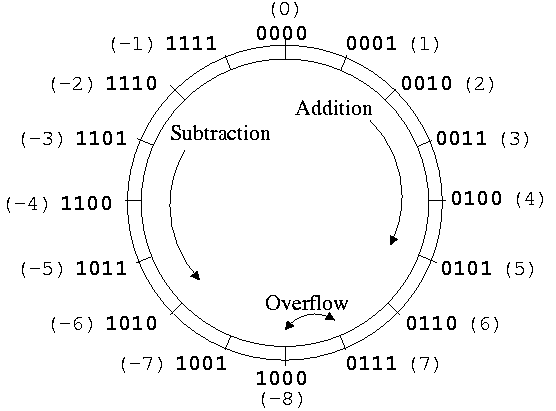

Manipuler des nombres en machine
=============================

## Somme d'entiers positifs

En binaire on a:  

* $0+0=0$
* $0+1=1+0=1$
* $1+1=0$ et on a une retenue de 1.

La dernière relation est facile à comprendre: en décimal $1+1=2$ qui est égal à $10_2$.  

!!! question "A faire"
    
    * Effectuer les sommes $1001_2+0101_2$ puis $0011_2+1001_2$;
    * Au maximum, combien de bits sont nécessaires pour additionner deux entiers codés sur $n$ bits? 


```python

```

## Somme d'entiers relatifs

Voici une proposition de codage des entiers négatifs sur 4 bits.  

<figure>
    
</figure>

!!! question "A faire"
    Compte tenu de ces informations, effectuer les additions $(-7)+5$ et $3+(-7)$. Les résultats obtenus sont-ils corrects?


```python

```

La méthode de codage des entiers négatifs, dite du *complément à 2* (qui sera détaillée dans le cours), est résumée ci-dessous.    
Pour coder un nombre $x$:  

* coder $\lvert x\rvert$ en binaire de façon habituelle;
* inverser tous les bits;
* additionner 1.

**Exemple**  
Soit à coder $-6$.

| \|-6\| = 6    	|   	| 0110 	|
|---------------	|---	|------	|
| Inversion     	|   	| 1001 	|
| Addition de 1 	| + 	| 0001 	|
| Résultat      	|   	| 1010 	|

!!! question "A faire"
    Coder $-68_{10}$ sur 8 bits en adoptant la méthode du complément à 2.    


```python

```

## Dépassement de capacité

!!! question "A faire"
    En utilisant la *roue binaire* précédente décrire ce qui se passe si on effectue $7+1$ ou $(-8)-1$ sur 4 bits.


```python

```

## Décomposition d'un nombre à virgule

!!! question "A faire"
    Décomposer le nombre $10,0111_2$ en base 2 selon la méthode habituelle, sachant qu'après la virgule les puissances de 2 sont négatives. Quelle est sa valeur en décimal ?


```python

```

## Comment convertir un nombre à virgule ?

Pour la partie entière (*avant la virgule*) on procède comme d'habitude. Pour la partie fractionnaire, la méthode est la suivante:  

* on multiplie la partie fractionnaire par 2;
* la partie entière donne le prochain chiffre binaire;
* on récupère la partie fractionnaire et on recommence le processus tant que cette dernière n'est pas nulle

**Exemple**  
Soit à convertir $6,125$.  
$6_{10}=110_2$  

| Multiplication par 2 	| Prochain chiffre binaire 	|
|----------------------	|--------------------------	|
| 0,125 x 2 = 0,25     	| 0                        	|
| 0,25 x 2 = 0,5       	| 0                        	|
| 0,5 x 2 = 1,0        	| 1                        	|

On a donc $6,125=110,001_2$.

!!! question "A faire"
    Convertir 9,375 en binaire.


```python

```
