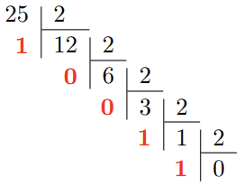
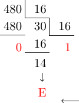

TRAVAILLER EN BASE 2, 10 ET 16
============================

## Repères historiques
L'invention du système binaire est souvent attribué à tort au savant allemand [Wilhelm Gottfried Leibniz](https://fr.wikipedia.org/wiki/Gottfried_Wilhelm_Leibniz#Syst%C3%A8me_binaire) (1646-1716). 

En effet, le mathématicien et astronome anglais [Thomas Harriot](https://images.math.cnrs.fr/L-edition-electronique-des-manuscrits-de-Thomas-Harriot-1560-1621) (1560-1621) avait déjà travaillé sur les systèmes non décimaux. Voir une [publication en ligne des manuscrits de Harriot](https://digilib.mpiwg-berlin.mpg.de/digitallibrary/jquery/digilib.html?fn=/permanent/library/TRMFCPMB/pageimg&pn=693&ww=0.7143&wh=0.7143) 

Leibniz s'inspira des figures de le l'empereur chinois Fuxi (-3000) que l'on peut considérer comme la première expression d'un codage binaire.  

## Comment représenter des informations sur une machine numérique ? 
### Unité d'information
Les machines numériques sont composées d'éléments manipulant l'information sous forme de **deux états distincts**. C'est la raison pour laquelle on les appelle machine **binaire**. Par convention, ces états sont notés $0$ ou $1$. En anglais, ces informations élémentaires sont appelées *binary digit* ou **bit**.  
Un bit permet de représenter $2^1=2$ informations.  

On peut généraliser: $n$ bits permettent de représenter $2^n$ informations. 

Les machines numériques manipulent habituellement des groupes de bits. Ainsi, un groupe de 8 bits forment un **octet**.  

!!! danger "ATTENTION"
    en anglais un **octet** est traduit par **BYTE**. 
    
Au delà de 8 bits on utilise le terme **mot**. On parle par exemple de mot de 16 bits, de mot de 32 bits (on trouve aussi le terme *double mot*) ou de mot de 64 bits (ou *quadruple mot*).

Les quantités d'informations stockées ou manipulées s'expriment avec les préfixes habituels reliés aux puissances de 10 (1 kilooctet (ko) $= 1\times10^3$ octets, 1 mégaoctet (Mo) $= 1\times10^6$ octets, 1 gigaoctet (Go) $= 1\times10^9$ octets etc).  

!!! info "Remarque"
    Certains informaticiens/électroniciens utilisent encore des définitions de ces quantités exprimées en puissances de 2 ($2^{10}$, $2^{20}$, $2^{30}$, etc). Pour éviter les confusions, l'International Electrotechnical Commission (IEC) a normalisé ces appellations en décembre 1998. Voir [lien](https://physics.nist.gov/cuu/Units/binary.html).

## Représentation binaire des entiers naturels
###  Représentation positionnelle: décomposition suivant une base
On présente les nombres entiers de manière classique en *représentation positionnelle*. Par exemple en base 10, la suite 123 signifie $1\times 10^2+2\times 10^1+3\times 10^0$. En base 2, la suite 10011 signifie $1\times 2^4+0\times 2^3+0\times 2^2+1\times 2^1+1\times 2^0$.  

Dans un motif binaire, le bit le plus à droite est le **bit de poids faible** ou **LSB** (*Least Significant Bit*). A l'opposé, le bit le plus à gauche est le **bit de poids fort** ou **MSB** (*Most Significant Bit*). 

!!! hint "Astuce"
    Le bit de poids faible peut être utilisé pour trouver la parité du nombre: $0$ indique un nombre pair et $1$ un nombre impair.

### Conversion binaire - décimal 
La conversion binaire - décimale d'un entier naturel découle simplement du mode de représentation positionnelle: on **additionne les puissances de 2 présentes dans le motif binaire**. Ainsi, pour l'exemple précédent on a:  
$10011_2=(1\times 2^4+0\times 2^3+0\times 2^2+1\times 2^1+1\times 2^0)_{10}=19_{10}$  

!!! info "Remarque"
    La base a été indiquée ici en indice, on peut l'omettre lorsqu'il n'y a pas d'ambiguité.

### Conversion décimal - binaire
On **décompose le nombre entier en une somme de puissance de 2** par divisions 
entières successives tant que le quotient n'est pas nul. Le résultat est 
alors constitué des restes de chaque division, en commençant par la dernière.  

  

$25=11001_2$  

## Représentation hexadécimale
La représentation binaire devient rapidement encombrante. On lui préfère souvent la représentation *hexadécimale* (base 16). L'utilisation de cette base nécessite 16 caractères. Le tableau ci-dessous présente ces caractères ainsi que leur équivalence en base 10 et 2.  

### Conversion décimal - hexadécimale
De la même façon qu'en binaire, on décompose le nombre entier en une somme de 
puissance de 16, par divisions successives par 16 tant que le quotient n'est pas nul.  

$480=1\mathrm{E}0_{16}$

### Conversion hexadécimale - décimale
On additionne les puissances de 16 présentes dans le motif hexadécimal.  

$1\mathrm{E}0_{16}=1\times 16^2+14\times 16^1+0\times 16^0=256+224+0=480$  

!!! hint "Remarque"
    Dans la somme, on remplace évidemment chaque chiffre hexadécimal par sa valeur
    (en décimal). Dans l'exemple précédent, $\mathrm{E}$ est remplacé par 14.

### Conversions binaire - hexadécimal et vice-versa
Pour passer du binaire à l'hexadécimal il suffit de grouper les bits par 4 et de 
les remplacer par leur équivalent hexdécimal (*voir tableau ci-dessus*).  

$1101011111_2=0011\ 0101\ 1111=35\mathrm{F}_{16}$

A l'inverse, pour passer de l'hexadécimal au binaire, on remplace chaque 
chiffre hexadécimal par sa valeur en binaire.

$\mathrm{F}15_{16}=1111\ 0001\ 0101_2$
