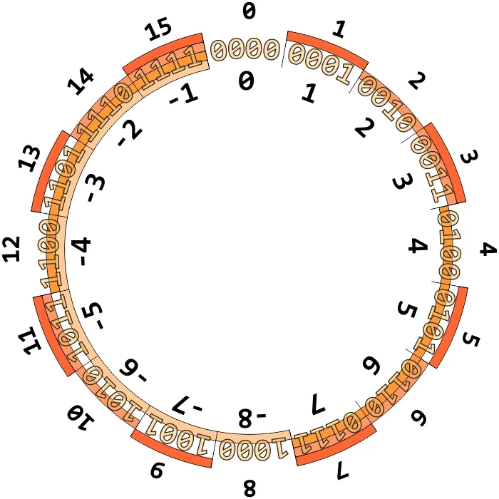

Encodage des entiers relatifs
========================

## Comment coder un entier signé sur une machine numérique?

Le signe d'un entier relatif peut prendre deux valeurs possibles: `+` ou `-`. Par conséquent, un seul bit suffit pour le codage du signe.  

!!! tip "Convention"
    Par convention le signe + est codé par 0 et le signe - par 1.
    
Les tailles courantes pour représenter un entier sont 8, 16, 32 ou 64 bits.

## Propriétés à vérifier et première solution

!!! note
    Quelque soit l'encodage choisi, on doit respecter deux propriétés essentielles:  
    
    * $a + (-a) = 0$ (propriété 1)
    * $-(-a) = a$ (propriété 2)
    
La première idée est d'utiliser un bit, généralement **le bit de poids fort**, pour représenter le signe et les autres bits pour représenter la valeur absolue du nombre $x$ à coder.  Ce qui peut être représenté par:  

```
    <---- n-1 bits -->
+---+----------------+
| 1 |    |x|         |
+---+----------------+
```
ou 

```
    <---- n-1 bits -->
+---+----------------+
| 0 |    |x|         |
+---+----------------+
```
selon que $x$ soit négatif ou positif.

**Exemple**  

Soit à coder $-5$ sur 4 bits.  
Avec 4 bits, la valeur absolue sera codée sur 3 bits et le signe sur 1 bit.
On a $|-5| = 5$, ce qui correspond à $101_{2}$, le bit de signe valant 1 car $-5<0$. On aura donc le codage suivant: $-5\rightarrow 1\ 1\ 0\ 1$  

La propriété (1) ci-dessus est-elle vérifiée ?  
Ajoutons les représentations de $5$ et $-5$, avec un résultat sur 4 bits:  

| $_1$ 	| $_1$ 	|   	| $_1$ 	|   	|
|------	|------	|---	|------	|---	|
|      	| 0    	| 1 	| 0    	| 1 	|
| +    	| 1    	| 1 	| 0    	| 1 	|
|      	| 0    	| 0 	| 1    	| 0 	|

**La valeur obtenue sur 4 bits est différente de zéro: cette solution n'est pas satisfaisante**.  

!!! info "Remarque"
    Un problème supplémentaire peut être mis en évidence: l'existence de **deux** représentations pour zéro.

## Une solution plus satisfaisante

### Le complément à 2

Sur $n$ bits on peut coder $2^n$ entiers. Il y en a autant de positifs que de négatifs, soit $\dfrac{2^n}{2}=2^{n-1}$. Les plages de valeurs représentables sont:

* de $0$ à $2^{n-1}-1$ pour les valeurs positives;
* de $-1$ à $-2^{n-1}$ pour les valeurs négatives

Ainsi, avec $n=8$ bits par exemple, on peut représenter les entiers allant de $-128$ à $+127$.  

!!! important "Définition"
    Soit un entier relatif $x$ à coder sur $n$ bits.  
    
    * Si $x\in [\![0..2^{n-1}-1]\!]$, alors on code $x$ comme un entier naturel sur $n$ bits;
    * si $x\in [\![-2^{n-1}..-1]\!]$, alors on code $x$ comme l'entier naturel $2^n-\lvert x\rvert$ sur $n$ bits.
    
!!! tip "Vocabulaire"
    La quantité $2^n-\lvert x\rvert$, appelée **complément à** $2^n$ **de** $x$ voit son nom souvent abrégé en **complément à 2**.

### Comment utiliser le complément à 2 ?

#### Méthode 1

On utilise directement la définition.  
**Exemples**  
Soit à coder les entiers relatifs $x_1=107$ et $x_2=-107$ sur 8 bits. 

* $x_1=107=1101011_2$, soit $0110\ 1011$. On constate que le bit de poids fort vaut $0$, ce qui indique un nombre positif.  
* Pour $x_2$ on a: $2^8-\lvert -107\rvert=149$ qui s'écrit en binaire $1001\ 0101$ et qui correspond à la représentation de $-107$ sur 8 bits. Par ailleurs, le bit de poids fort vaut $1$, ce qui indique bien un nombre négatif.

Effectuons $x_1+x_2$:

| 1 	| 1 	| 1 	| 1 	| 1 	| 1 	| 1 	| 1 	|   	|
|---	|---	|---	|---	|---	|---	|---	|---	|---	|
|   	| 0 	| 1 	| 1 	| 0 	| 1 	| 0 	| 1 	| 1 	|
| + 	| 1 	| 0 	| 0 	| 1 	| 0 	| 1 	| 0 	| 1 	|
|   	| 0 	| 0 	| 0 	| 0 	| 0 	| 0 	| 0 	| 0 	|

La méthode du complément à 2 vérifie la propriété 1.

!!! important "Méthode 2 (à connaître)"
    Pour représenter l'opposé d'un entier relatif:
    
       * Ecrire la valeur absolue du nombre en binaire naturel avec le nombre de bits spécifié (compléter si besoin avec des zéros);
       * Inverser tous les bits (complément à un);
       * Ajouter 1 au résultat précédent.

**Exemple**  
Coder $x_2=-107$ sur 8 bits en utilisant la méthode 2.  
$\lvert x_2\rvert = 0110\ 1011$. On inverse les bits: $1001\ 0100$ et on ajoute 1: $1001\ 0101$. On retrouve heureusement le résultat précédent.  
Appliquons une deuxième fois le complément à 2 sur le résultat $1001\ 0101$:  
Inversion des bits: $0110\ 1010$, additionner 1: $0110\ 1011$. La propriété 2 est vérifiée.

### Représentation circulaire

Il est commode de représenter le codage d'entiers relatifs sous forme circulaire.  

<figure>
    
</figure>

On y repère l'intervalle des valeurs couvertes selon qu'on travaille avec des entiers non signés (*extérieur*) ou signés (*intérieur*).  
Par ailleurs, la notion de complément à $2^n$ est bien mise en évidence. Par exemple, $-5$ sera codé comme son complément à $2^4$, c'est-à-dire $2^4-\lvert -5\rvert=11$.

## A retenir
Pour coder un entier relatif, on utilise la méthode du complément à $2^n$. Pour cela, si la capacité est fixée à $n$ bits, on peut simplement:  

*  écrire la valeur absolue du nombre en binaire naturel avec le nombre de bits spécifié (compléter si besoin avec des zéros);  
*  inverser tous les bits (complément à un);  
*  ajouter 1 au résultat précédent  

Avec $n$ bits, on peut coder les entiers appartenant à l'intervalle $[\![-2^{n-1}...2^{n-1}-1]\!]$. Si une opération conduit à un nombre se situant en dehors de cet intervalle, on a un phénomène de dépassement de capacité (en anglais *overflow*).

