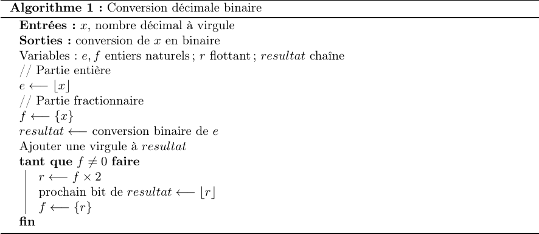

CODAGE DES NOMBRES DECIMAUX
===============================

## Conversion décimal - binaire d'un nombre en virgule fixe

Pour passer du binaire au décimal, la méthode consiste à considérer deux parties:  

* la première, composéee de puissances positives et qui correspond à la partie entière;
* la seconde, composée de puissances négatives et qui correspond à la la partie fractionnaire.

Ces deux parties étant séparées par la virgule *qui est fixe dans ce cas*.  
La conversion binaire $\rightarrow$ décimale est obtenue en additionnant les termes de la décomposition en base 2.  

??? tip "Exemple"

    | $2^2$ 	| $2^1$ 	| $2^0$ 	| $2^{-1}$ 	| $2^{-2}$ 	| $2^{-3}$ 	| $2^{-4}$ 	|
    |-------	|-------	|-------	|----------	|----------	|----------	|----------	|
    |1      	|0      	|  1     	|  1       	|  1       	|  0       	|  1       	|
    
    Ce nombre vaut $2^2+1+\dfrac{1}{2}+\dfrac{1}{4}+\dfrac{1}{16}=5.8125$

Pour passer du décimal au binaire, on peut utiliser l'algorithme ci-dessous.  

<figure>
    
</figure>

!!! bug "ATTENTION"
    Cet algorithme est destiné à être *déroulé à la main*. En effet, il peut boucler indéfiniment. Ce cas se produit pour des nombres qui ne peuvent être représentés en machine. La valeur retenue est forcément **approchée**.


??? tip "Exemple"
    Convertir en binaire 6,6875. En appliquant l'algorithme (la conversion de 6 en binaire est immédiate et 
    n'est pas détaillée):
    
    | r     | f      | resultat |
    |-------|--------|----------|
    |       | 0,6875 | 110,     |
    | 1,375 | 0,375  | 110,1    |
    | 0,75  | 0,75   | 110,10   |
    | 1,5   | 0,5    | 110,101  |
    | 1,0   | 0      | 110,1011 |
    
    Par conséquent $6,6875=110,1011_2$ en virgule fixe.
    

## Conversion d'un nombre décimal en binaire - virgule flottante  

Il s'agit de découvrir ici la façon dont on représente **de manière approximative** les nombres décimaux ou **nombres flottants** en machine. Il s'agit de la **représentation en virgule flottante**.

### Le format et les notations

Cette deuxième façon d'encoder un nombre décimal est inspirée de la notation scientifique: $\pm m\times 10^n$ avec $1\leq m<10$ et $n$ un entier.  
De manière similaire, en base 2, on va écrire les nombres sous la forme $\pm m\times 2^n$ avec $1\leq m \lt 2$ et $n$ un entier.  
Le codage d'un nombre décimal en base 2 nécessite trois informations binaires:  

*  une pour le signe $s$;
*  une pour l'exposant $n$;
*  une pour $m$ qu'on appelle encore **mantisse**. 

### Représentation en simple ou double précision

Le format précédent a été détaillé dans une norme appelée [IEEE754](https://fr.wikipedia.org/wiki/IEEE_754). Plusieurs niveaux de précisions sont définis dans cette norme. On ne s'intéressera ici qu'à la représentation en **simple précision sur 32 bits** et **double précision sur 64 bits**.

#### Le signe

Un seul bit est nécessaire pour coder le signe $s$. On garde la convention déjà rencontrée: 0 pour le signe `+` et 1 pour le signe `-` .

#### L'exposant

La norme prévoit **8 bits en simple précision** et **11 bits en double précision** pour l'exposant. Les valeurs de $n$ possibles seraient donc comprises entre 0 et 255 ou 0 et 2047. C'est un problème car cela nous empêche de travailler avec des nombres proches de zéro.  

Pour y remédier, on a eu recours à l'astuce suivante: l'exposant est *biaisé* ou *décalé* de 127 en simple précision et 1023 en double précision. **La conséquence est que l'exposant** $n$  **ne correspond pas à la valeur codée** $e$ mais à:  

* $e-127$ en simple précision;
* $e-1023$ en double précision.

Ainsi, sur 8 bits, la valeur codée $e$ variant de $0000\ 0000=0$ à $1111\ 1111=255$ va correspondre à un exposant allant de $0-127=127$ à $255-127=128$.

#### La mantisse

Avec le format décrit, $1\leq m \lt 2$, on aura toujours $m=1,\dots$. La mantisse commence toujours par $1$ (*sauf cas particuliers qui ne seront pas traités ici*). De ce fait, on ne code jamais le 1 et **les 23 ou 52 bits restants sont utilisés pour coder la partie fractionnaire** $f$ **de la mantisse**.  

!!! tip "Remarque"
    $m=1+f$

#### Résumé

Un nombre décimal sera codé de la manière suivante: *signe* | *exposant* $e$ | *partie fractionnaire* $f$ 

| précision 	| exposant $e$ 	|partie frac. $f$       	| expression de la valeur en décimal                    	|
|-----------	|--------------	|--------------	|-------------------------------------	|
| 32 bits   	| 8 bits       	| 23 bits      	| $(-1)^s\times (1+f)\times 2^{e-127}$  	|
| 64 bits   	| 11 bits      	| 52 bits      	| $(-1)^s\times (1+f)\times 2^{e-1023}$ 	|

!!! note "En marge du programme"
    D'après le programme officiel aucune connaissance **précise** de la norme IEEE754 n'est exigible. Les deux exemples qui suivent complètent le cours (*notamment pour les plus curieux*) mais **ne feront pas l'objet d'évaluation**.

### Exemple de conversion décimal - flottant

Soit à convertir $N=17,25$ en flottant, format simple précision. Il s'agit de touver les trois composantes $s,e \mbox{ et}f$ de la représentation en virgule flottante.  

**Signe**  
Le nombre est positif donc $s=0$.  

**Mantisse et code de l'exposant**  
En virgule fixe on a $N=10001,01$. Après décalage de la virgule de 4 rangs vers la gauche (cela revient à multiplier par $2^4$), on obtient:  

$$ N=1,000101 \times 2^4$$

On a fait apparaître la partie fractionnaire $f=000101$ soit, sur 23 bits, $f=00010100\ 00000000\ 0000000$.  
L'exposant réel est $n=4$. La valeur codée $e$ sera:  

$$ n=e - 127 = 4 \iff e=131=10000011_2$$

**Ecriture selon la norme IEEE754 simple précision**  

$$N= 0\ 10000011\ 00010100 00000000 0000000$$


### Exemple de conversion flottant - décimal

Soit à convertir $1\ 10000110\ 10101101100000000000000$  
**Signe**  
$s=(-1)^1=-1$;  

**Exposant**  
En simple précision, $n=e-127$. Or on peut lire $e=10000110_2 = 134_{10}$; on a donc $n=134-127=7$.  

**Mantisse**
$m=1+f$ avec $f=2^{-1}+2^{-3}+2^{-5}+2^{-6}+2^{-8}+2^{-9}$, soit $m=1,677734375$.  

Finalement, ce nombre vaut en décimal:

$$-1,677734375\times 2^7=-214,75$$

### Cas particuliers
Lorsque tous les bits sont à zéros, cela correspond à la valeur zéro. Lorsque tous les bits de l'exposant sont à 1 et que la partie fractionnaire est nulle, cela correspond à l'infini (plus ou moins, cela dépend du bit de signe).
Enfin, pour les nombres très petits (inférieurs à $2^{-126}$) il existe une forme dénormalisée, qui ne sera pas étudiée ici.

## Caractère approchée de la représentation

=== "Problème"
    Quel constat peut-on faire concernant les représentations binaires de certains nombres comme 0.2 et 0.3 par exemple ?

=== "Réponse"
    En déroulant l'algorithme proposé à la main, on constate rapidement que la partie fractionnaire est constituée d'une **répétition infinie** du motif `1001`.

Un ordinateur qui ne peut stocker qu'un **nombre fini de chiffre**, ne peut représenter correctement certains nombres réels et utilise par conséquent une valeur approchée. Par exemple:  

*  `1.2* 3` donne 3.5999999999999996;
*  `0.1 + 0.2 == 0.3` donne False  
    
Par ailleurs, des propriétés comme l'associativité de l'addition ne sont plus valables


```python
1.6 +(3.2 + 1.7)
```


    6.5


```python
(1.6 + 3.2) + 1.7
```


    6.500000000000001


!!! danger "CONSEQUENCE IMPORTANTE"
    Il faut éviter de tester l'égalité entre deux nombres flottants.

!!! warning "A retenir"
    Les nombres flottants sont une représentation approximatives des nombres réels dans les ordinateurs. Une norme internationale IEEE754 définit un encodage en simple ou double précision (32 ou 64 bits). Les opérations arithmétiques sur les nombres flottants n'ont pas toujours les mêmes propriétés que ces mêmes opérations sur les nombres réels.
