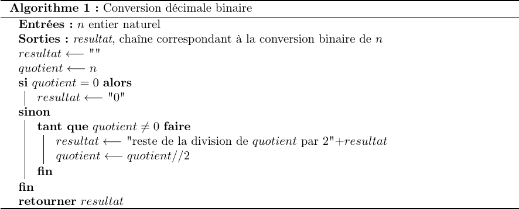

Travailler en base 2, 10 ou 16 - Applications
===================================

## Manipulations binaires en python
### Préambule: types natifs
Python possède trois types d'objets numériques natifs, parmi lesquels on peux citer le type `int` (*integer*) pour manipuler les entiers relatifs  et le type `float` pour manipuler les nombres décimaux à virgule flottante.  
Pour manipuler les chaînes de caractères, on dispose du type `str` (*string*). Ces dernières sont déclarées en étant entourées de double quotes `" "` ou de simples quotes `' '`  (s'il n'y a pas d'ambiguités avec l'apostrophe). Par exemple 

```python
mavariable = "programmation"
```

Pour accéder au type d'un objet `obj`on utilise la fonction native `type()` sur cet objet:  
```python
type(obj)
```

!!! question "A faire"
    Donner le type des objets suivants: 11, 11.0 et "11". Représentent-ils le même objet ?


```python

```

### Convertisseur decimal binaire
Python possède une fonction native qui permet la conversion d'un entier en binaire: la fonction `bin()`.  


```python
bin(77)
```


    '0b1001101'


On constate que le résultat est:  

* une chaîne de caractères;
* préfixé des caractères `0b` pour indiquer du binaire.  

On se propose d'écrire ici notre propre fonction de conversion en python, en suivant l'algorithme écrit en pseudo-code ci-après.  

<figure>

</figure>

Dans cet algorithme, l'affectation est notée $\leftarrow$ (flêche gauche) et la chaine de caractères vide `""`.  
Par ailleurs, en python:  

  *  le reste `r` de la division d'un entier naturel $a$ par un entier naturel $b$ est obtenu par `r = a % b`; 
  *  le quotient `q` de la division euclidienne de $a$ par $b$ s'obtient par `q = a // b`;
  *  la transformation d'un nombre $x$ en chaine de caractères `"x"` est réalisée par `str(x)`.  


```python
# Réaliser des divisions euclidiennes en python
a = 17
b = 2
q = a // b
r = a % b
print("quotient:", q, ", reste:", r)
print("concaténation de 'r' et '00':", str(r) + '00')
```

    quotient: 8 , reste: 1
    concaténation de 'r' et '00': 100


!!! question "A faire"
    * Ecrire une fonction `dec2bin` qui prend en paramètre un entier naturel `n` et qui renvoit la représentation binaire de `n`sous forme de chaine de caractères, à partir de l'algorithme fourni.
    * **Bonus** (*pour les plus rapides*) écrire une fonction `sur_16_bits` qui prend en paramètre une chaine représentant un nombre binaire (*donc formée de 0 et de 1*) et qui renvoit une chaine correspondant au même nombre écrit sur 16 bits. Il faudra donc rajouter, si besoin, des zéros.

## Application de la numération hexadécimale
### Introduction
Quelque soit leur type, les fichiers sont stockés en machine sous forme binaire. Celle-ci est peu pratique la plupart du temps. On lui préfère la forme hexadécimale.  

!!! question "A faire"
    * On peut utiliser un outil en ligne de commande pour visualiser le contenu en hexadécimal d'un fichier.  Dans un terminal (++ctrl+alt+t++), saisir la commande `hexdump -C -n 64 logo.bmp` qui affiche les 64 premiers octets du fichier `logo.bmp` en hexadécimal. On s'intéressera uniquement à la colonne centrale où chaque ligne représente 16 octets.
    * Donner la valeur des 6 premiers octets.
    * On peut aussi convertir un nombre hexadécimal en décimal via la ligne de commande en penant soin de le préfixé par `0x`. Exemple de syntaxe: `echo $((0x7F))` qui donne 127. Convertir le nombre héxadécimal `B104` en décimal.


```python

```

### Notion de boutisme
Pour une donnée qui occupent au moins deux octets, la question de sa représentation en mémoire (on dit aussi de son boutisme) se pose. En effet, on a deux possibilités pour l'écrire:  

* de l'octet de poids fort vers l'octet de poids faible; c'est la représentation *gros-boutisme* ou *big-endian*;
* de l'octet de poids faible vers l'octet de poids fort; c'est la représentation *petit-boutisme* ou *little-endian*;

Le choix du boutisme est typiquement fixé par l'architecture du processeur ou le protocole. Pour ce TP, au lycée, c'est la représentation *little-endian* qui prévaut.  

**Exemple**  
Le nombre hexadécimal `0x1A597C` occupe trois octets, `1A` est l'octet de poids fort et `7C` l'octet de poids faible. Sur une architecture *little-endian* ce nombre sera représenté par `7C 59 1A`.  

!!! question "A faire"
    * Saisir la commande `hexdump -C -n 14 logo.bmp` qui affiche les 14 premiers octets du fichier. Relever les 4 octets allant du n°2 au n°5 (attention, on compte à partir de 0);
    * Sachant que c'est la représentation *little-endian* qui est utilisée, quel est le nombre hexadécimal correspondant ?


```python

```

### Caractéristiques d'une image au format BMP
Les fichiers images au format [BMP](https://en.wikipedia.org/wiki/BMP_file_format) sont bien documentés. On peut aisemment consulter les informations avec un éditeur hexadecimal. Les 2 premiers octets servent à identifier le fichier. Pour une image BMP, on doit avoir 'BM' soit `42 4D` en hexadécimal.  

Les **4 octets suivants nous donnent la taille du fichier**, en hexadécimal.  

!!! question "A faire"
    * A partir d'un relevé fait avec `hexdump` et compte tenu du boutisme, donner la taille du fichier en hexadécimal puis en décimal. Est-ce cohérent avec la valeur fourni par la commande `ls -l`?
    * Avec des options appropriées, la commande `hexdump` nous permet de récupérer $n$ octets à partir d'une adresse $s$ (appelée aussi *offset*) par rapport au début du fichier. Ainsi, `hexdump -n 4 -s 2 logo.bmp` affichera 4 octets à partir de l'octet n° 2 (*offset*). Tester.
    * La documentation du format BMP est résumée en annexe et est disponible sur [wikipedia](https://en.wikipedia.org/wiki/BMP_file_format). A partir de toutes ces informations et des questions précédentes:
        * donner la valeur en hexadécimal **et** en décimal de la largeur (en anglais *width*) de l'image;
        * donner la valeur en hexadécimal **et** en décimal de la hauteur (en anglais *height*) de l'image;
        * dire si l'image est compressée ou non. Justifier avec la lecture d'octets bien particuliers.


