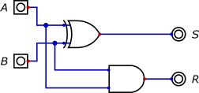
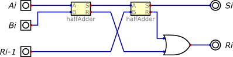

Simulations logiques
=================

*Les fichiers de simulation sont à récupérer* [ici](doc/fichiers_simulation.zip)

## Opérateurs and, or et not

!!! question "A faire"
    Simuler avec le logiciel *Digital* du [professeur Helmut Neemann](https://github.com/hneemann/Digital) les 
    opérations logiques `and`, `or` et `not`. &Eacute;tablir leur table de vérité.  

## Lois de De Morgan

1. Dresser la table de vérité de l'expression `not (A or B)`;
2. Vérifier les résultats par simulation;
3. Proposer une expression équivalente;
4. Reprendre les questions 1, 2 et 3 avec l'expression `not (A and B)`

## Une opération logique très utilisée

Ouvrir le circuit `Dilemme.dig`.  

Réaliser la simulation. &Eacute;tablir et commenter sa table de vérité.  
Cette opération très utilisée a pour symbole (*US*):  

## Addition binaire
### Demi additionneur
Le demi additionneur est un circuit combinatoire qui permet de réaliser la **somme arithmétique de deux nombres A et B chacun sur un bit**.  

A la sortie on va avoir la somme S et une éventuelle retenue R.  

1. Ouvrir le fichier `halfAdder.dig` et passer en mode simulation. Dresser alors la table de vérité de ce circuit.
2. En déduire la table d'addition binaire.
3. En utilisant la fonction d'analyse du logiciel, donner l'expression booléenne de la sortie S et de la retenue R.

### Additionneur complet
Lorsqu'on souhaite effectuer l'addition binaire sur un bit de deux nombres $A_i$ et $B_i$, il faut tenir compte d'une éventuelle retenue $R_{i-1}$ provenant du calcul du rang précédent. On a alors un additionneur complet, qui est réalisé avec deux demi-additionneurs.  

  

A la sortie on va avoir la somme $S_i$ et une éventuelle retenue $R_i$.  
Ouvrir le fichier `fullAdder.dig` et passer en mode simulation. Dresser la table de vérité de l'additionneur complet.
