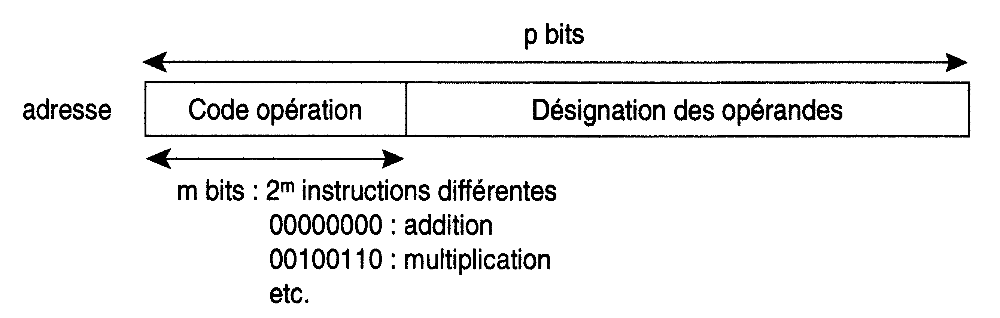
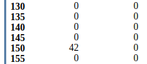

Séquence d'instructions en langage machine
=====================================

## Format d'une instruction
Un mot extrait depuis la mémoire représente un ordre donné au processeur. Il se présente sous la forme d'une chaine binaire de $p$ bits (typiquement $p=32$ ou $64$ bits), composée de deux parties.  

<figure>
    
</figure>

Pour s'affranchir des codes binaires et des calculs d'adresse le programmeur utilise plutôt un **langage d'assemblage** où les instructions binaires sont remplacés par une chaine de caractères mnémoniques.  
En effet, `MOV R0,#127` est un peu plus explicite que ` 11100011 10100000 00000000 01111111` !  

Un programme appelé **assembleur** réalisera ensuite le passage vers le code binaire.  

??? warning "Complément"
    Les instructions du langage machine peuvent être rangées dans six catégories: calcul, transfert, 
    entrées/sorties, saut, appel de sous programme, instructions particulières (arrêt par exemple).  

L'ensemble des codes opération reconnu par un processeur s'appelle son *jeu d'instructions*.

*Il n'est pas question dans cette activité de détailler un quelconque jeu d'instructions, ni les subtilités de son utilisation. Il s'agit plutôt de présenter quelques séquences simples*. 

## Premiers pas avec un langage d'assemblage

*Dans les exemples qui suivront le jeu d'instructions minimaliste utilisé (voisin de celui des processeurs* [ARM](https://fr.wikipedia.org/wiki/Architecture_ARM)) *peut être trouvé* [ici](http://www.peterhigginson.co.uk/AQA/info.html).

!!! question "A faire"
    Réalisez l'activité ci-dessous et dont la version originale peut être trouvée à 
    [cette adresse](https://pixees.fr/informatiquelycee/prem/c9a.html).

Afin de mettre en pratique ce que nous avons étudié dans le cours 2 "Architecture des ordinateurs - Modèle de von Neumann", nous allons utiliser un simulateur développé par Peter L Higginson. Ce simulateur est basé sur une architecture de von Neumann. Nous allons trouver dans ce simulateur :

- une RAM

- un CPU

Une version en ligne de ce simulateur est disponible ici :  [http://www.peterhigginson.co.uk/AQA/](http://www.peterhigginson.co.uk/AQA/)

Voici ce que vous devriez obtenir en vous rendant à l'adresse indiquée ci-dessus :

**Simulateur développé par Peter L Higginson**


Il est relativement facile de distinguer les différentes parties du simulateur :

- à droite, on trouve la mémoire vive ("main memory")
au centre, on trouve le microprocesseur

- à gauche on trouve la zone d'édition ("Assembly Language"), c'est dans cette zone que nous allons saisir nos programmes en assembleur

Revenons sur les parties RAM et CPU

#### La RAM

Par défaut le contenu des différentes cellules de la mémoire est en base 10 (entier signé), mais d'autres options sont possibles : base 10 (entier non-signé, "unsigned"), base 16 ("hex"), base 2 ("binary"). On accède à ces options à l'aide du bouton "OPTIONS" situé en bas dans la partie gauche du simulateur.

### activité 9.1

!!! question "A faire"
    À l'aide du bouton "OPTIONS", passez à un affichage en binaire.

Comme vous pouvez le constater, chaque cellule de la mémoire comporte 32 bits (nous avons vu que classiquement une cellule de RAM comporte 8 bits). Chaque cellule de la mémoire possède une adresse (de 000 à 199), ces adresses sont codées en base 10.

!!! question "A faire"
    Vous pouvez repasser à un affichage en base 10 (bouton "OPTION"->"signed")

#### Le CPU

Dans la partie centrale du simulateur, nous allons trouver en allant du haut vers le bas :

* le bloc "registre" ("Registers") : nous avons 13 registres (R0 à R12) + 1 registre (PC) qui contient l'adresse mémoire de l'instruction en court d'exécution;
* le bloc "unité de commande" ("Control Unit") qui contient l'instruction machine en cours d'exécution (au format hexadécimal)
* le bloc "unité arithmétique et logique" ("Arithmetic and Logic Unit")

Nous ne nous intéresserons pas aux autres composants de la partie CPU

#### Programmer en langage d'assemblage.

### activité 9.2

!!! question "A faire"
    Dans la partie "éditeur" ("Assembly Language") saisissez les lignes de codes ci-dessous.

```
MOV R0,#42
STR R0,150
HALT
```
			
!!! question "A faire"
    Une fois la saisie terminée, cliquez sur le bouton "submit". Vous devriez voir apparaitre des nombres 
    "étranges" dans les cellules mémoires d'adresses 000, 001 et 002 :


L'assembleur a fait son travail, il a converti les 3 lignes de notre programme en instructions machines, la première instruction machine est stockée à l'adresse mémoire 000 (elle correspond à `MOV R0,#42` en assembleur), la deuxième à l'adresse 001 (elle correspond à `STR R0,150` en assembleur) et la troisième à l'adresse 002 (elle correspond à `HALT` en langage d'assemblage). 

!!! question "A faire"
    Pour avoir une idée des véritables instructions machines, vous devez repasser à un affichage en binaire 
    (bouton "OPTION"->"binary"). Vous devriez obtenir ceci :


Nous pouvons donc maintenant affirmer que :

- l'instruction machine `11100011 10100000 00000000 00101010` correspond au code assembleur `MOV R0,#42`
- l'instruction machine `11100101 10001111 00000010 01001100` correspond au code assembleur `STR R0,150`
- l'instruction machine `11101111 00000000 00000000 00000000` correspond au code assembleur `HALT`

Au passage, pour l'instruction machine `11100011 10100000 00000000 00101010`, vous pouvez remarquer que l'octet le plus à droite, $00101010_2$, est bien égale à $42_{10}$!

!!! question "A faire"
    Repassez à un affichage en base 10 afin de faciliter la lecture des données présentes en mémoire.

### activité 9.3

!!! question "A faire"
    Pour exécuter notre programme, il suffit maintenant de cliquer sur le bouton `RUN`. Vous allez voir le CPU 
    *travailler* en direct grâce à de petites animations.  
    Si cela va trop vite (ou trop doucement), vous pouvez régler la vitesse de simulation à l'aide des 
    boutons `<<` et `>>`.  
    
    Un appui sur le bouton `STOP` met en pause la simulation, si vous rappuyez une 
    deuxième fois sur ce même bouton `STOP`, la simulation reprend là où elle s'était arrêtée.
    
    Une fois la simulation terminée, vous pouvez constater que la cellule mémoire d'adresse 150, contient bien 
    le nombre 42 (en base 10). Vous pouvez aussi constater que le registre `R0` a bien stocké le nombre 42.




!!! danger "ATTENTION"
    Pour relancer la simulation, il est nécessaire d'appuyer sur le bouton `RESET` afin de remettre les 
    registres `R0` à `R12` à 0, ainsi que le registre `PC` (il faut que l'unité de commande pointe de nouveau 
    sur l'instruction située à l'adresse mémoire 000).  
    
    La mémoire n'est pas modifiée par un appui sur le bouton `RESET`, pour remettre la mémoire à 0, il faut 
    cliquer sur le bouton `OPTIONS` et choisir `clr memory`. Si vous remettez votre mémoire à 0, il faudra 
    cliquer sur le bouton "ASSEMBLE" avant de pouvoir exécuter de nouveau votre programme.

### activité 9.4

!!! question "A faire"
    Modifiez le programme précédent pour qu'à la fin de l'exécution on trouve le nombre 54 à l'adresse mémoire 
    50. On utilisera le registre `R1` à la place du registre `R0`. Testez vos modifications en exécutant la 
    simulation.

Le simulateur prend en charge les *labels*.

### activité 9.5

!!! question "A faire"
    Saisissez et testez le programme suivant :

```
   MOV R0, #4
   STR R0,30
   MOV R0, #8
   STR R0,75
   LDR R0,30
   CMP R0, #10
   BNE else
   MOV R0, #9
   STR R0,75
   B endif
else:
   LDR R0,30
   ADD R0, R0, #1
   STR R0,30
endif:
   MOV R0, #6
   STR R0,23
   HALT
```

### activité 9.6

Voici un programme Python :

```
x=0
while x<3:
   x=x+1
```
!!! question "A faire"
    Écrivez et testez un programme en assembleur équivalent au programme ci-dessus.
