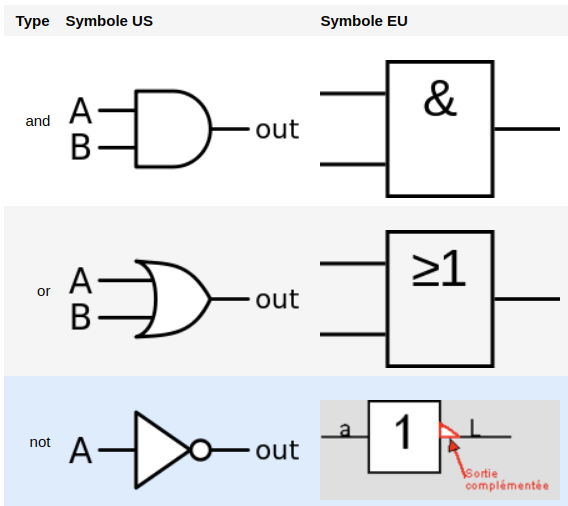

Expressions booléennes
====================

## Repères historiques
  

[George Boole](https://fr.wikipedia.org/wiki/George_Boole) (*1815-1864*): mathématicien, logicien britannique, auteur d'une algèbre **binaire** dite **booléenne** n'acceptant que deux valeurs 0 et 1.  
Voir ce [lien](https://tube-outremer.beta.education.fr/videos/watch/3f992951-1b15-4ceb-94ad-ebd75228cb6e) ou [celui-ci](https://www.dailymotion.com/video/x71hxwp) vers la présentation de Marie Duflot-Kremer, chercheuse en informatique l'Université de Lorraine.  
Aujourd'hui, l'algèbre de Boole trouve de nombreuses applications en informatique et dans la conception des circuits électroniques

## Quelques définitions

!!! info "Valeur logique (booléenne)"
    On appelle **valeur logique** ou **valeur booléenne** toute valeur notée par deux symboles. 

On peut utiliser par exemple un des couples de valeurs suivants : {0,1}, {vrai, faux}, {true, false} ou {ouvert, fermé}.  
**Exemple**  
L'état d'un interrupteur a une valeur booléenne, il peut être *ouvert* ou *fermé*.  

!!! info "Variable booléenne"
    Une variable booléenne ou variable logique est une grandeur représentée par un nom et pouvant prendre des
    valeurs booléennes.  

L'algèbre de Boole est caractérisée par la donnée:  

*  de deux opérations binaires **or** et **and** (`ou` et `et` en français, correspondant respectivement, à la somme "+" et au produit ".")  
*  d'une opération unaire **not** (*en français non, correspondant au complémentaire $\bar{}$*).  

Ces opérations doivent vérifier certaines conditions qui ne seront pas exposées ici.
!!! hint "Remarque"
    En mathématique on trouve les notations $\lor$ (*disjonction* pour le `ou`), $\wedge$ (*conjonction* pour 
    le `et`) et $\lnot$ (*négation*).  

!!! info "Expression booléenne"
    On appelle expression booléenne, l'association de variables booléennes et d'opérateur(s) booléen(s).

**Exemple**  
Si $a$, $b$ et $c$ sont trois variables booléennes, `(a and b and not c) or (a and  not b and c)` est une expression booléenne.  

!!! hint "Remarque"
    L'usage de parenthèses améliore la lisibilité.

!!! info "Table de vérité"
    Dresser la **table de vérité** d'une expression booléenne signifie construire une table ayant autant de 
    colonnes que de variables d'entrée plus une colonne donnant le résultat (*vrai* ou *faux*, 0 ou 1) pour 
    chaque combinaison possible des variables d'entrée.

## Les opérations logiques élémentaires

### Les symboles

Les opérations logiques sont réalisées simplement avec des circuits électroniques (à base de transistors) appelés **portes logiques**. Voici les symboles des portes logiques utilisées pour les opérations `and`, `or` et `not`.  




### La conjonction ("et logique")

La conjonction fait appel à l'opérateur logique **and**. Elle traduit le fait que deux expressions sont **vraies simultanément**: `a and b` est vrai si et seulement si `a` est vrai et `b` est vrai aussi.  

**Table de vérité**  

| a 	| b 	| a and b 	|
|---	|---	|:-------:	|
| 0 	| 0 	|    0    	|
| 0 	| 1 	|    0    	|
| 1 	| 0 	|    0    	|
| 1 	| 1 	|    1    	|

### La disjonction ("ou logique")

La disjonction fait appel à l'opérateur logique **or**. Elle traduit le fait  qu’**une parmi deux expressions est vraie**: `a or b` est vrai si soit `a` est vrai, soit `b` est vrai soit les deux sont vrais.  

**Table de vérité**  

| a 	| b 	| a or b 	|
|---	|---	|:-------:	|
| 0 	| 0 	|    0    	|
| 0 	| 1 	|    1    	|
| 1 	| 0 	|    1    	|
| 1 	| 1 	|    1    	|

### La négation ("non logique")

La négation fait appel à l'opérateur logique **not**. Il permet d'obtenir la valeur inverse d’une valeur booléenne.  

**Table de vérité**

| a 	| not a 	|
|---	|:-----:	|
| 0 	|   1   	|
| 1 	|   0   	|

## Expression booléenne en python

Python possède un type de base `bool`. Les objets de ce type ne peuvent prendre que deux valeurs `True` ou `False`.  

Les opérateurs logiques sont notés, sans surprise: `and`, `or` et `not`.  

**Exemples**


```python
a = 6
b = 7
c = 42
print('- a == 6:',a == 6)
print('- a == 7:', a == 7)
print('- a == 16 and b == 7:', a == 16 and b == 7)
print('- a == 6 or b == 67:', a == 6 or b == 67)
```

    - a == 6: True
    - a == 7: False
    - a == 16 and b == 7: False
    - a == 6 or b == 67: True


!!! tip "Important"
    Les expressions contenant les opérateurs `and`et `or`sont évaluées de manières *séquentielles*. Ainsi, 
    dans une expression du type:  
    
    * `x and y`, le deuxième argument `y` est évalué uniquement si `x` est vrai;
    * `x or y`, le deuxième argument `y` est évalué uniquement si `x` est faux.
    
    Voir les exemples lignes 6 et 7 ci-dessus.
