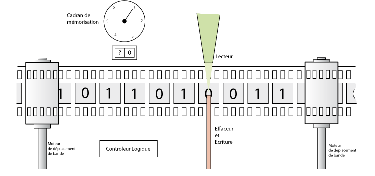
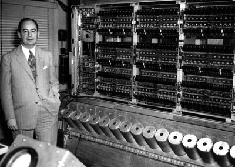
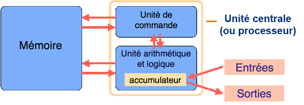
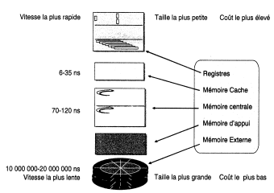
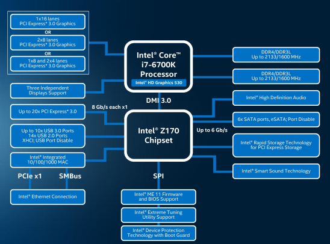
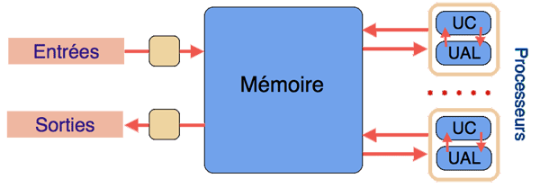

ARCHITECTURE DES ORDINATEURS - MODELE DE VON NEUMANN
=======================================================

*Ce cours comporte deux niveaux de lecture.  
Un premier niveau que l'on peut qualifié de normal et accessible à un élève de 1re spécialité NSI et un second niveau plus complet où apparaissent des détails (non exigibles à l'évaluation) et repéré par la mention "En complément"*

## Repères historiques

### L’objet conceptuel. . .
En 1936, **Alan Turing** - un des plus brillants mathématiciens du XX e siècle - décrit une machine
abstraite pour donner un support formel aux notions d’algorithme et de calcul : la fameuse «machine de Turing». Tout algorithme (procédé systématique de calcul) peut être réalisé par une machine de Turing.  

??? warning "En complément"
    Il s’agit d’un automate imaginaire muni d’un programme (sous la forme d’une table de transition entre 
    états) et pouvant lire et écrire des caractères sur un ruban de longueur illimitée.  
    Le coup de génie de Turing est de démontrer l’existence d’une **Machine Universelle**: si on fournit à 
    cette dernière la table de transition d’une machine de Turing particulière, autrement dit le programme 
    d’un algorithme, **elle est capable de reproduire le fonctionnement de cette machine, donc d’exécuter le 
    programme en question**!  
    
    
    
    On peut également consulter l'article sur 
    [interstices](https://interstices.info/alan-turing-du-concept-a-la-machine/)

### Au modèle d’architecture de von Neumann

En 1945, **John von Neumann** (1903-1957), mathématicien américano-hongrois qui avait déjà
rencontré Alan Turing et qui connaissait ses travaux, publia un rapport dans lequel il définit le
modèle de l’ordinateur à «programme enregistré».  

**La mémoire de l'ordinateur contient à la fois les programmes et les données**!  

## Modèle d'architecture séquentielle ou modèle de von Neumann

Un des grands points faibles du premier calculateur électronique l’[ENIAC](https://fr.wikipedia.org/wiki/ENIAC) était le fait que
les données étaient lues sur cartes perforées, alors que le programme était représenté sur un **support externe**, sous la forme d’un panneau de connexion analogue à celui d’un standard téléphonique.
L’idée fondamentale de John von Neumann a été de stocker **les données et les instructions des programmes en mémoire centrale**.

### Les composants essentiels
En juin 1945 dans la première version du rapport  sur la conception de [l'EDVAC](https://fr.wikipedia.org/wiki/Electronic_Discrete_Variable_Automatic_Computer)  John von Neumann décrit un schéma d'architecture d'un calculateur organisé autour des éléments suivants:  

*  une unité centrale ou **processeur** (on dit aussi CPU pour Central Processing Unit), formée d’une **unité arithmétique et logique** (*UAL*) et d’une **unité de commande** (*Control Unit*);
*  la **mémoire**;
*  des **unités d'entrée/sortie** qui permettent de communiquer avec l'extérieur.

Ces éléments étant reliés entre eux par des **bus**.  

#### L'unité arithmétique et logique (UAL) 
Elle est chargée d'effectuer le traitements des opérations arithmétiques ou booléennes.

??? warning "En complément"
    L'UAL réalise:  
    
    * les addition, multiplication, soustraction, division;
    * les opérations logiques ET, OU et NON;
    * les décalages de bits dans des registres ;
    
    Elle est entourée généralement de **registres de données** (mémoires rapides) et d'un accumulateur qui 
    accueille les opérandes des opérations ou le résultat.

#### L'unité de commande  ou unité de contrôle
Elle est chargée de coordonner les échanges dans les transferts entre la mémoire, les différents registres et l'UAL.  

??? warning "En complément"
    Elle joue ainsi un rôle essentiel dans le cycle de fonctionnement du processeur, c'est-à-dire pendant les 
    phases:  
    
    * de récupération d'instruction en mémoire;
    * de décodage d'instruction;
    * d'exécution d'instruction.
    
    Pour les plus curieux voir la [vidéo suivante](https://www.youtube.com/watch?v=L8RVT0zG8Zk) décrivant le
    processus *Fetch-Decode-Execute* qu'un processeur effectue en permanence.

#### Les mémoires  
Le rôle des mémoires est d'enregistrer les programmes et les données pouvant être executées par le microprocesseur.  

??? warning "En complément"
    On peut classer les mémoires en deux grandes catégories:  
    
    * les mémoires de travail;
    * les mémoires de stockage.
    
    Les **registres** sont des mémoires internes au microprocesseur. Ils sont très rapides et en nombre 
    limité.  
    La **mémoire cache** est un intermédiaire entre une unité du microprocesseur et la RAM. Elle stocke des 
    données provenant de celle-ci et permet ainsi d'accélérer leurs traitements.  
    Les **mémoires vives ou RAM** (*Random Access Memory*) permettent des opérations de lecture et d'écriture. 
    Elles sont volatiles.  
    Les mémoires accessibles uniquement en lecture sont connues sous le nom de ROM (*Read Only Memory*).  
    
    Les **mémoires de stockage** (ou *mémoire de masse*) se présentent souvent sous la forme de disque.  
    Même si la fonction est la même (*mémorisation de l'information*), toutes ces mémoires ont des 
    caractéristiques différentes.  
    
    

#### Les entrées-sorties

Les périphériques d’entrée-sortie permettent à l’ordinateur de communiquer avec l’homme
ou d’autres machines. Ils étaient initialement commandés par l’unité centrale. Depuis le début des
années 1960 ils sont sous le contrôle de processeurs autonomes.  

??? warning "En complément"
    Exemple de fonctionnement d’un périphérique d’entrée-sortie : le disque dur. Supposons que l’unité 
    centrale veuille lire un bloc sur le disque dur. Les principales étapes sont les suivantes:  
    
    * l’unité centrale formule cette demande en écrivant à l’adresse mémoire du contrôleur de disque;
    * le contrôleur de disque se charge d’écrire directement en mémoire les octets lus depuis le disque;
    * le contrôleur de disque signale la fin de la lecture sur le disque par le biais d’un mécanisme 
    d’interruption (non abordé ici) ;
    * l’unité centrale execute la routine d’interruption puis reprend le flot d’instructions où il a été 
    interrompu.
    
    

### Les bus

Les différentes unités sont interconnectées par des systèmes de câblage appelé bus. Autour du processeur on trouve:  

  *  le bus d'adresse (unidirectionnel);
  *  le bus de données (bidirectionnel);
  *  le bus de contrôle (bidirectionnel).
  
??? warning "En complément"
    Les ordinateurs récents possèdent d'autres types de bus repérés en trait épais bleu sur la figure ci-
    dessous. 
    

## Qu'en est-il aujourd'hui ?
Presque 75 ans après sa présentation le modèle d'architecture de Von Neumann est toujours valable. 
Cependant, les différences de vitesse entre le processeur et la mémoire ont conduit les fabricants d'ordinateur à intercaler des **mémoires caches** très rapides entre la mémoire centrale et le processeur.  
Par ailleurs, les ordinateurs actuels comportent plusieurs processeurs (on dit aussi plusieurs "coeurs") intégrés sur une même puce. Cette tendance au "parallélisme" dans le traitement et la circulation des informations a conduit à une augmentation de la puissance de calcul sans augmenter la fréquence des processeurs individuels.

Enfin, une différence, peu significative, par rapport au modèle original est que les dispositifs d'entrées/sorties peuvent communiquer avec la mémoire par le biais de contrôleur dédié ([DMA](https://fr.wikipedia.org/wiki/Acc%C3%A8s_direct_%C3%A0_la_m%C3%A9moire)). Si bien que le schéma actuel serait plutôt le suivant:
  

??? warning "En complément"
    Alternative: architecture de Harvard  
    Dans le modèle d'architecture de Harvard les instructions et les données sont situées dans des mémoires 
    différentes et sont véhiculés sur des bus indépendants.
    
    
    
    La vitesse d'execution est de fait améliorée car en un seul cycle d'horloge on peut récupérer les données 
    et le code instruction.  
    L'architecture de Harvard se retrouve beaucoup dans les systèmes embarqués.
