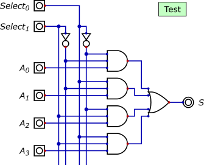

Implémentation d'un additionneur complet en python
===========================================

!!! question "A faire"
    Prendre absolument connaissance des documents 1 et 2 avant de répondre aux questions. Ne pas hésiter à exécuter les 
    exemples fournis dans les diverses cellules.

### Document 1: notation des électroniciens

On rappelle le schéma d'un additionneur complet, vu dans l'activité 1:  


En logique électronique, il est commun de noter les opérations logiques *et* et *ou* respectivement `.` et `+`. Quant à la négation *non*, on la représente avec une barre au dessus de la variable.  

Ainsi, l'expression booléenne de la sortie $S_i$ de l'additionneur complet est  

$$S_i=(\overline{A_i} \cdot \overline{B_i} \cdot R_{i-1}) + (\overline{A_i} \cdot B_i \cdot \overline{R_{i-1}}) + (A_i \cdot \overline{B_i} \cdot \overline{R_{i-1}}) + (A_i \cdot B_i \cdot R_{i-1})$$

Celle de la retenue est:  

$$R_i=(A_i \cdot R_{i-1}) + (A_i \cdot B_i) + (B_i \cdot R_{i-1})$$ 

### Document 2: connaissances du langage
#### Le type booléen
En python, les opérateurs booléens sont nommés `and`, `or` et `not`. Ainsi l'expression booléenne $\overline{A}\cdot(B+\overline{C})$ se traduit en python par:  

```python
not A and (B or not C)
```
Par ailleurs, Python possède un type booléen nommé `bool`. Les valeurs booléenne *vrai* et *faux* ou *1* et *0* se notent `True` et `False`. Voir ci-dessous.


```python
print(type(False))
A = False
print(not A)
```


```python
B = True
print(A or B)
```

Python associe les valeurs booléennes `True`et `False` à `1` et `0` respectivement.


```python
A = True
B = False
print(A == 1)
print(B == 0)
```

#### Le type chaîne de caractères

Python possède un type natif pour traiter les chaînes de caractères: le type *string* `str`. Une chaîne de caratères est déclarée en étant entourée de *double quotes* `"` ou simple quote `'`.  

```python
ch = "bonjour"
```

On peut accéder aux caractères individuellement avec une notation **indexée** entre *crochet* `[ ]`.

| index 	| 0   	| 1   	| 2   	| 3   	| 4   	| 5   	| 6   	|
|-------	|-----	|-----	|-----	|-----	|-----	|-----	|-----	|
| ch    	| 'b' 	| 'o' 	| 'n' 	| 'j' 	| 'o' 	| 'u' 	| 'r' 	|


```python
ch = "bonjour"
print(ch[0])
print(ch[3])
```

---

## Comprendre une fonction


```python
def addb(n,a,b):
    """
    Renvoie ....
    On suppose que a et b sont des chaines constitués des caractères 
    appartenant à {'0','1'}; n est un entier naturel supérieur à zéro.
    """
    ri_1 = False
    res = ""
    for i in range(n - 1, -1, -1):
        ai = int(a[i])
        bi = int(b[i])
        si = (not ai and not bi and ri_1) or (not ai and bi and not ri_1) or \
        (ai and not bi and not ri_1) or (ai and bi and ri_1)
        ri_1 = (ai and ri_1) or (ai and bi) or (bi and ri_1)
        res = str(int(si)) + res
    if ri_1:
        res = '1' + res
    return res
```


```python
addb(8,'11111111','00000001')
```

*  Consulter la [documentation officielle](https://docs.python.org/fr/3/library/stdtypes.html?highlight=range#range) de python sur la fonction range afin de comprendre la construction qui apparait à la ligne 9.
*  Les spécifications étant incomplètes, expliquer ce que réalise cette fonction en étudiant le code fourni ainsi que les documents 1 & 2.
*  Vérifier vos hypothèses avec quelques tests; par exemple:
  *    `addb(4,'0001','0001')` 
  *  `addb(8,'11111111','00000001')` 
*  Quelle est l'utilité du test ligne 16 ?

## Un circuit important: le multiplexeur

Le [multiplexeur](https://fr.wikipedia.org/wiki/Multiplexeur) est un circuit logique très important en architecture machine. Il permet de sélectionner une entrée parmi $N$ et de transférer sa valeur sur la sortie. La sélection se fait à l'aide d'une entrée *Select*.

### Principe
La figure ci-dessous présente le schéma de principe d'un multiplexeur à 4 entrées $A_0 ... A_3$ que vous pouvez tester avec le fichier `mux1.dig`. 

 

---

Sa réalisation avec les portes logiques élémentaires:



### Simulation

1. Ouvrir le fichier `mux2.dig` et passer en mode simulation.
2. Quelle opération logique effectuent les 4 circuits à 3 entrées, visibles sur la réalisation ci-dessus?
3. Quelles valeurs logiques doit-on porter les entrées de ces circuits si on veut obtenir un *1* logique sur leur sortie?
4. On souhaite sélectionner la deuxième entrée (en d'autres termes $S$ doit *recopier* $A_1$), quelle valeur logique doit-on affecter à $Select_0$ et $Select_1$?
5. Réaliser la sélection précédente sur le simulateur. Entrer la combinaison $(1,1,0,0)$ pour $(A_0,A_1,A_2,A_3)$. Que vaut $S$ ? Expliquer.
6. Garder la même sélection pour $Select_0$ et $Select_1$. Donner une autre combinaison qui conduit à $S=1$. Expliquer.


```python

```
