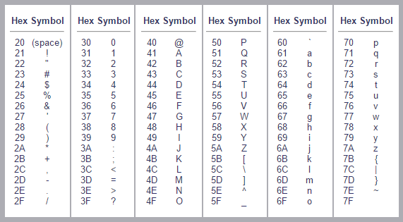
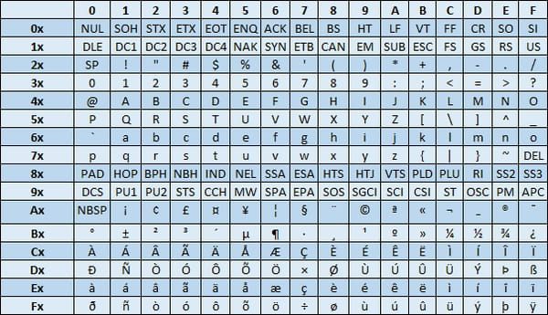
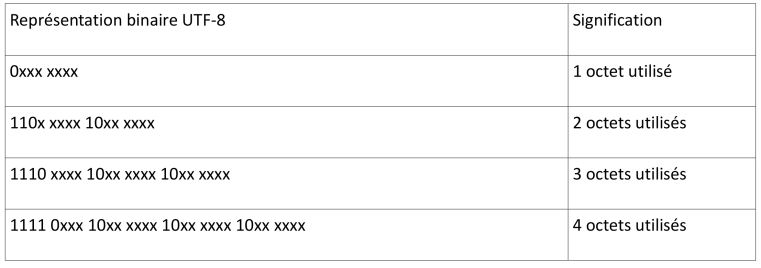

Séquence 5 - Activité 1: le codage des caractères
=================================================

En recherchant un extrait du « Seigneur des anneaux » sur Internet avec un navigateur mal configuré, nous sommes tombés sur une page web, dont le contenu est reproduit ci-dessous. 

> Les anneaux de pouvoir (au nombre de 20) sont d'abord décrits au début de la Communauté de l'Anneau dans un poème, connu depuis 
> longtemps des Elfes, énoncé par Gandalf à Frodon Sacquet.
>
> Trois anneaux pour les rois Elfes sous le ciel,
>
> Sept pour les seigneurs Nains dans leurs demeures de pierre,
>
> Neuf pour les Hommes, mortels destinés au trépas,
>
> Un pour le Seigneur Ténébreux sur son sombre trône,
>
> Dans le Pays de Mordor où s'étendent les Ombres.
>
> Un anneau pour les gouverner tous. Un anneau pour les trouver,
> 
> Un anneau pour les amener tous et dans les ténèbres les lier,
>
> Au Pays de Mordor où s'étendent les Ombres.

!!! question "Analyser"
    Expliquer la situation.
    Préciser quel type de lettres pose problème.

## Le code ASCII
Le code ASCII (**A**merican **S**tandard **C**ode for **I**nformation **I**nterchange), défini aux Etats-Unis en
1963, est basé sur un tableau contenant les caractères les plus utilisés en langue anglaise. Chaque
caractère est représenté par un nombre écrit sur 7 bits (ce qui donne $2^7=128$ combinaisons possibles).  

**Table de codes ascii (en hexadécimal)** 

!!! question "Analyser et réutiliser des solutions"
    
    * Coder, à l'aide de la table ci-dessus, la phrase suivante : *La compagnie de l’anneau*.
    * Retrouver le texte correspondant au code ASCII suivant : (46 72 6F 64 6F 6E 20 6C 65 20 48 6F 62 62 69 74).
    * Justifier, pourquoi il n'est pas possible de coder correctement le texte *Mon précieux* à l'aide du code ASCII.

## La norme ISO 8859-1 (latin 1)

La nécessité de représenter des caractères non présents dans la table ASCII tels que ceux de
l’alphabet latin comme le «à», le «é», «ç» ... impose l’utilisation d’un autre code.
Ces codes sont des extensions du code ASCII.  
Pour cela le 8ème bit est utilisé ce qui permet de coder
256 caractères (128 caractères supplémentaire par rapport au code ASCII de base). On parle de code
ASCII étendu. 

Les tables ascii étendu sont souvent présentés sous la forme de tableau à double entrées.  

L’ISO, organisation internationale de normalisation, propose plusieurs variantes de ce
code, adaptée aux différentes langues. Nous utilisons la norme ISO-8859-1 nommée aussi ISO-Latin1.

!!! question "Réutiliser des solutions"
    Coder le texte *Mon précieux* en utilisant la table « ASCII étendu » précédente.

## La norme ISO 10646 (Unicode)
### Présentation

La généralisation de l’utilisation d’Internet dans le monde a ainsi nécessité une prise en compte d’un
nombre beaucoup plus important de caractères. Ce que permet la norme Unicode qui établit une
correspondance unique caractère - code numérique (on dit aussi *charset* en anglais).  

Le répertoire Unicode peut contenir plus d'un million de caractères. Unicode définit des méthodes standardisées pour coder
et stocker cet index sous forme de séquence d'octets : UTF-8, UTF-16, UTF-32 et leurs différentes variantes. 

L’UTF-8 est l’encodage (*encoding* en anglais) le plus répandu. Les navigateurs Internet utilisent le
codage UTF-8 par défaut. Le langage de programmation utilisé en NSI (Python) gère l'Unicode par défaut.

L’index des caractères UNICODE est disponible à l’adresse suivante [http://www.unicode.org/fr/charts/charindex.html](http://www.unicode.org/fr/charts/charindex.html).
Par ailleurs, une description détaillée de l'UTF-8 peut être trouvée sur Wikipedia [https://fr.wikipedia.org/wiki/UTF-8](https://fr.wikipedia.org/wiki/UTF-8)

### Description rapide et simplifiée

L'encodage UTF-8 utilise 1, 2, 3 ou 4 octets. Si le code du caractère est inférieur ou égal à 127, on
n’utilise qu'un octet avec le bit de poids fort à 0. Sinon, les bits de poids fort du premier octet forment
une suite de 1 indiquant le nombre d'octets utilisés pour coder le caractère. Les octets suivants
commencent tous par le bloc binaire 10.

!!! question "Analyser et mobiliser des concepts"
    Sous Unicode le caractère *inférieur ou égal* a comme point de code U+2A7D.  
    
    * Quelle la valeur binaire de 0x2A7D ? Combien d’octets seront nécessaires pour représenter ce caractère en unicode UTF-8?
    * Déterminer la représentation binaire puis hexadécimale du caractère inférieur ou égal en Unicode UTF-8.
