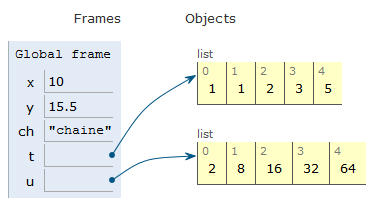
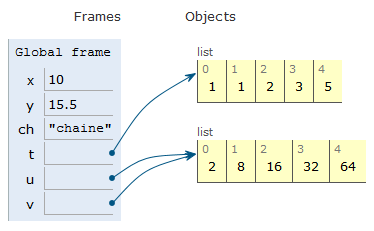

TYPES CONSTRUITS: LES TABLEAUX 
==============================

## Introduction: les structures de données

Une des problématiques importantes de l'informatique est le stockage de données. Pour traiter efficacement ces dernières, il faut les ranger **de manière adéquate en mémoire**.  
L'objet informatique utilisé pour stocker ces données en mémoire s'appelle une **structure de données**. Une structure de donnée est caractérisée par les opérations qu'elle permet ainsi que leur coût (notion développée dans le cours d'algorithmique).  
La première structure de donnée étudiée en spécialité NSI est le **tableau**.

## Qu'est-ce qu'un tableau ?

!!! info "Définition"
    Un tableau est une suite de valeurs de même type, stockées dans des cases mémoires contigües.  

Un tableau permet de stocker plusieurs valeurs dans une seule variable et d'y accéder ensuite facilement. Python ne possède pas de type *tableau*, du moins pas sans utilisation de module spécialisé. De ce fait, on utilisera le type *list* de python pour construire des tableaux.  
En pratique, il s'agira d'énumérer  les valeurs entre **crochets et séparées par une virgule**.  
Ainsi, on déclare et affecte un tableau à la variable `t` en utilisant la syntaxe `t = [valeur_1, valeur_2, ..., valeur_n]`.


```python
# Exemple

t = [12, 13, 15]
```

Les valeurs 12, 13 et 15 sont indexées c'est-à-dire qu'on peut les repérer par leur position à l'aide d'un indice.  

!!! important "Important"
    Les index (*indices*) commencent **partir de zéro** en python.  

```
  0    1    2     Index
  |    |    |
  v    v    v
+----+----+----+
| 12 | 13 | 15 |  Tableau
+----+----+----+
```

Seules les valeurs sont stockées, les indices ne le sont pas. On accède à une valeur à l'aide de la notation `t[indice]`.  
Exemple


```python
print(t[2])
```

    15


Si on tente un accès en dehors des cases valides du tableau on obtient une erreur de type `IndexError`:

```python
t[4]
---------------------------------------------------------------------------
IndexError                                Traceback (most recent call last)
<ipython-input-4-5977d405d0f2> in <module>
----> 1 t[4]

IndexError: list index out of range
```

On obtient la taille d'un tableau avec la fonction native `len`.


```python
len(t)
```


    3


Le contenu d'un tableau peut être modifié: c'est une structure **mutable**. Pour cela, on utilise une affectation, exactement comme on l'a fait avec les variables jusqu'à maintenant:


```python
t[1] = 0
print(t)
```

    [12, 0, 15]


!!! info "Remarques"
    *  le terme de `list` bien que couramment utilisé en python est un choix malheureux de vocabulaire; en effet la confusion est souvent faite 
    avec une structure de donnée qui sera vue en terminale;
    *  conformément au programme, on n'utilisera que des tableaux **homogènes** (c-à-d contenant qu'un seul type de donnée), bien que les `list` 
    de python permettraient de construire des tableaux hétérogènes.

## Comment accéder aux éléments d'un tableau ?

### Itération sur les index

Une première possibilité pour parcourir les éléments d'un tableau est d'utiliser une boucle `for` sur les indices. Parcourir un tableau `t` en **itérant** sur les indices se fait de la manière suivante:  

```python 
for i in range(len(t)):
    traitement()
```

Dans le code précédent, le générateur d'entier `range` permet d'obtenir une **séquence** allant de `0` à `len(t)-1`. Par exemple, le code suivant permet d'afficher tous les éléments du tableau:


```python
for i in range(len(t)): # parcours tout le tableau
    print(t[i]) # affiche le ième élément
```

    12
    0
    15


### Itération sur les éléments

Une autre possibilité pour parcourir les éléments d'un tableau est d'utiliser une boucle `for` sur les éléments. Parcourir un tableau `t` en **itérant** sur les éléments se fait de la manière suivante:  

```python 
for element in t:
    traitement()
```

Dans le code précédent, `element` est une variable qui va valoir successivement `t[0]`, `t[1]`, etc.  

Exemple


```python
for elt in t:
    print(elt)
```

    12
    0
    15


## Comment construire de grands tableaux ?

Lorsque le tableau à construire est très grand, il est difficile d'énumérer tous ses éléments. On utilise alors la construction typique de Python:


```python
DIM = 500 # taille du tableau
t = [0] * DIM
print(len(t))
```

    500


Supposons que l'on veuille remplir ce tableau avec le carré des 500 premiers entiers:


```python
for i in range(DIM):
    t[i] = i * i

### Que vaut t[25] ?
print(t[25])
```

    625


On peut également **concaténer** c'est-à-dire mettre bout à bout, deux tableaux:


```python
t2 = [7, 10, 13] + [16, 19]
print(t2)
```

    [7, 10, 13, 16, 19]


## Quelques subtilités

Contrairement aux variables dont le type est un type de base comme `int`, `float` ou `string`, une variable de type tableau ne contient pas les valeurs. Elle contient une **référence vers l'objet qui contient les valeurs**, symbolisé sur le schéma ci-dessous par un point relié à une flêche.  

```python
x = 10
y = 15.5
ch = "chaine"
t = [1, 1, 2, 3, 5]
u = [2, 8, 16, 32, 64]
```



!!! info "Remarque"
    Ce schéma a été obtenu avec un outil en ligne très intéressant [Pythontutor](https://pythontutor.com/) et qui nous sera très utile dans certaine situation.

Une conséquence importante de ce mode de représentation est que **l'affectation du tableau à une autre variable ne crée pas un nouveau tableau**, elle ne fait que recopier la référence vers l'objet `list` qui contient les valeurs.  
Ainsi, si à la suite du code précédent, on ajoute:  

```python
v = u
```

cela signifiera que `v` fait référence au même objet `list` que `u`.



Cela implique que **toute modification de v entraine une modification de u**. Par exemple,  

```python
v[0] = 0
```

entraine:  
  

!!! warning "Recommandation"
    Dans la mesure du possible on évitera d'avoir deux variables qui référencent le même tableau.
