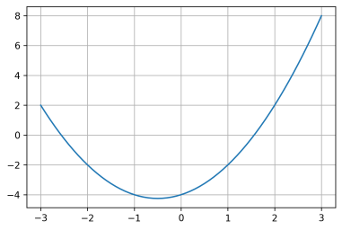

Types construits - Exercices
=======================

## Tableau défini en compréhension

1. Que construit l'expression ci-dessous?  

```python
t = [i % 3 for i in range(100)]
```

2. On défini une fonction $f$ telle que:  

```python
def f(t):
    """
    renvoie ...?
    """
    return [n for n in t if n > 0]
```
Etant donné `x = [-5, 2, 3, -7, 42, 7]`. Que vaut `f(x)`?

## Utilisation des tableaux en compréhension

On souhaite écrire un programme donnant le graphe d'une fonction $f$ sur un intervalle donné.  



On définit d'abord la fonction $f$.


```python
def f(x):
    return x ** 2 + x - 4
```

1. Que réalise l'instruction `X = [0.1 * n for n in range(-30, 31)]`?
2. Construire un tableau `Y` par compréhension, qui correspond à l'image de `X` par $f$. *En d'autres termes, on devra appliquer la fonction* $f$ *à chaque élément de* `X` *pour construire le tableau* `Y`.


```python
X = [0.1 * n for n in range(-30, 31)]
# ENTRER VOTRE CODE ICI
```

**3**. Éxecuter la cellule ci-dessous. Le résultat obtenu est-il conforme à la demande ?


```python
import matplotlib.pyplot as plt


def tracer(t_x, t_y):
    assert len(t_x) == len(t_y), "Erreur: tableaux incohérents"
    plt.plot(t_x, t_y)
    plt.grid()
    plt.show()

tracer(X, Y)
```

## Composantes d'un vecteur
Ecrire une fonction `vecteur` qui prend en paramètres deux p-uplets qui correspondent aux coordonnées dans le plan de deux points A et B et qui renvoie un p-uplet correspondant aux coordonnées du vecteur $\overrightarrow{AB}$ dans le plan.


```python
#Votre code dans cette cellule
def vecteur(pt_A, pt_B):
    """
    Renvoie un p-uplet ayant deux composantes correspondant aux coordonnées d'un vecteur AB.
    pt_A, pt_B: tuple à deux éléments, correspondant aux coordonnées (xA, yA) et (xB, yB) de
    deux points A et B.
    """
    # Indications
    # pt_A: ce sont les coordonnées de A. Exemple:
    # pt_A = (2, 5); on a donc xA = 2 et yA = 5
    # Il en est de même pour B;
    # On doit renvoyer (xB - xA, yB - yA)
    pass
```


```python
# TEST - DECOMMENTER et EXECUTER
assert vecteur((5,1), (3,4)) == (-2, 3), "La fonction ne passe pas le test"
```

## Trouver le jour correspondant à une date

Python possède un module permettant de gérer les dates. Il s'agit du module `datetime`. On y trouve, entre autres, une `classe` (*ce mot sera défini en terminale*) qui permet la création d'objet `date` à partir d'entiers naturels représentant **l'année, le mois et le jour**.  
On y trouve aussi une méthode `today()` dont on verra une utilisation plus loin.  

Par exemple, pour créer un objet `date` correspondant au 31 décembre 2019, on procèdera de la manière suivante:  

```python
from datetime import date


d = date(2019, 12, 31)
```

Les attributs year (*année*), month (*mois*) et day (*jour*) d'un objet date `d` peuvent être obtenus par `d.year`, `d.month` et `d.day`.

**1**. Consulter la documentation relative aux objets de type `date` et notamment la méthode `today()` et `weekday()`. *Indication: utiliser la fonction* `help` de python.

**2**. Éxécuter la cellule suivante qui utilise des objets `date`.  


```python
from datetime import date


d1 = date(2019, 12, 31)
d2 = date.today() # date d'aujourd'hui
print(d1.day, '/', d1.month, '/', d1.year)
print("Aujourd'hui, on est le ", end='')
print(d2.day, '/', d2.month, '/', d2.year)
```

**3**. À partir des exemples précédents, créer un objet `date_an` de type `date` et correspondant à votre date d'anniversaire. 


```python
# À compléter

date_an = ...
```

**4**. Écrire une fonction `trouver_jour` (*en complétant la cellule suivante*) qui prend en paramètre un objet de type date et qui renvoie un p-uplet à 4 composantes, qui sont dans l'ordre:  

* le jour, ici une chaine de caractères valant 'lundi', 'mardi', etc.
* le jour dans le mois, ici un entier valant 1, 2, .., 30 ou 31 selon le mois;
* le mois, une chaîne de caractère valant 'janvier', 'février', etc.
* l'année, un entier positif.

??? info "Aide: méthode weekday()"
    Cette méthode permet d'obtenir **le jour correspondant à une date**.  
    Par exemple, le premier jour de l'an 2000 correspondait à :  
    
    ```python
    from datetime import date
    
    
    d2000 = date(2000,1,1)
    print(d2000.weekday())
    5
    ```
    
    D'après la documentation, si lundi correspond à 0 alors 5 correspond à un samedi


```python
#Votre code ici
def trouver_jour(d):
    """
    Renvoie le jour sous la forme d'un p-uplet à 4 composantes: jour de la semaine (string), 
    jour dans le mois (int), mois (int) et année (int).
    d: objet de type date
    """
    
    # Constantes de type p-uplet à utiliser
    SEMAINE = ('lundi', 'mardi', 'mercredi', 'jeudi', 'vendredi', 'samedi', 'dimanche')
    MOIS = ('janvier', 'février', 'mars', 'avril', 'mai', 'juin', 'juillet',
           'août', 'septembre', 'octobre', 'novembre', 'décembre')
    #A compléter
    pass
```


```python
# TEST - DECOMMENTER et EXECUTER
assert trouver_jour(date(2021, 12, 6)) == ('lundi', 6, 'décembre', 2021), "La fonction ne passe pas le test"
```

**5**. Trouver le jour de votre naissance.


```python
# Votre code ici
```

## Analyse d'un tableau de notes
On souhaite analyser les notes obtenues par un groupe de spécialité NSI. Ces résultats sont modélisés sous la forme d'un tableau de nombres flottants compris entre 0 et 20. Ecrire une fonction `analyse_note` qui prend comme paramètre un tableau de notes et qui renvoie un p-uplet composé de la médiane, la moyenne et l'écart type.  
On utilisera des fonctions disponibles dans la librairie standard de python, plus précisemment dans le module `statistics`: `median`, `mean` et `stdev`.

1.  Prendre connaissance de la documentation sur les fonctions `median`, `mean` et `stdev` du module `statistics`.  
2.  L'écart type est défini comme la racine carrée de la variance. La fonction racine carrée `sqrt` peut être importée depuis le module `math`. Compléter la fonction `analyse_note` dans la cellule déjà préparée ci-dessous, puis tester votre code.


```python
#1. Afficher l'aide sur les fonctions median, mean et variance du module statistics
```


```python
#2. Votre code dans cette cellule
from math import sqrt
from statistics import median, mean, stdev


def analyse_note(t):
    """
    Renvoie un p-uplet composé de la médiane, la moyenne et l'écart type d'échantillon de notes.
    t: tableau de nombres flottants compris entre 0.0 et 20.0
    """
    #A compléter
    pass
```


```python
# TEST - DECOMMENTER et EXECUTER
from math import fabs


notes = [15, 10, 3, 9, 5, 13, 2]
epsilon = 1e-5
assert fabs(analyse_note(notes)[0] - 9.0) < epsilon, "La fonction ne passe pas le test"
assert fabs(analyse_note(notes)[1] - 8.14285) < epsilon, "La fonction ne passe pas le test"
assert fabs(analyse_note(notes)[2] - 4.98091) < epsilon, "La fonction ne passe pas le test" 
```

## Itérer sur les éléments d'un dictionnaire
Au zoo de Beauval, il y a 5 éléphants d'Asie, 17 écureuils d'Asie, 2 pandas d'Asie, etc. On modélise cet inventaire avec un dictionnaire, de la façon suivante:


```python
zoo_Beauval = {
    "éléphant" : ("Asie", 5),
    "écureuil" : ("Asie", 17),
    "panda" : ("Asie", 2),
    "hippopotame" : ("Afrique", 7),
    "girafe" : ("Afrique", 4)}
```

De la même façon on représente le zoo de La Flèche:


```python
zoo_LaFleche = {
    "ours" : ("Europe", 4),
    "tigre" : ("Asie", 7),
    "hippopotame" : ("Afrique", 3),
    "girafe" : ("Afrique", 11)}
```


```python
maxi = 0
nom_animal = ''
for categorie in zoo_Beauval.items():
    if categorie[1][1] > maxi:
        maxi = categorie[1][1]
        nom_animal = categorie[0]
        
```

    Asie
    Asie
    Asie
    Afrique
    Afrique


On souhaite écrire une fonction `plus_grand_nombre` qui prend un zoo en paramètre et qui retourne le nom de l'animal le plus représenté dans ce zoo.  

**1**. Quel type d'itération doit-on utiliser dans cette fonction?  

   * `for cle in d.keys()`
   * `for val in d.values()`
   * `for cle,val in d.items()`
   * Aucune itération
   
**2**. Écrire cette fonction


```python
#Votre code dans cette cellule
def plus_grand_nombre(zoo):
    """
    Renvoie le nom de l'animal (string) le plus représenté dans le zoo passé en paramètre.
    zoo: dictionnaire
    """
    pass
```


```python
# TEST - DECOMMENTER et EXECUTER
assert plus_grand_nombre(zoo_LaFleche) == "girafe", "La fonction ne passe pas le test"
assert plus_grand_nombre(zoo_Beauval) == "écureuil", "La fonction ne passe pas le test"
```

**3**. On souhaite écrire une fonction `nombre_total` qui prend en paramètres un zoo et un nom de continent. Cette fonction doit renvoyer le nombre total d'animaux originaires de ce continent. Quel type d'itération doit-on utiliser dans cette fonction?
   
   * `for cle in d.keys()`
   * `for val in d.values()`
   * `for cle,val in d.items()`
   * Aucune itération  
   
**4**. Écrire cette fonction


```python
#Votre code dans cette cellule
def nombre_total(zoo, continent):
    """
    Renvoie le nombre total d'animaux (entier naturel) présents dans le zoo 
    et originaire du continent.
    zoo: dictionnaire
    continent: string
    """
    #A compléter
    pass
```


```python
# TEST - DECOMMENTER et EXECUTER
assert nombre_total(zoo_LaFleche, "Afrique") == 14, "La fonction ne passe pas le test"
assert nombre_total(zoo_Beauval, "Asie") == 24, "La fonction ne passe pas le test"
```

**5**. On souhaite écrire une fonction `nombre` qui prend en paramètres un zoo et un nom d'animal. La fonction doit renvoyer le nombre de représentant de cet animal (entier naturel) dans le zoo. Quel type d'itération doit-on utiliser dans cette fonction?

   * `for cle in d.keys()`
   * `for val in d.values()`
   * `for cle,val in d.items()`
   * Aucune itération

**6**. Écrire cette fonction


```python
#Votre code dans cette cellule
def nombre(zoo, animal):
    """
    Renvoie le nombre total d'animaux (entier naturel) présents dans le zoo 
    et originaire du continent.
    zoo: dictionnaire
    continent: string
    """
    #A compléter
    pass
```


```python
# TEST - DECOMMENTER et EXECUTER
assert nombre_total(zoo_LaFleche, "Afrique") == 14, "La fonction ne passe pas le test"
assert nombre_total(zoo_Beauval, "Asie") == 24, "La fonction ne passe pas le test"
```
