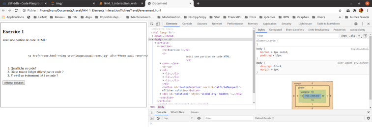

ELEMENTS D'INTERACTION DANS UNE PAGE WEB
==========================================

## Analyse d'une page web

### Les composants graphiques permettant l'interaction avec l'utilisateur

Dans une page web, des éléments servent à structurer la page et à fournir sa *sémantique*. D'autres vont permettre à l'utilisateur d'interagir avec la page.

!!! question "À faire"
    Saisir et exécuter le code ci-dessous dans [jsfiddle](https://jsfiddle.net) ou avec VSCode + Chrome

```html
<!DOCTYPE html>
<html lang="fr">
<head>
    <meta charset="UTF-8">
    <title>IHM sur le web en NSI</title>
    <style>
        span:hover {
            color: royalblue;
            font-size: 120%;
        }
    </style>
</head>
<body>
    <article>
        <h1>Identification</h1>

        <form action="">
            <label for="nom">Votre Nom</label> 
            <input type="text" name="nom" id="nom">
            <label for="prenom">Votre prénom</label>
            <input type="text" name="prenom" id="prenom">
            <label for="mdp">Mot de passe</label>
            <input type="password" name="mdp" id="mdp">
            <input type="submit" value="Valider">
        </form>
    <h1>Les ressources</h1>
    <p> 
    Le site incontournable pour l'étudiant ayant un parcours <span>Web</span> dans son cursus est le site 
    <strong>MDN  web docs</strong>. il s'agit d'une communauté ouverte de développeurs et rédacteurs 
    qui créent des ressources afin de rendre le <span>Web</span> meilleur. <br>
    <a href="https://developer.mozilla.org/fr/docs/Apprendre" target="_blank">Adresse du site</a>   
    </p>
    <p>Son dernier logo</p>
    
    <h1>Les langages</h1>
    <p>Les trois langages à connaître sont:</p>
    <ol>
        <li>HTML</li>
        <li>CSS</li>
        <li>Javascript</li>
    </ol>
    <label for="langage">Sélectionner votre niveau dans ces trois langages</label>
    <select name="listlangages" id="langages">
        <option value="debutant">Débutant</option>
        <option value="inter">Intermédiaire</option>
        <option value="expert">Expert</option>
    </select>
    </article>
</body>
</html>
```

Une possibilité d'interaction avec la page est donnée par l'utilisation de *composants graphiques* (formulaire, liste déroulante, case à cocher, bouton, etc.). On trouvera une liste exhaustive de toutes les possibilités à cette [adresse](https://developer.mozilla.org/fr/docs/Web/HTML/Element/Input).

!!! question "À faire"
    Quels sont les éléments qui permettent une interaction 
    dans la page précédente?

## Quels événements sont associés aux composants graphiques?

### Découvrir les attributs d'événements

??? question "À faire"
    Ouvrir le fichier `evenement.html` avec Chrome. Ouvrir 
    la *console de développement web* (touche **F12**).
    
    
    **1.** Quel élément graphique de la page permet d'interagir 
    avec l'utilisateur ?  
    **2.** Lister tous les attributs de cet élément. Etant donné 
    le caractère explicite de leur nom, faire une hypothèse sur 
    leur rôle.  
    **3.** Quel événement provoque un changement dans la page ?  
    **4.** À quel attribut, ce changement est-il lié?

### Qu'appelle-t-on événement et comment est-il lié à une page web?

On appelle **événement** une action de l'utilisateur ou d'un composant du navigateur. Les événements associés à des balises HTML sont nombreux. Voici quelques exemples:

| Dénomination de l'événement (event en anglais) | Description                           | Domaine d'utilisation    |
|------------------------------------------------|---------------------------------------|--------------------------|
| onclick                                        | Clic du bouton gauche                 | Pointage souris          |
| oninput                                        | Modification de champ d'un formulaire | Formulaire               |
| onload                                         | Chargement complet d'une page         | Traitement des pages web |

Ils sont liés aux éléments d'une page web en tant qu'**attribut**. Les attributs d'événements portent un nom préfixé par `on`. La syntaxe habituelle est:  

`<tag on....="action()"></tag>`  

Dans cette écriture, `tag` est le nom d'une balise, le terme `on....` est l'événement et `action()` est une fonction qui traite l'événement (voir paragraphe suivant).  
On trouvera sur le site [W3Schools.com](https://www.w3schools.com/tags/ref_eventattributes.asp) une liste exhaustive des attributs d'événements.

??? question "Application directe"
    On dispose d'une page `exercice.html` (dans le dossier 
    `Ex_seq_6`) dans laquelle on 
    souhaiterait:  
    
    * rendre le lien actif (adresse du site: 
    https://www.w3schools.com/)
    * que le lien réagisse à un clic en ouvrant un `popup`
    (*fenêtre surgissante*) qui indique 'Très bon choix !'.  
    
    Réaliser ces deux consignes.  
    
    *Indications*: l'ouverture d'un `popup` (l'action à réaliser) 
    se fait avec la méthode `alert()` à qui on passe le texte à 
    afficher.

## Comment modifier le traitement des événements?

### Le langage utilisé
Le troisième langage incontournable du web est incontestablement **Javascript** (*autre dénomination ECMAScript*). Il est utilisé pour implémenter l'interactivité dans les pages web. Le programme de première NSI ne prévoit pas une étude approfondie de ce langage, aussi pour les curieux pourront visiter les excellentes adresses suivantes:

* [Openclassrooms](https://openclassrooms.com/fr/courses/2984401-apprenez-a-coder-avec-javascript) (*en français*);
* [W3Schools](https://www.w3schools.com/js/default.asp) (*en anglais*).

### Présentation de quelques exemples

#### Exemple 1: manipuler date et heure
Dans ce premier exemple simple, on souhaite afficher la date et l'heure si l'utilisateur clique sur le bouton.

??? question "À faire"
    Saisir et exécuter le code ci-dessous dans 
    [jsfiddle](https://jsfiddle.net) ou avec VSCode + Chrome.

```html
<!DOCTYPE html>
<html lang="fr">
<head>
    <meta charset="UTF-8">
    <title>Exemple 1</title>
</head>
<body>
    <p>Pour afficher la date et l'heure, cliquer sur le bouton</p>
    <button onclick="alert('Nous sommes le : '+ Date())">Quelle heure est-il?</button>
</body>
</html>
```

Ici l'événement traité est le clic (*du bouton gauche*) de la souris sur le bouton. Lorsque cet événement se produit, la fonction `alert` qui permet d'afficher un message dans une fenêtre de type *popup*. Le message est concaténé ici avec l'objet `Date` de Javascript.  

Les fonctions de traitement d'événements peuvent être beaucoup plus longue que dans ce premier exemple. Dans ce cas, **on évitera de passer tout le code dans l'attribut de l'élément comme dans cet exemple et on privilégiera une des méthodes traitées dans les prochains exemples**.

---

#### Exemple 2: utilisation de la balise script
On reprend le même exemple mais en déportant le traitement de l'événement `onclick` dans une fonction définie dans un élément `<script>`.

!!! question "À faire"
    Saisir et exécuter le code ci-dessous dans 
    [jsfiddle](https://jsfiddle.net) ou avec VSCode + Chrome.

```html
<!DOCTYPE html>
<html lang="fr">
<head>
    <meta charset="UTF-8">
    <title>Exemple 2</title>
    <script defer>
        function displayDate() {
            alert('Nous sommes le: ' + Date());
        }
    </script>
</head>
<body>
    <p>Cliquer sur le bouton pour afficher la date et l'heure.</p>
    <button onclick="displayDate()">Quelle heure est-il?</button>    
</body>
</html>
```

---
En Javascript une façon de déclarer une fonction est d'utiliser le mot clé `function` suivi d'un nom et d'éventuels paramètres entre parenthèses.  
L'attribut `defer` indique au navigateur de charger tous les éléments de la page avant d'exécuter le script. 

**Cette façon de procéder est acceptable**.  
***

#### Exemple 3: changer la couleur d'un paragraphe

On considère le code de l'exemple 3 suivant:

```html
<!DOCTYPE html>
<html lang="fr">
<head>
    <meta charset="UTF-8">
    <title>Exemple 3</title>
    <script defer>
        function dblClic() {
            let paraCible = document.getElementById("para1");
            paraCible.style.color = "red";
        }
    </script>
</head>
<body>
    <p id="para1">Double-cliquer sur ce paragraphe pour changer la couleur.</p>

    <p id="para2">
        L'exercice <br>
        La fonction 'dblClic()' doit être appelée lorsque l'utilisateur double clique sur le paragraphe identifié par "para1"
        Cette fonction modifie la couleur du texte de ce paragraphe.
    </p>
</body>
</html>
```

On souhaiterait modifier l'élément `p` approprié de cette page de sorte que le texte du paragraphe 1 passe en rouge lorsque l'utilisateur double-clique dessus. 

??? question "À faire"
    Saisir et exécuter le code ci-dessus dans 
    [jsfiddle](https://jsfiddle.net) ou avec VSCode + Chrome et 
    apporter les modifications nécessaires.

Un extrait de la documentation sur les attributs événementiels est donné ci-après:

| Attribute    | Value  | Description                                                        |
|--------------|--------|--------------------------------------------------------------------|
| onclick      | script | Fires on a mouse click on the element                              |
| ondblclick   | script | Fires on a mouse double-click on the element                       |
| onmousedown  | script | Fires when a mouse button is pressed down on an element            |
| onmousemove  | script | Fires when the mouse pointer is moving while it is over an element |
| onmouseout   | script | Fires when the mouse pointer moves out of an element               |
| onmouseover  | script | Fires when the mouse pointer moves over an element                 |
| onmouseup    | script | Fires when a mouse button is released over an element              |
| onmousewheel | script | Deprecated. Use the onwheel attribute instead                      |
| onwheel      | script | Fires when the mouse wheel rolls up or down over an element        |


---

#### Exemple 4: code javascript déporté

Une bonne pratique à adopter est de déporter le code javascript dans un fichier externe. Analysons le code HTML puis Javascript de la page `evenement.html` rencontrée plus haut.  

??? question "À faire"
    Ouvrir la page evenement.html avec Chrome avec sa console de 
    développement web (F12).

La gestion d'un clic sur le bouton est assurée par la ligne:

`<button id="boutonSolution" onclick="afficheMasque()">Afficher solution</button>`

L'évènement `onclick` est géré par l'appel de la fonction `afficheMasque()` qui est définie dans le fichier externe `script1.js`.

??? tip "En complément"
    Le code javascript de la fonction afficheMasque gérant le clic 
    sur le bouton.  
    
    ```javascript
    
    const afficheMasque = function () {
        // On utilise la propriété CSS visibility pour rendre visible ou pour masquer un élément

        let sol = document.getElementById("solution1")//sélection du bloc html contenant la solution 
        let etatAffichage = getComputedStyle(sol, null)//détermination de sa propriété visible ou caché

        let btn = document.getElementById("boutonSolution")
        //sélection de l'élément bouton

        if (etatAffichage.visibility == "hidden") {
            /*
            Si le bloc solution est caché, un clic le rendra visible;
            On change aussi le texte du bouton.
            */
            sol.style.visibility = "visible";
            btn.innerHTML = "Cacher solution"
        } else {
            /*
            Si le bloc solution est visible, un clic le rendra caché;
            On change aussi le texte du bouton.
            */
            sol.style.visibility = "hidden"; 
            btn.innerHTML = "Afficher solution"
        }
    }
    ```
        
    En Javascript, les blocs d'instructions sont délimités par les accolades `{` et `}`. L'indentation n'est significative comme en python, cependant elle améliore la lisibilité du code.  
    Les commentaires sont signalés par `//` ou la paire `/*`, `*/` selon qu'ils tiennent sur une ligne ou plusieurs lignes. Le mot clé `let` permet de déclarer des variables.  
    Javascript est utilisé ici pour modifier les propriétés CSS du bloc `div` contenant la solution:  
    `visibility = "visible"` ou `visibility = "hidden"`.

##### Alternative plus élégante

Une deuxième façon de procéder (plus élégante) est de ne pas surcharger le code HTML avec l'attribut `onclick` mais de gérer l'évènement `click` dans un fichier Javascript (voir fichier `script2.js`) avec une définition du type:  

```javascript
btn.addEventListener('click', (e) => {
...
});
```

On indique ainsi que l'on *écoute* l'événement `click` sur le bouton ciblé par `btn`, et que lorsque le clic survient, on exécute le traitement approprié.

---

#### Exercice  pour les plus curieux/rapides

On souhaiterait modifier légèrement le code de la fonction `afficheMasque()` de manière à ce que même si l'utilisateur clique sur `Afficher solution` celle-ci soit automatiquement cachée au bout de 5 secondes.  

On utilisera la méthode javascript `setTimeout` à qui on passera deux arguments: la fonction qui *cachera* le code à nouveau et le temps (*en millisecondes*) au bout duquel cette fonction sera exécutée. Typiquement, cette fonction sera appelée avec la syntaxe suivante:

```javascript
const cacher = function () {
    ....
};

setTimeout(cacher, 5000);
```

On peut trouver des exemples sur [le site MDN](https://developer.mozilla.org/fr/docs/Web/API/WindowOrWorkerGlobalScope/setTimeout)

----
**En résumé**
****

Les principaux éléments d'interaction d'une page web sont:

* les styles CSS;
* des éléments graphiques HTML comme des boutons, associés à des fonctions de traitements d'événements par le biais de leurs attributs.

Les fonctions de traitements des événements sont codées en javascript. On déportera les codes javascript dans un fichier externe. Dans les cas simples, il s'agira de:

* sélectionner un élément HTMl avec une méthode appropriée;
* modifier une propriété CSS de cet élément.
