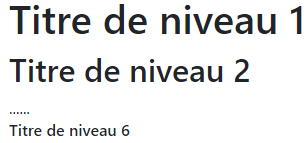

HTML5 & CSS3: LES BASES
=======================

*L'objectif est de rappeler puis d'approfondir des notions déjà rencontrées en SNT*.  
*Les tests de code pourront être réalisés de deux façons différentes*:  

* en ligne, sur [jsfiddle](https://jsfiddle.net);
* en local avec un éditeur de code (*Visual Studio Code*) + navigateur (*Chrome* de préférence).

## Les langages du web
Côté client, c'est-à-dire côté utilisateur, les langages incontournables sont:  

* HTML pour la description du contenu d'une page;
* CSS pour définir la mise en forme des pages;
* Javascript (*qui ne sera pas abordé dans ce chapitre*) pour permettre l'interactivité avec l'utilisateur.

## HTML

### Rappels et définitions

Le langage **HTML** est un langage de _balisage_ qui permet de décrire la **structure** et le **contenu** d'un document. Un navigateur web **donne un rendu graphique** au fichier textuel HTML.

!!! question "À faire"
    Tester le code ci-dessous dans <a href="https://jsfiddle.net">jsfiddle</a> ou avec VSCode + Chrome

```html
   <!DOCTYPE html>
   <html lang="fr">
   <head>
         <meta charset="UTF-8">
         <title>Document</title>
   </head>
   <body>
         <h1>Structuration de document</h1>
         <p>Les <em>balises</em> html doivent rendre compte de la structure de la page.</p>
   </body>
   </html> 
```

Un fichier HTML est structuré à partir de **balises** (*tag* en anglais). Ce sont des informations situées entre les caractères `<` et `>`.  
La première ligne n'est pas une balise HTML, en toute rigueur il s'agit d'une déclaration de type de document à destination du navigateur.  

Sauf exceptions, qui seront vues au fur et à mesure de la découverte du langage, **à une balise ouvrante <...> correspond une balise fermante </...>**. La premère exception rencontrée ici est la balise `meta` (qui est une balise *auto-fermante*).  

L'ensemble constitué des balises ouvrante et fermante et du contenu se trouvant entre ces balises, constitue un **élément** HTML.  Chaque élément HTML peut avoir des **attributs**. Ce sont des valeurs supplémentaires qui permettent de configurer ces éléments ou d'adapter leur comportement, avec une syntaxe du type `attribut="valeur"`.  
**Exemple**  

<figure>

<figcaption>Élément HTML</figcaption>
</figure>

### Application directe: décrire des éléments

!!! question "À faire"
    Donner les attributs et les valeurs associées, des éléments <em>meta</em> et <em>html</em> de l'exemple ci-dessus.

### Structuration des documents

D'une manière générale, un fichier HTML aura un *squelette* sera très proche de celui de l'exemple donné en introduction. On adaptera le contenu de l'élément `head`, notamment le texte de sa balise `<title>`, ainsi que celui de l'élément `body`.  

L'élément **obligatoire** `head` apporte des informations (*non affichées*) sur la page et l'élément `body` délimite le contenu de la page.

#### Les titres
Les titres peuvent être déclinés en six niveaux de 1 à 6 à l'aide des balises `<h1>` à `<h6>`:

```html
<h1>Titre de niveau 1</h1>
<h2>Titre de niveau 2</h2>
......
<h6>Titre de niveau 6</h6>
```

Le rendu est le suivant:  

<figure>

<figcaption>Balises de titre</figcaption>
</figure>

!!! question "À faire"
    Ajouter un titre de niveau à l'exemple d'introduction.

#### Les textes
Les textes peuvent être organisés en paragraphes avec la balise `<p>`.

**Exemple**

```html
<p>HTML contient environ 140 balises qui fournissent au navigateur des indications sur 
le sens d'un élément, son interprétation ou son affichage. Entre autres choses, les balises 
permettent de fournir des méta-données pour le document HTML, de mettre en avant certaines 
phrases, d'ajouter des fichiers multimédias ou de gérer des formulaires en ligne.
</p>
```
On peut également présenter du texte sous forme de **listes** ordonnées:
```html
Les parties essentielles d'un document HTML:
<ol>
    <li>l'élément html;</li>
    <li>l'élément head;</li>
    <li>l'élément body.</li>
</ol>
```

!!! question "À faire"
    Ajouter la liste ci-dessus à l'exemple d'introduction, dans <a href="https://jsfiddle.net">jsfiddle</a>. Commentez le rendu.

La présentation peut se faire également sous forme de listes **non** ordonnées:
```html
Les parties essentielles d'un document HTML:
<ul>
    <li>l'élément html;</li>
    <li>l'élément head;</li>
    <li>l'élément body.</li>
</ul>
```

!!! question "À faire"
    Modifier le code HTML sur <a href="https://jsfiddle.net">jsfiddle</a> de manière à avoir une liste non ordonnée. Commentez le rendu.

#### Liens et ressources
Une des caractéristiques essentielles de HTML est de fournir des liens *hypertextes*. Ces derniers sont insérés avec la balise `<a>` (*ancre*). Cette balise est utilisée avec l'attribut `href` qui fournit l'adresse de la ressource.  

```html
<a href="https://www.w3schools.com/tags/tag_a.asp">Lien vers W3schools.com</a>
```

!!! question "À faire"
    Ajouter un lien vers lien vers W3school à votre page web.

Parmi les ressources, on peut citer les images. On les insère dans un document HTML avec une balise auto-fermante `` à qui on doit fournir deux attributs `src="nom_fichier.jpg" alt="texte_alternatif"`. 

**Exemple**  

```html

```
Rendu:  

<figure>

<figcaption>Logo HTML 5</figcaption>
</figure>

!!! question "À faire"
    Ajouter le logo de la fondation Mozilla à votre page.

Son adresse est la suivante: https://www.mozilla.org/media/protocol/img/logos/mozilla/black.40d1af88c248.svg

#### Conseils: utilisation de balises sémantiques

HTML5 accentue encore plus l'objectif de bien structurer un document en y ajoutant de nouvelles balises (*par rapport à HTML4*). Parmi ces nouvelles balises, on peut citer, entre autres: `header`, `nav`, `section`, `article`, `aside` et `footer`. Ces balises sont dites *sémantiques*, c'est-à-dire qui ont du sens, ... par opposition à d'anciennes balises génériques comme `div` ou `span`.  

Bien qu'il ne s'agisse pas d'une règle absolue, voici un exemple correct (au sens HTML5) de structure de document:  

<figure>

<figcaption>Balises sémantiques</figcaption> 
</figure>

Dans la mesure du possible, on réservera la balise générique `div` pour des regroupements d'éléments nécessitant un traitement CSS (voir ci-dessous) spécifique.

## CSS

### Qu'est-ce que le CSS et comment le mettre en application?

Le langage CSS (*Cascading Style Sheet*) est un langage permettant de **définir  la mise en forme des éléments HTML** constituant une page web. Il est important de retenir: **HTML est gère le 'fond', CSS gère la 'forme'**. Il existe trois emplacements pour placer les **règles de style** CSS associées à un document. 

### Règles de style en ligne - A EVITER ABSOLUMENT-

Il s'agit de définir une règle de style directement via l'attribut `style`d'un élément. Sa syntaxe est la suivante:  

`<tag style="definition_des_styles">....</tag>` où `definition_des_styles` est de la forme `propriete: valeur;`.   

**Exemple**  

```html
<p style="text-align: right; border: 2px solid red;">Lorem ipsum dolor sit amet consectetur. <br>
    adipisicing elit deleniti magni sequi ducimus ad similique quo beatae dolor tempora et cum. <br>
    corporis enim earum eligendi unde itaque dicta, blanditiis aut consequuntur?
</p>
```
!!! warning "Attention"
    Cette méthode est à déconseiller franchement car elle rend le code HTML peu lisible et on mélange la forme et le fond.

!!! question "À faire"
    Tester la mise en forme précédente en l'ajoutant à votre page.

### Règles de style interne - ACCEPTABLE-
Il s'agit de déclarer les règles de style à l'intérieur d'une balise `<style>` de l'élément `head` du document HTML. Les règles étant écrites les unes en dessous des autres (*la syntaxe détaillée sera vue dans le prochain paragraphe*).    
**Exemple**
```html
   <!DOCTYPE html>
   <html lang="fr">
   <head>
         <meta charset="UTF-8">
         <title>Document</title>
         <style>
               p { 
                 text-align: right; 
                 border: 2px solid gray;
                 }
               .remarque {color: red;}
         </style>
   </head>
   <body>
      <p>Lorem ipsum dolor sit amet consectetur adipisicing elit.<br> 
         Deleniti magni sequi ducimus <span class="remarque"> similique dolor tempora</span> et cum. <br>
         corporis enim earum eligendi unde itaque 
         dicta, blanditiis aut consequuntur?
      </p>
   </body>
   </html>
```

!!! question "À faire"
    Tester le code ci-dessus.

Cette méthode est acceptable mais elle présente l'inconvénient de *mélanger* le fond et la forme et surtout de **ne pas permettre la réutilisation** des règles de style dans d'autres pages (*à moins de faire du copier-coller*).

### Règles de style dans un fichier externe - A PRIVILEGIER-
Les règles de style sont définies dans un fichier *texte* externe, d'extension `.css`. La présence de ce fichier doit être signalé au navigateur dans l'élément `head`avec une balise `<link>`:  

```html
<head>
    ......
    <link rel="stylesheet" href="style/fichier.css" />
</head>
```

si on suppose que le fichier s'appelle `fichier.css` et qu'il se trouve dans le dossier `style`. On remarque au passage que la **balise link est auto-fermante**.  

La syntaxe d'une règle de style CSS est la suivante:  

```html
selecteur {
    propriete1: valeur1;
    propriete2: valeur2;
    ...
}
```

Le **selecteur** peut être un tag HTML, l'identifiant d'un élément précédé du caractère `#` (sans espace) ou le nom d'une classe précédé du caractère `.` (*point*).  
**Exemple de** `fichier.css`  

```javascript
p {
    text-align: right;
    border: 2px solid gray;
}

.remarque {
    color: red;
}
```

On voit ici tout l'intérêt à ajuster les attributs `class` et `id` des éléments HTML lors de la construction de la page (voir documentation sur W3Schools.com pour [class](https://www.w3schools.com/tags/att_global_class.asp) et [id](https://www.w3schools.com/tags/att_global_id.asp)).


## Quelques propriétés CSS

Il n'est pas question questions de citer toutes les propriétés CSS (qu'on peut trouver sur [W3Schools.com](https://www.w3schools.com/cssref/css3_pr_all.asp)), mais quelques unes fréquemment utilisées.  

* `font-size`: fixe la taille de la police;
* `color`: fixe la couleur du texte;
* `text-align`: définit l'alignement horizontal du texte;
* `background-color`: couleur d'arrière plan;

---

