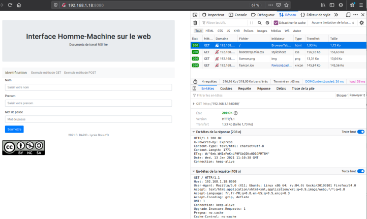
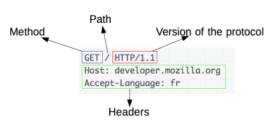
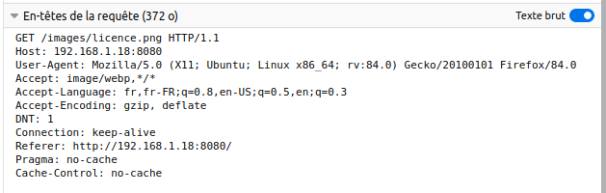

INTERACTIONS CLIENT-SERVEUR: protocole HTTP
==========================================

## Modèle client-serveur et protocole http.

!!! tip "Définition"
    On appelle interaction client-serveur un mode de communication entre un programme qualifié de *client* qui 
    **envoie des requêtes** et un programme dit *serveur* qui y **répond**.  

Dans le cas du Web, le client peut être un navigateur (*Google Chrome, Firefox, etc*) et le serveur un programme tel que *Apache, Nginx, etc*.  
Le protocole utilisé est **HTTP**.

## Les outils utilisés

On utilisera le navigateur *Firefox* avec sa console de développement (voir [la vidéo pour la configuration](https://tube-outremer.beta.education.fr/videos/watch/f6315495-d53d-435b-9d2a-9ec3fc23e05f?loop=1) côté client).  
Côté serveur, on utilisera un programme léger écrit en Javascript (*Node.js* plus exactement). L'adresse de ce serveur noté `xxx.xxx.xxx.xxx:8080` sera fournie par le professeur au cours de la séance.

## Analyse d'un échange

### Que se passe-t-il après avoir saisi une URL?

!!! question "À faire"
    Ouvrir l'URL http://xxx.xxx.xxx.xxx:8080/ dans Firefox ainsi que la console de développement.

*Rappel*  
L'URL est composée de la manière suivante: **protocole://adresse-ou-nom/ressource**. Le protocole est souvent HTTP (ou HTTPS); on écrit généralement un nom plutôt qu'une adresse (le DNS fait la conversion) et la ressource peut être une page HTML, un image, une vidéo etc. 

La partie haute de la console de développement liste les fichiers nécessaires à l'affichage de la page.  

!!! question "À faire"
    Combien de requêtes sont nécessaires à l'affichage de la page '/' ? Quels types de fichiers sont demandés?

L'accès à une ressource se fait selon le protocole HTTP. Le détail de l'échange peut être suivi dans la console de développement.

!!! info "En résumé"
    Pour afficher une page web le navigateur (client) réalise les opérations suivantes:  
    
    * ouverture d'une connection TCP à destination du serveur;
    * envoi d'un *message* HTTP (qui est lisible en version 1.1);
    * lecture de la réponse du serveur;
    * fermeture ou réutilisation de la connection pour d'autres requêtes. 

### Envoi d'une requête par le client

La deuxième partie de la console détaille, entre autres, les requêtes du client (navigateur) envoyées au serveur. Une requête HTTP est composée d'une première ligne où figurent la **méthode**, le **chemin** de la ressource et la **version du protocole**. Ensuite, on trouve plusieurs lignes d'entête.  

On peut avoir une signification de chaque entête en cliquant sur le point d'interrogation associé (bouton *Texte brut* désactivé) dans la console de développement.

!!! question "À faire"
    Quel est le chemin de la ressource associée à la troisième requête lors de l'affichage de la page 
    précdente?

La méthode *GET* est utilisée pour récupérer une ressource. D'autres méthodes existent, on pourra consulter [cette page](https://developer.mozilla.org/fr/docs/Web/HTTP/M%C3%A9thode) pour avoir une liste complète. On utilisera notamment la méthode *POST* dans le prochain chapitre.

### Lecture de la réponse du serveur

La première ligne contient la version du protocole, un code de retour et un message de retour. On trouve ensuite des ligne d'entête comme pour les requêtes.   

On pourra trouver à [cette adresse](https://developer.mozilla.org/fr/docs/Web/HTTP/Status), les codes de réponse du protocole HTTP.

!!! "À faire"
    Saisir l'URL `http://xxx.xxx.xxx.xxx:8080/Exercice` puis commentez la réponse du serveur.
