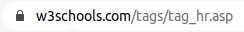

INTERACTIONS CLIENT-SERVEUR: Transmission de paramètres
=====================================================

## Formulaire dans une page web

### Qu'est-ce qu'un formulaire?

Les formulaires HTML sont des objets permettant l'interaction entre un utilisateur et un site web ou une application. Grâce à eux l'utilisateur d'envoyer des données au site web.  
La plupart du temps, ces données sont envoyées à des serveurs web mais la page peut aussi les intercepter et les utiliser elle-même comme nous le verrons dans le premier exemple.  
Les formulaires utilisent divers composants graphiques comme:  

* des zones de saisie de texte;
* des cases à cocher;
* des listes déroulantes;
* des boutons;
* etc.

L'élément HTML utilisé est l'élément `<form> ... </form>`. 

### Mise en oeuvre d'un premier formulaire HTML: syntaxe

Le premier exemple choisi est celui d'un convertisseur de température des degrés Celcius vers le Kelvin ou les degrés Fahrenheit. Le fichier source est `convertisseur.html`.

!!! question "À faire"
    Ouvrir le fichier `convertisseur.html` dans Visual Studio Code afin de consulter le code source **ET** dans un navigateur.

La saisie de la température est réalisée dans un formulaire. La portion de code concernée est la suivante:  

```html
<form action="">
        <label for="saisie">Température en degré Celcius</label>
        <input type="text" name="valeur" id="saisie" value="">       
        <div id="units">
            <label for="unites">Choisir une unité</label>
            <select name="temp" id="unites">
                <option value="">--Choisir une unité de conversion--</option>
                <option value="kelvin">Kelvin</option>
                <option value="fahrenheit">Fahrenheit</option>
            </select>
        </div>
        <input type="submit" value="Convertir">
</form>
```

La balise `form` comporte souvent un attribut `action` qui indique la ressource qui va traiter les données du formulaire. Dans notre cas ce sera la page elle-même, par le biais d'un script annexe.  

Notre formulaire est composé des éléments suivants:  

* une zone de saisie de texte, repérée par l'élément `<input type="text" ...>`;
* une liste déroulante avec une option à sélectionner, repérée par `<select> ... </select>`;
* un bouton pour soumettre les données, repéré par `<input type="submit" ...>`.

Il est très courant d'associer un *label* aux éléments d'un formulaire. La syntaxe est `<label for="..."> ...</label>`. La valeur de l'attribut `for` correspond à la valeur de l'attribut `id` de l'élément de formulaire associé (*input, select, etc.*).  

Enfin, l'élément `<div>` présent ne correspond pas à une entrée du formulaire. C'est ici un élément structurant dont l'identifiant sera utilisé en CSS.  

Une documentation intéressantes est disponible [sur le site de la MDN](https://developer.mozilla.org/fr/docs/Web/Guide/HTML/Formulaires/Comment_structurer_un_formulaire_HTML).

## Transmission de requêtes par méthode GET

!!! question "À faire"
    Ouvrir la page web située à http://xxx.xxx.xxx.xxx:8080/ dans Firefox, puis choisir "Exemple 1 méthode GET". 

1. En utilisant la console de développement, repérer la portion de code correspondant au formulaire présent sur cette page. Quelle est la principale différence avec le formulaire de l'exemple précédent?
2. Quitter l'Inspecteur et choisir Réseau.
3. Compléter le formulaire et valider. 
4. Commentez. Observer notamment l'URL dans la barre d'adresse

---

En utilisant la méthode GET dans un formulaire, le navigateur est en mesure d'envoyer des informations vers un serveur. Il procède de la manière suivante:  

* pour chaque élément graphique, formation d'un couple `paramètre=valeur` où `paramètre` est la chaîne correspondant à l'attribut `name` et `valeur` la valeur saisie ou sélectionnée (ou cochée);
* formation d'une chaîne de caractères `param1=val1&param2=val2&...&param_n=val_n`, les couples paramètre-valeur sont séparés par le caractère `&`;
* formation de l'url: `http://xxx.xxx.xxx.xxx/page_traitement?param1=val1&param2=val2&...&param_n=val_n`.

**Dans la méthode GET, les données sont transmises au serveur DANS L'URL et EN CLAIR.** Ce qui peut poser un gros problème de confidentialité (cas de mot de passe). Il faudra faire attention également au fait que l'URL a une taille limitée.  

## Transmission de requêtes par méthode POST 

!!! question "À faire"
    Ouvrir la page web située à http://xxx.xxx.xxx.xxx:8080/ dans Firefox, puis choisir "Exemple 2 méthode 
    POST".

1. Compléter le formulaire et valider.
2. Les paramètres sont-ils présents dans l'URL?
3. Comment ont été transmis les paramètres? Indication: voir le détail de la première requête dans la console de développement.

---

Dans la méthode POST, les paramètres sont passés **dans le corps de la requête**. Ils ne sont plus visibles dans l'URL.  
Cette méthode permet en outre, d'envoyer du contenu plus long.

## Transmission chiffrée

Un gros problème avec le protocole HTTP est que celui-ci manipule des données *en clair* et donc lisible de n'importe qui. C'est particulièrement problématique dans le cas de données confidentielles.  
Pour pallier à cette insuffisance, on a recours (*presque systématiquement maintenant, la majorité des serveurs l'impose*) à la version sécurisée: **HTTPS**. Le `s` de https signifie `secured`.  Une fois l'identitée du serveur confirmée, l'échange se poursuit de manière chiffrée.

D'un point de vue pratique, on reconnait une connection sécurisée par la présence d'un cadenas à côté de l'URL.  


On peut aussi consulter les détails d'échanges préliminaires de certificats avec un outil en ligne de commande.  

