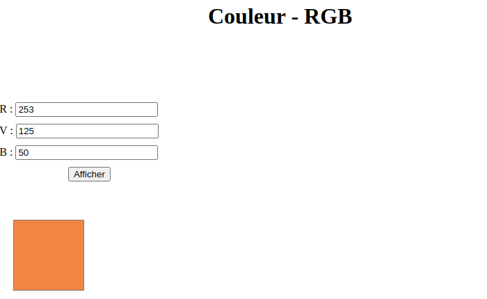

IHM_1_Interaction_web_Exercices
============================

**Capacités**  

* Identifier les différents composants graphiques permettant d’interagir avec une application Web.
* Identifier les événements que les fonctions associées aux différents composants graphiques sont capables de traiter.

**Pour atteindre ces objectifs**  

Il s’agira:  
* d’examiner le code HTML d’une page comprenant des composants graphiques;
* de distinguer ce qui relève de la description des composants graphiques en HTML de leur comportement (*réaction aux événements*) programmé par exemple en JavaScript.

## QCM

1. Dans le code HTML les délimiteurs tels que `<body>` et `</body>` s’appellent:  

    A. des bornes;  
    B. des balises;  
    C. des paragraphes;  
    D. des liens.

2. Dans une page HTML, lequel de ces codes permet la présence d'un bouton qui appelle la fonction javascript `afficher_reponse()` lorsque l'utilisateur clique dessus ?  

    A. `<a href="afficher_reponse()">Cliquez ici</a>`  
    B. `<button if_clicked="afficher_reponse()">Cliquez ici</button>`  
    C. `<button  value="Cliquez ici"><a> afficher_reponse()</a></button>`  
    D. `<button onclick="afficher_reponse()">Cliquez ici</button>`

3. On considère le formulaire ci-dessous :
Quel est votre langage préféré ?
Python □ Java □ Php □
Quelle balise parmi les quatre suivantes a été utilisée pour les cases à cocher ?  
    A. `<input type="radio">`  
    B. `<input type="circle">`  
    C. `<input type="checkbox">`  
    D. `<input type="square">`

4. On souhaite qu’un menu apparaisse à chaque fois que l’utilisateur passe sa souris sur l’image de bannière du site. L’attribut de la balise `img` dans lequel on doit mettre un code Javascript à cet effet est :  
    A. `onclick`  
    B. `src`  
    C. `alt`  
    D. `onmouseover`

5. Quel est le nom de l’événement généré lorsque l’utilisateur clique sur un bouton de type button dans une page HTML ?  
    A. `action`  
    B. `mouse`  
    C. `submit`  
    D. `click`

6. Voici un extrait d'un document HTML  
```hmtl
<body>
  .........
    Clic !
  </button>
  <h1><span id="valeur">2000</span></h1>
</body>
<html>
```
Quelle doit être la ligne qui remplace les pointillés pour obtenir un bouton dont l'appui déclenche la fonction javascript `actionBouton()`?  
    A. `<button click = "actionBouton();">`  
    B. `<button onclick = "actionBouton();">`  
    C. `<button onclick => "actionBouton();"`  
    D. `<button> onclick = "actionBouton();"`

7.  Comment doit-on procéder pour insérer des instructions en javascript dans un fichier html ?  
    A. Il suffit de mettre les instructions entre les balises <javascript> et </javascript>  
    B. Il faut utiliser une balise `<script>`  
    C. Il faut les insérer dans le fichier CSS  
    D. Il est inutile de mettre des balises spéciales

---

## Une horloge dans une page web

1. Ouvrir la page `horloge.html` et examiner les codes sources disponibles. Quel est l'élément graphique qui permet une interaction avec l'utilisateur? (*donner la balise HTML*)
2. Décrire l'évènement qui provoque un changement sur la page.
3. Cet évènement est-il géré directement dans la page HTML? Dans la négative où est-il géré?
4. Que réalise cette portion de code du fichier `horloge.js`?
```javascript
cadre.addEventListener('mouseover', (event) => {
    doc.style.visibility = "visible";
});
```
5. Même question pour:
```javascript
cadre.addEventListener('mouseleave', (event) => {
    doc.style.visibility = "hidden";
});
```

---

## Couleur en RGB

On souhaite afficher la couleur associée aux valeurs des composantes rouge, vert et bleue. Le résultat dans une page web aurait l'allure suivante:  


On fournit les codes sources suivants:  

* `couleur.html`;
* `couleur.css`;
* deux fichiers javascript `script_couleur1.js` et `script_couleur2.js`.

1. Lier le fichier de mise en forme CSS au code HTML.
2. Combien de composants graphiques ou *widget* en anglais permettant l'interaction, peut-on identifier sur la page `couleur.html`? Donner le nom de l'élément HTML associé pour chacun d'eux.
3. On souhaite afficher la couleur résultant du mélange des composantes rouge bleue et verte dans un cadre prévu à cet effet. On dispose pour cela de deux scripts écrits en Javascript et directement utilisable sans modification de leur code. En modifiant la page `couleur.html` proposer deux façons de résoudre le problème posé. 
