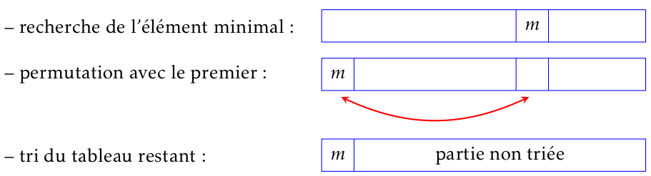
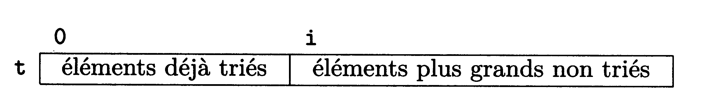

Tri par sélection
=============

## Principe

Le tri par sélection (*selection sort* en anglais) fait partie des algorithmes de tri les plus simples.  
Consulter l'animation située à [cette adresse](https://tube-outremer.beta.education.fr/videos/watch/7fefca67-d719-467d-bb59-e298f8f8401a).  

On commence par rechercher le plus petit élement du tableau puis on l'échange avec le premier élement. Ensuite, on cherche le deuxième plus petit élement et on l'échange avec le deuxième élément du tableau et ainsi de suite jusqu'à ce que le tableau soit entièrement trié.  

On peut représenter ces opérations de manière schématique:  



??? question "À faire"
    Pour résoudre le problème du tri par sélection, on aura besoin de deux fonctions annexes: `index_minimum` et `echanger`. Les spécifications de ces fonctions sont les suivantes:  
    
    * `index_minimum(t, j)`: prend en paramètres un tableau d'éléments comparables (souvent des nombres) `t` et un entier `j`; renvoie l'index de l'élément le plus petit trouvé entre `j` et la fin du tableau;
    * `echanger(t, i, j)`: prend en paramètres un tableau `t` et permute les éléments situés aux index `i` et `j`.
    
    Ècrire ces deux fonctions.

## Algorithme et implémentation

### Algorithme

On peut formaliser l'algorithme du tri par sélection avec le pseudo-code suivant:  

!!! important "Algorithme"
    
    ```
    Tri_selection(t)
    t: tableau de n éléments comparables (t[0..n-1])
    Pour i allant de 0 à n-2:
        rechercher l'indice k du plus petit élément de t[i..n-1]
        échanger t[i] et t[k]
    ```

### Implémentation

!!! question "À faire"
    Appliquer cet algorithme à la main sur le tableau `t = [3, 4, 1, 7, 2]`. Donner une implémentation possible en python de cet algorithme et tester.


```python
# TEST
t = [5, 6, 1, 1, 15, 0, 4]
tri_selection(t)
assert t == [0, 1, 1, 4, 5, 6, 15]
```

## Validité de l'algorithme

La situation au $i^{ème}$ tour de boucle peut être représentée de la manière suivante:

Tous les éléments d'indice compris entre 0 et $i-1$ inclus sont triés **ET** ils sont tous inférieurs ou égaux aux éléments de la partie non triée, entre $i$ et $n-1$. La preuve de cette proposition logique peut être délicate à établir en classe de 1re. On dit que c'est un **invariant** pour l'algorithme `tri_selection`.  

!!! important "Définition"
    Un invariant de boucle est un *prédicat* (proposition logique) qui est:  
    
    * initialement vrai;
    * vrai à l'entrée d'une itération ainsi qu'à la sortie de celle-ci
    

Trouver le *bon* invariant garantit que l'algorithme renvoie un résultat conforme aux spécifications et assurer ainsi sa **correction partielle**.  

Dans le cas de l'algorithme du tri par sélection, la terminaison est assurée car il fait intervenir une boucle bornée (*en réalité deux ... le voyez-vous*?).  

La combinaison de la correction partielle et de la terminaison permet de conclure à la **correction totale** de l'algorithme.

!!! info "Vocabulaire"
    Le terme **correction** est à prendre ici au sens correct. 

## Complexité en temps

!!! important "Qu'est-ce que la complexité en temps ?"
    Le coût (*en temps*) ou complexité en temps de l'algorithme `Tri_selection` est lié au nombre d’opérations élémentaires effectuées pour trier une collection d’éléments. Elle donne une idée du temps d'exécution d'un programme implémentant cet algorithme.  
    
    La complexité est un critère **majeur** pour comparer les algorithmes entre eux.  
    *Remarque*: on peut s'interesser aussi à la complexité en espace mémoire

La boucle présente dans `tri_selection` est parcourue $n-1$ fois. Évaluons le nombre de comparaisons qu'elle effectue (à travers l'appel de `index_minimum`).

Pour $i=0$, on effectue $n-1$ comparaisons dans `index_minimum` .  
Pour $i=1$, on effectue $n-2$ comparaisons.  
$\cdots$  
Pour $i=n-2$, on effectue 1 comparaison.  

Le nombre total de comparaisons est donc:  

$$(n-1)+(n-2)+\cdots +2+1$$

Cette somme correspond à la somme des termes consécutifs d'une suite arithmétique, dont la valeur pour $n>1$ est donnée par:

$$\dfrac{n}{2}\times (n-1)=\dfrac{1}{2}n^2-\dfrac{1}{2}n$$

Pour une taille $n$ très grande de l'entrée, le terme en $n^2$ devient prépondérant. En d'autres termes, le nombre de comparaisons effectuées, donc le temps d'exécution, est proportionnel à $n^2$.  

On retiendra que le coût en temps ou complexité temporelle du tri par sélection est proportionnelle au carré de la taille de l'entrée. On dit aussi que cet algorithme a une complexité temporelle quadratique.  

!!! abstract "À retenir"
    Le tri par sélection (du minimum) consiste à chercher le plus petit élément de la partie de tableau non triée pour le mettre à sa place définitive.  
    Ce problème est résolu habituellement par un algorithme faisant intervenir deux boucles bornées. La **terminaison est donc assurée**.  
    Un invariant de boucle permet de conclure à sa **correction partielle**. La conjugaison de ces deux propriétés assure la correction totale de l'algorithme proposé.  
    Cet algorithme a une complexité temporelle quadratique.
