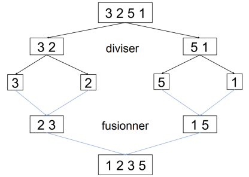

# Algorithmique: DIVISER POUR REGNER


## L'approche diviser pour régner

L'idée est de séparer le problème initial en des problèmes semblables mais avec une taille plus petite, puis de résoudre (*de façon récursive*) ces problèmes et enfin de combiner les solutions obtenues pour obtenir la solution du problème initial.  

Il y aura donc trois étapes essentielles:  

* **diviser** le problème en problèmes semblables, plus petits;
* **régner** en résolvant de manière récursive les problèmes plus petits;
* **combiner** (on dit aussi *fusionner*) les solutions des sous-problèmes pour obtenir la solution du problème initial.

## Première application: la recherche dichotomique

### Le problème

Rappel du problème de 1re NSI: il s'agit de déterminer si une valeur `v` appartient à un tableau `t` trié. Ce problème a été résolu de manière itérative (voir [cours 1re sur github](https://brunodrd.github.io/book/algo/recherche_dico_v2.html).  

Adoptons une approche *diviser pour régner*.

#### Diviser  
Comme le tableau est trié, on peut le "*couper*" en deux pour y effectuer la recherche. Si on note les indices extêmes du tableau `g` et `d`, alors le milieu se situe à l'indice $m=\lfloor\frac{g+d}{2}\rfloor$ (*à une unité près*).  

#### Régner 
Il s'agit d'effectuer la recherche dans **une partie** de tableau qui est de taille plus petite que le tableau original.  

#### Combiner  
Lors d'une recherche, si `v` est trouvé, on renvoie son indice. Sinon, ou dans le cas d'un tableau vide, on renvoie `None`.

Illustration de la situation après quelques appels récursifs  

```
 __________________________________________
|               |             |             |
|  éléments < v | ........... | éléments > v|
|__________________________________________ |
 ^               ^           ^               
 |               |           |
 0               g           d
 
```
 
### Une solution

On a fait le choix ici de déléguer le calcul d'index de la valeur à rechercher à une fonction auxiliaire (*helper function*). Ce n'est absolument pas une obligation, il est tout aussi valable de mettre tout le code dans une seule fonction. 


```python
def index(t, v, g, d):
    """
    Renvoie l'index de v dans un tableau t, s'il est présent, None sinon.
    t: tableau d'éléments comparables
    v: valeur de même type que les éléments de t;
    g, d: index extrêmes du tableau (entiers naturels)
    """
    if g > d: 
        return None
    m = (g + d) // 2
    if v > t[m]:
        return index(t, v, m+1, d)
    if v < t[m]:
        return index(t, v, g, m-1)
    else:
        return m        
```

Pour effectuer la recherche dichotomique de `v` dans un tableau `tab`, on appelle la fonction `index` sur l'intégralité du tableau, c'est-à-dire de `0` jusqu'à `len(tab)-1`.


```python
def dicho(tab, v):
    """
    Effectue une recherche dichotomique de v dans tab et
    renvoie son index de v dans t si trouvé, None sinon
    """
    return index(tab, v, 0, len(t)-1)
```


```python
# TEST
t = [1,7,8,9,12,15,15,22,30,31]
assert dicho(t, 15) == 5
```

!!! tip "Remarque"
    Le programme termine car on peut exhiber un **variant** de boucle: $d-g$. Il s'agit d'une grandeur 
    entière, strictement positive et qui décroit à chaque appel récursif.

## Deuxième application: le tri fusion (voir TP)

### Le problème initial

Il s'agit de trier une liste chaînée d'entiers, par ordre croissant. Plusieurs méthodes de tri peuvent être envisagées (*tri par sélection*, *tri par insertion*). On choisit ici une approche *diviser pour régner*.  
La liste sont des instances de la classe `Cell` vue au premier trimestre.


```python
class Cell:
    """ Classe cellule pour liste chainée"""
    
    def __init__(self, v, s):
        self.val = v
        self.suiv = s
```


```python
# Exemple
lst1 = Cell(2, Cell(10, Cell(5, Cell(-4, Cell(0, Cell(1, None))))))
```

### Approche diviser pour régner

#### Diviser 

Il s'agit dans un premier temps de "*couper*" la liste originale en deux listes de taille égale (ou presque dans le cas d'un nombre impair d'éléments).  
Il existe plusieurs façon de résoudre ce problème (voir TP), on présente ici une version ne nécessitant pas de calcul de taille de liste au préalable.


```python
def coupe_v3(lst):
    """
    Sera complétée après le TP
    """
```

#### Régner

Après avoir réduit les listes à un élément, il devient facile de les trier: une liste à un élément est forcément triée !

#### Combiner

Il s'agit maintenant de "*fusionner*" les solutions des sous problèmes. Concrètement, on écrit une fonction `fusion` qui prend deux listes en paramètres et qui renvoie une liste, triée par ordre croissant.


```python
def fusion(l1, l2):
    """
    Sera complétée après le TP
    """
```

L'implémentation de l'algorithme du tri fusion, utilisant une approche diviser pour régner en python, s'écrit alors:


```python
def tri_fusion(lst):
    """
    """
    # Cas de base: liste contenant 1 élément
    if lst.suiv is None:
        return lst
    # Cas récursif
    left, right = coupe_v3(lst)
    return fusion(tri_fusion(left), tri_fusion(right))
```

#### Illustration



#### Efficacité

Voici les relevés effectués sur des listes de tailles différentes, triées soit avec l'algorithme du tri sélection soit avec le tri fusion.  

| Taille 	| Tri sélection 	| Tri fusion 	|
|--------	|---------------	|------------	|
| 1000   	| 0.06 s        	| 0.01 s     	|
| 2000   	| 0.13 s        	| 0.03 s     	|
| 4000   	| 0.44 s        	| 0.05       	|
| 8000   	| 1.78          	| 0.11 s     	|
| 16000  	| 6.79          	| 0.29 s     	|

Il apparaît clairement que le tri fusion est nettement plus performant que le tri sélection lorsque la taille du problème augmente.  
Une étude approfondie de cet algorithme montre que sa complexité en temps est $\mathcal{O}(n\log{}n)$.
