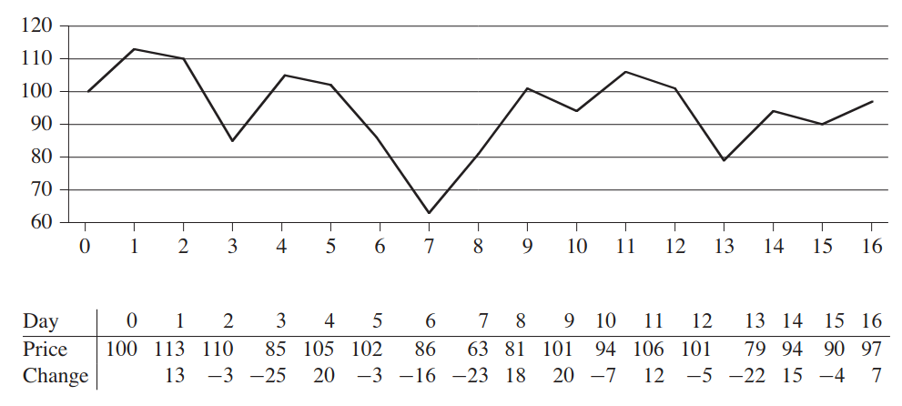
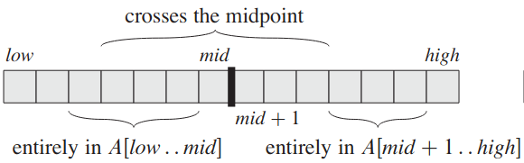
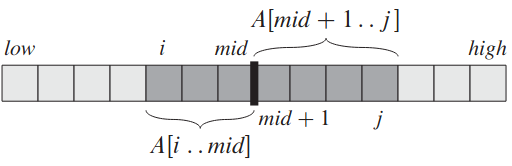

Le programme du sous tableau maximal
=================================

## Un exemple d'application

### Quand acheter et quand vendre pour maximiser le profit?



### Modélisation 

On souhaite trouver un sous tableau maximal issu d'un sous tableau `A[g..d]`. On adopte l'approche *diviser pour régner* en divisant ce tableau en deux sous tableaux de taille sensiblement égale `A[g..m]` et `A[m+1..d]`.  



Un sous tableau maximal peut se situer entièrement dans la partie gauche `A[g..m]`, ou entièrement dans la partie de droite `A[m+1..d]` ou ...  

  

... à cheval sur ces deux parties !  

La recherche d'un sous tableau maximal peut se faire de manière récursive dans les parties gauches et droite. C'est une instance plus petite du même problème initial.  
On cherche ensuite un sous tableau maximal à cheval sur les parties gauche et droite (*qui n'est pas une instance du problème initial*).  
Enfin, on prendra le sous tableau ayant la plus grande somme des trois calculés précédemment.

### Algorithmes

Très fortement inspiré de [cet ouvrage de référence](https://edutechlearners.com/download/Introduction_to_algorithms-3rd%20Edition.pdf) - chapitre 4, page 68.

#### Sous tableau maximal situé au milieu

Il suffit de trouver deux sous-tableaux maximaux de la forme `A[i..m]` et `A[m+1..j]` puis de les combiner.  

!!! important "ALGORITHME 1"
    ```
    Algorithme ss_tab_milieu(A, g, m, d)
    Entrées: 
        A: tableau d'entiers relatifs;
        g, m, d: index de tableau, entiers naturels
    Sortie:
        les index d'un sous tableau maximal, ainsi que la somme maximale associée.

    s_gauche = - infini
    s = 0
    Pour i allant de m à g (en décroissant)
        s = s + A[i]
        Si s > s_gauche:
            s_gauche = s
            idx_gauche = i
    s_droite = - infini
    s = 0
    Pour j allant de m+1 à d
        s = s + A[j]
        Si s > s_droite:
            s_droite = s
            idx_droite = j
    Renvoyer idx_gauche, idx_droite, s_gauche+s_droite
    ```

#### Sous tableau maximal

!!! important "ALGORITHME 2"
    ```
    Algorithme ss_tab_maximal(A, g, d)
    Entrées: 
        A: tableau d'entiers relatifs;
        g, d: index extrêmes d'un tableau, entiers naturels
    Sortie:
        les index d'un sous tableau maximal, ainsi que la somme maximale associée.

    Si d = g
        Renvoyer g, d, A[d]
    Sinon
        m = partie entière inférieure de (g+d) / 2
        idx_i_gauche, idx_j_gauche, s_gauche = ss_tab_maximal(A, g, m)
        idx_i_droite, idx_j_droite, s_droite = ss_tab_maximal(A, m+1, d)
        idx_i_milieu, idx_j_milieu, s_milieu = ss_tab_milieu(A, g, m, d)

        Si s_gauche >= s_droite ET s_gauche >= s_milieu
            Renvoyer idx_i_gauche, idx_j_gauche, s_gauche
        Sinon Si s_droite >= s_gauche ET s_droite >= s_milieu
            Renvoyer idx_i_droite, idx_j_droite, s_droite
        Sinon
            Renvoyer idx_i_milieu, idx_j_milieu, s_milieu
    ```    

## Analyse simplifiée du coût des algorithmes

Soit $n$ la taille du tableau d'entrée. L'algorithme de recherche de sous tableau au milieu a clairement une complexité temporelle en $\mathcal{O}(n)$. En effet, les deux boucles *Pour* permettent de parcourir tout le tableau `A`.  

Pour le deuxième algorithme, le cas de base prend un temps constant. Pour le cas récursif et pour un tableau de taille $n$, on doit résoudre:  

* 2 problèmes de taille $n/2$;
* le problème de recherche du sous tableau au milieu

plus des opérations à coût constant. De ce fait, résoudre un problème de taille $n$ prendra un temps:  

$$T(n)=2T(n/2) + \mathcal{O}(n)$$

Il existe un théorème (*théorème général*) premettant de résoudre cette équation de récurrence. On admettra ici la solution:  

$$T(n)=\mathcal{O}(n\log_2 n)$$

!!! info "Remarque"
    Ce coût est nettement meilleur que le coût quadratique de l'algorithme naïf (brute force) rencontré dans le sujet de bac blanc 2021.

## Travail à faire

!!! question "À faire"
    Implémenter ces deux algorithmes en Python. Tester (notamment avec l'exemple du bac blanc, que l'on peut retrouver à [cette adresse](https://nsiboisdo.bdrd.fr/NSITerm/ALGO/doc/ex3_bac_blanc.pdf)).
