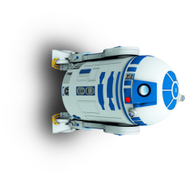

TP QUART DE TOUR
=================

## Le problème à résoudre

On souhaite effectuer la rotation d'un quart de tour (ou 90°) d'une image *carrée*, par exemple de 512 pixels sur 512 pixels.  


## Méthode de résolution

On utilise l'approche **diviser pour régner**. On divise l'image en 4 puis on effectue une permutation circulaire des quatre quadrants obtenus. Ensuite on applique récursivement le même processus sur chaque quadrant jusqu'à obtenir ... 1 pixel.  


## Modéliser l'image comme un tableau de pixel


```python
from PIL import Image


im = Image.open("img/R2D2.png")
largeur, hauteur = im.size
pix = im.load()
```


```python
largeur
```


    512


`pix` est une instance de la classe `PixelAccess` du module `Image` de la librairie `PIL`. Cet objet peut être vu comme un **tableau de pixels**. Ces derniers étant des n-uplets des composantes Rouge, Vert et Bleu. Pour modifier un pixel aux coordonées `x, y` on effectue l'affectation:  
`pix[x, y] = c` où `c` est un triplet représentant une couleur.


```python
# Permet de visualier l'image avec le programme par défaut
im.show()
```

## Résolution

On suppose pour simplifer que l'image est carrée `(t x t) `où `t` est sa taille et correspond à une puissance de 2. On va récursivement:  

* découper l'image en 4 et effectuer une rotation de 90° de chacun des 4 morceaux;
* déplacer chacun des morceaux vers leur position finale (voir schéma ci-dessous)

| A 	| B 	|
|---	|---	|
| D 	| C 	|

Après 3 permutations circulaires, la position finale est:

| D 	| A 	|
|---	|---	|
| C 	| B 	|

### Comment échanger les pixels de deux quadrants ?

Écrire une fonction `echanger_quart` répondant aux spécifications ci-dessous.  

!!! tip "Indication"
    En python, on peut permuter les valeurs de deux variables sans utiliser une variable temporaire avec la construction: `a, b = b, a`.


```python
def echanger_quart(img, coord_orig, coord_dest, n):
    """
    Échange les pixels d'un quadrant origine avec ceux d'un quadrant de destination. Ne renvoie rien.
    img: "tableau de pixels" (PixelAccess)
    coord_orig: coordonnées du coin supérieur gauche du quadrant d'origine (tuple);
    coord_dest: coordonnées du coin supérieur gauche du quadrant de destination (tuple);
    n: taille du quadrant.
    """
    xi, yi = coord_orig
    xf, yf = coord_dest
    # À compléter
```

### Fonction diviser_regner

En utilisant les informations précédentes, écrire une fonction récursive `diviser_regner` qui répond aux deux points énoncés au début de la section **Résolution**.


```python
def diviser_regner(img, coord, n):
    """
    Divise une image en 4 parties puis les déplace dans le sens horaire.
    img: "tableau de pixels" (type PixelAcess);
    coord: coordonnées du coin supérieur gauche de l'image (tuple);
    n: taille de l'image (int).
    """
    xg, yg = coord
    # Cas de base
    #À  compléter
    
    # Cas récursifs    
    # On divise l'image originale en 4 et on résoud les pb plus petits
    # À compléter 
    
    # Déplacement des 4 parties
    # À compléter
```

### Solution du problème

En utilisant les fonctions précédentes, écrire une fonction `quart_tour` qui résoud le problème posé. Tester avec l'image de `R2D2`.


```python
def quart_tour(px, taille):
    """
    Effectue une rotation d'un quart de tour d'une image d'une taille puissance de 2.
    px: tableau de pixels
    taille: taille de l'image (int puissance de 2).
    """
    # À compléter
```


```python
# RÉSULTAT À VÉRIFIER
quart_tour(pix, 512)
im.save("temp3.png")
```

### Conclusion

L'algorithme utilisé a une complexité en temps en $\mathcal{O}(n^2)$. Commenter ce résultat.
