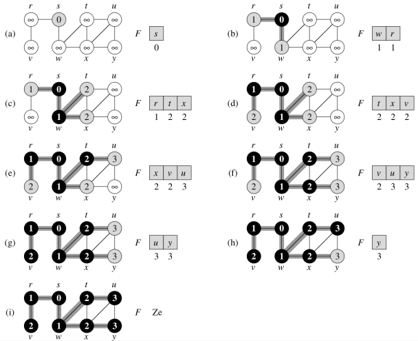

Fiche de découverte des principaux algorithmes de parcours des graphes
======================================================================

## Parcours en profondeur d'abord

### Principe et algorithme

La stratégie consiste à *descendre* le plus profondément possible dans le graphe, à chaque fois que cela est possible.
Ce type de parcours appelé **parcours en profondeur d'abord** ou Depth-first search (DFS) en anglais, s'applique à n'importe quel graphe et permet de trouver tous les sommets joignables depuis un sommet de départ.  
En d'autres termes, il permet, entre autres, de dire s'il existe un chemin entre deux sommets.  

Dans sa forme la plus classique, il s'agit d'un algorithme récursif très simple:

```
------------------------------------
Algorithme parcours_p(g, s, deja_vu)
------------------------------------
Entrées
    g: graphe
    s: sommet
    deja_vu: dictionnaire de booléen caractérisant le statut d'un sommet (visité ou non).
Début
    marquer s comme 'visité'
    Pour chaque sommet v voisin de s:
        Si v n'est pas marqué:
            parcours_p(g, v, deja_vu)
        Fin Si
    Fin Pour
Fin
```

!!! question "À faire"
    Implémenter cet algorithme en python.  
    *On utilisera l'interface de la classe* `GrapheOriente2` *vue lundi 28 mars, notamment pour avoir les voisins d'un sommet* `s`. 


```python
def parcours_p(g, s, deja_vu):
    """
    parcours récursivement, en profondeur, le graphe G, depuis le sommet s.
    G: graphe
    s: sommet
    deja_vu: dictionnaire de booléen caractérisant le statut d'un sommet
            (déjà visité ou non).
    """
    pass
```

!!! question "À faire"
    Proposer une fonction `existe_chemin`, spécifiée ci-dessous et qui permet de savoir s'il existe un chemin entre deux sommets donnés. On 
    utilisera la fonction `parcours_p` précédente.


```python
def existe_chemin(g, s1, s2):
    """
    renvoie un booléen correspondant à l'existence ou non d'un chemin entre s1 et s2.
    g: graphe
    s1, s2: sommets
    """
    pass
```

### Applications

Soit le graphe suivant  


Existe-t-il un chemin entre D et C? entre A et E? entre E et G? Pour répondre à ces questions, on demande:  

* de construire le graphe avec la classe `GrapheOriente2` de la fiche d'exercices du lundi 28 mars;
* de tester la fonction `existe_chemin`.


```python
# À compléter
```

## Le parcours en largeur

Le parcours en profondeur permet de trouver un chemin entre deux sommets $u$ et $v$ (*s'il existe*) mais ne garantit pas que celui-ci soit le plus court. Si on a besoin de la distance entre deux sommets, il faut utiliser un **parcours en largeur d'abord** (en anglais *Breadth-first search* ou BFS).  

Etant donné un graphe `g = (S, A)`, l'algorithme du parcours en largeur permet de découvrir tous les sommets accessibles depuis un sommet de départ `s`. Dans sa forme la plus générale, il permet en outre, de trouver la distance d'un sommet avec `s` et de déterminer les relations ancêtre-descendant.

```
---------------------------
Algorithme parcours_l(g, s)
---------------------------
Entrées:
    g: graphe
    s: sommet de départ
Variables:
    dist, pred: dictionnaire
    F: file
    
Début
    Initialiser une file vide F
    Pour chaque sommets u de g:
        dist[u] = infini
        u n'a aucun prédécesseur
    Fin Pour

    dist[s] = 0
    Enfiler(F, s)
    Tant que F n'est pas vide:
        u = Defiler(F)
        Pour chaque voisin v de u:
            Si dist[v] == infini:
                dist[v] = dist[u] + 1
                pred[v] = u
                Enfiler(F, v)
            Fin Si
        Fin Pour
    Fin Tant que
Fin
```

Déroulement de l'agorithme sur le graphe ci-après où le sommet de départ est 's':  



!!! question "À faire"
    Dérouler cet algorithme à la main sur le graphe ci-après:  


!!! question "À faire"
    Implémenter cet algorithme en python. Tester.


```python
from queue import Queue


def parcours_l(g, s):
    """
    """
    F = Queue()
    # À compléter
```

---

## Références

* Numérique et sciences informatiques - Balabonski, Conchon & al. - éd. ellipses
* Algorithmique - CLRS - éd. Dunod
* Site de David Roche
