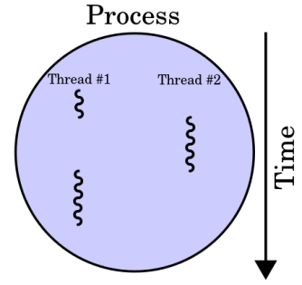
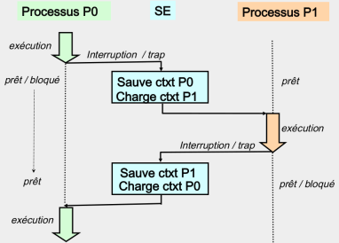
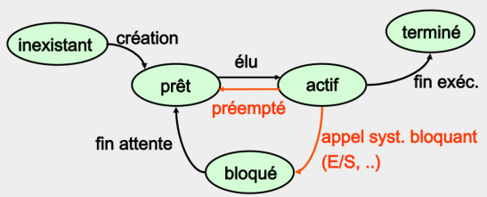

Gestion des processus et des ressources par un système d’exploitation
=====================================================================

*Dans les années 1970 les ordinateurs personnels n'étaient pas capables d'exécuter plusieurs tâches à la fois : on lancait un programme et on y restait jusqu'à ce que celui-ci plante ou se termine. Comment les ordinateurs modernes arrivent à faire exécuter «en même temps» plusieurs programmes ?  
La réponse est apportée par* **l'ordonnanceur de processus**.

## Vocabulaire

Un *programme* est stocké sous forme de fichier binaire contenant des instructions machines directement exécutables par le processeur. Ce fichier est souvent appelé **exécutable**.  
Un **processus** est un *modèle* du programme en cours d'exécution. Il est caractérisé par:  

* l'ensemble de la mémoire allouée par le système pour l'exécution du programme;
* l'ensemble des ressources matérielles utilisées: processeur, entrées-sorties, connexions réseau, etc.
* les valeurs stockées dans les registres du processeur.

Un  **thread** (en français *tâche*) est l'exécution d'une suite d'instruction par un processus. Contrairement aux processus qui ne partagent pas leur mémoire, les threads d'un même processus peuvent accéder aux variables globales et occupent le même espace mémoire.  

Deux processus s'exécutent de manière **concurrente** si les intervalles de temps entre le début et la fin de leur exécution se chevauchent (*voir schéma ci-dessous*).  
**L'ordonnanceur** de processus est la partie du système d'exploitation qui s'occupe d’allouer le processeur aux différents processus concurrents. Lorsque l'ordonnanceur doit interrompre un processus pour *donner la main* à un autre, il doit effectuer une sauvegarde du contexte.  

## Gestion des processus sur un système Linux
### Types de processus
On distingue deux types de processus:  

* les processus système, qui ont comme propriétaire le super-utilisateur et tournent indéfiniment : ce sont des démons;
* les processus utilisateur qui sont des programmes lancés par les utilisateurs.

### Valeur de retour
Tout processus doit retourner un code entier lorsqu’il se termine. Par convention, si ce code est:

* 0 la fin de processus a été normale;
* une valeur autre que 0, la fin de processus a été anormale.

### Identification d’un processus
Un processus a un *identifiant unique* le `PID` (Process IDentifier). Il possède un propriétaire effectif (celui qui l’a créé) et un propriétaire réel (celui qui l’exécute).  
Lorsqu'un processus engendre un fils, le SE génère un nouveau numéro de processus pour le fils. Le fils connaît aussi le numéro de son père : le `PPID` (Parent Process Identifier).

### Obtention de la liste de processus
La liste des processus peut être obtenue avec la commande `ps` du shell, avec les options suivantes:

* `ps -a` affiche tous les processus;
* `ps -e` affiche les processus de tout le monde;
* `ps -f` affiche toutes les infos sur les processus

On peut également formater la sortie de cette commande, en indiquant ce qu'on souhaite voir affiché. Par exemple `ps -e -o pid,ppid,stat,command` permet d’afficher le `PID`, le `PPID`, le statut (*voir plus loin*) et la commande qui a initié ce processus.

??? question "À faire"
    Utiliser la commande `ps` pour répondre aux questions suivantes:
    
    * Quel est le PID du processus `init`?
    * Quel est le PPID de `init`?
    * `init` possède t-il un *frère*?
    * Citer quelques descendants directs de `init`

### État d'un processus
Le cycle de vie d'un processus, depuis sa création jusqu'à sa mort peut être résumé par le schéma suivant:  

L’option `stat` de la commande `ps` donne l’état du processus. Les valeurs fréquentes sont:  

* `R`: en cours d'exécution;
* `T`: processus stoppé;
* `I`: processus endormi (>20s);
* `S`: processus endormi (<20s);
* `Z`: processus zombie;
* `D`: processus non interruptible;
* `W`: processus swappé sur disque.

??? question "À faire"
    Inspecter les processus en temps réel avec la commande `top`.
    Lancer cette commande dans un terminal. Ajuster les options avec les raccourcis claviers suivants:  
    
    * `h`: affiche l'aide;
    * `M`: trie la liste par ordre décroissant d'occupation mémoire. Pratique pour repérer les processus trop gourmands;
    * `P̀: trie la liste par ordre décroissant d'occupation processeur;
    * `i`: filtre les processus inactifs. Cela ne montre que ceux qui travaillent réellement;
    * `k`: permet de tuer un processus - à condition d'en être le propriétaire. Essayez de tuer `init` ...
    * `V`: permet d'avoir la vue arborescente sur les processus;
    * ̀q`: permet de quitter `top`.

### Création de processus
En python, il y a plusieurs façons de créer un processus fils par exemple avec le module `os`.  
**Exemple**: `newpid = os.fork()`

On peut aussi utiliser `Process` du module `multiprocessing`.  
**Exemple**: `p = Process(target=f, args=('bob',))` où `f` est une fonction et `‘bob’`, un paramètre d’entrée de cette fonction.  

Dans tous les cas, la fonction donne naissance à un processus fils  par duplication du processus père. Il partage le même espace mémoire adressable.  
`fork()` renvoie 0 quand il est dans le fils et le `pid` du fils quand il est dans le père (entier >0). Si le nombre renvoyé est négatif, c’est qu’il y a eu un problème lors de la création.

### Terminer un processus
Pour tuer un processus, on lui envoie un signal de terminaison. On en utilise principalement deux signaux:

* ̀`SIGTERM` (15) : demande la terminaison d'un processus. Cela permet au processus de se terminer proprement en libérant les ressources allouées.
* `SIGKILL` (9) : demande la terminaison immédiate et inconditionnelle d'un processus. C'est une terminaison violente à n'appliquer que sur les processus récalcitrants qui ne répondent pas au signal `SIGTERM`.

Par exemple, pour terminer `top` proprement, on envoie la commande shell `kill -15 PID` où `PID` désigne le numéro du processus à quitter proprement. Si ce dernier est planté et ne réagit pas à ce signal, alors on envoie `kill -9 PID`.  

??? question "À faire"
    Réaliser les consignes suivantes:  
    
    * lancer l'éditeur de textes;
    * repérer son PID à l'aide de la commande `ps` ou `top`
    * quitter l'application en utilisant la commande `kill`

