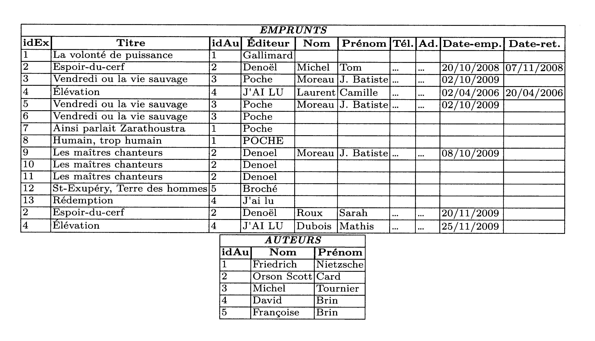

Activité de découverte: insuffisance des structures de données plates
=====================================================================

*Certains d'entre vous ont probablement déjà entendu parler des bases de données. Dans le cadre de cette activité, oublions, dans un premier temps, toutes nos connaissances et nos réflexions sur le sujet*.  

## Contexte

Supposons que nous ayons à développer une application de gestion d'une bibliothèque. Tous les livres de la bibliothèque possèdent un **numéro d'exemplaire**, un **titre**, un ou plusieurs **auteurs** et un **éditeur**. Le numéro d'exemplaire est un identifiant unique permettant de différentier les exemplaires d'un même livre. Lorsqu'une personne emprunte un livre, il faut mémoriser son **nom**, son **prénom**, son **numéro de téléphone**, son **adresse**, la **date de l'emprunt** et la **date de retour** une fois ce dernier réalisé. Toutes les informations doivent être conservées pour garder un historique des emprunts.  

## Une solution simple et naïve... 

Notre application va devoir stocker toutes les informations précisées ci-dessus de manière persistante. Nous choisissons donc d'utiliser un fichier texte de type `csv` pour enregistrer les données. Pour cela, nous adoptons naïvement la solution simple et naturelle suivante : 

— Nous créons un fichier texte `csv` comportant à l'origine une ligne par livre.  
— Dans chaque ligne, nous renseignons les informations: numéro d'exemplaire `idEx`, `Titre`, `Auteur` et `Éditeur`, séparées par une virgule.  
— Quand une personne emprunte un livre, nous complétons la ligne du livre emprunté par les champs: `Nom`, `Prénom`, `Téléphone`, `Adresse` et `Date-emprunt` toujours en séparant ces informations par une virgule.  
— Lorsqu'une personne retourne un livre, il suffit de compléter le dernier champ `Date-retour` sur la ligne du livre emprunté.  
— Quand un livre est emprunté une nouvelle fois, nous ajoutons une nouvelle ligne avec toutes les informations concernant le livre et la personne qui l'emprunte. Bien entendu, le bibliothécaire ne ressaisit pas tout, l'application va chercher la plupart de ces informations dans le fichier. Le fichier en question peut donc être perçu comme un tableau de chaînes de caractères. Nous parlerons également de table plutôt que de tableau ou de fichier. Ouvrir le fichier `biblio.csv` pour avoir une idée plus précise du contenu.

## ...Mais pas sans conséquence  

Supposons que l'application de gestion de bibliothèque fonctionne correctement et stocke toutes ses données dans un fichier comme celui que nous venons de décrire. Nous allons nous pencher sur les inconvénients et les conséquences inhérents à une telle approche.  
L'application fonctionne maintenant depuis 20 ans. Le nombre de personnes inscrites à la bibliothèque est relativement constant et est de 5000 personnes en moyenne par an. Un abonné emprunte en moyenne 2 livres par mois.

1. Quel est, approximativement, le nombre de lignes du fichier des données?
2. Quelle est la taille approximative du fichier si on fait l'hypothèse que presque tous les caractères sont codés sur 1 octet et qu'une ligne contient, en moyenne, 200 caractères?
3. Lorsqu'un abonné emprunte un livre, le bibliothécaire saisit simplement le numéro de l'exemplaire, le nom et le prénom de l'abonné. L'application se charge alors de parcourir le fichier pour rechercher les informations manquantes concernant le livre et l'abonné afin de préremplir, à la fin du fichier, la nouvelle ligne concernant l'emprunt.  
Dans le pire des cas, l'application doit parcourir tout le fichier. Supposons qu'un accès au fichier coûte 8 ms (c'est le temps d'accès moyen au disque dur), qu'une lecture de ligne coûte 0.1 ms (temps pour lire les 200 caractères de la ligne) et qu'une recherche sur la ligne pour trouver le numéro de l'exemplaire ou le nom et le prénom de l'abonné coûte 0.01 ms. Quel est, dans le pire des cas, le temps mis par l'application pour compléter les informations saisies par le bibliothécaire ?
4. Supposons qu'une personne est abonnée depuis l'origine de l'application. Elle prévient le bibliothécaire que son prénom est mal orthographié. Combien de lignes, approximativement, doivent être modifiées pour corriger cette erreur dans tout le fichier de données?
5. Cette base de données permet-elle vraiment de retrouver des informations ? Par exemple, en se rappelant du travail fait en 1re sur l'exploitation des fichiers `csv` (*en python*), réfléchir au moyen de retrouver les informations suivantes :  

    * Quels sont les livres édités chez Poche?
    * Quels sont les livres édités chez Denoël?
    * Quels sont les livres écrits par Orson Scott Card?
    * Quels sont les livres écrits par Friedrich Nietzsche?
    * Quels sont les livres écrits par David Brin?

    !!! tip "Indice"
        On pourra utiliser le cadeau du professeur:  
        ```python
        import csv

        with open('biblio.csv', newline='', encoding='utf8') as fp:
            table = [dict(row) for row in csv.DictReader(fp, delimiter=',')]
        ```    

6. Supposons la situation suivante:  
M. Moreau Jean-Batiste et son fils, Jean-Batiste également, ont tous les deux emprunté un exemplaire de deux livres différents : *Vendredi ou la vie sauvage de Michel Tournier chez Poche* et *Vendredi ou la vie sauvage de Michel Tournier chez Poche*.  
Lorsqu'il vient rendre les deux livres, le père précise que le prénom de son fils est Jean-Batiste Junior, et non pas Jean-Batiste. Il remarque également que le livre qu'il (le père) vient d'emprunter, qui porte le numéro 3, n'est pas écrit par Michel Tournier, mais qu'il est coécrit par Michel Tournier et Gérard Franquin. Est-il possible de corriger ces erreurs dans notre fichier ?
7. Énumérer ou résumer tous les problèmes que la représentation des données choisie (*utilisation de fichier de données csv*) semble poser.  

## Affinement de la solution 

Il est maintenant évident que la solution naïve décrite dans la section précédente pose de nombreux problèmes. Elle est totalement inacceptable pour une application sérieuse bien qu'elle soit encore largement employée dans des cas de petite taille.  
Pour résoudre les problèmes d'incohérences concernant les auteurs, nous proposons de décomposer le tableau de départ en deux sous-tableaux (voir les fichiers `biblio2.csv` et `auteur.csv`).  
Les colonnes `idAu` permettent de faire le lien entre les deux tables. La redondance sur les noms des auteurs est-elle toujours présente ?

<figure markdown> 
  { width="900px" }
  <figcaption>Amélioration 1</figcaption>
</figure>

8. Cette décomposition a-t-elle engendré une perte d'information? Autrement dit, est-il possible de reconstituer la table originale à partir de cette décomposition?
9. Pouvons-nous maintenant répondre aux requêtes suivantes :
    * Quels sont les livres écrits par Orson Scott Card?
    * Quels sont les livres écrits par Friedrich Nietzsche?
    * Quels sont les livres écrits par David Brin? 
10. Sur le même principe, proposer une solution pour que le titre de chaque livre ne soit représenté qu'une seule fois dans notre base de données. Dans cette perspective, nous précisons que deux livres distincts portent le même titre : *Vendredi ou ta vie sauvage*. Le premier livre existe en deux exemplaires à la bibliothèque, le 3 et le 6, le second en un seul exemplaire, le 5.
11. Toujours en appliquant la même méthode, supprimer les redondances concernant la mention des éditeurs et les informations associées aux abonnés. Pour ce faire, nous précisons que l'abonné qui a emprunté le livre *Les maîtres chanteurs* est le père.
12. Notre base de données est encore largement entachée de redondances. Où se situent-elles ?
13. Proposer une solution pour corriger la redondance détectée dans la question précédente.
14. Proposer une solution pour tenir compte du cas des livres co-écrits par plusieurs auteurs. 
