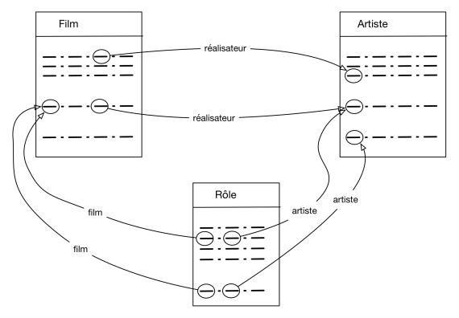

STRUCTURE DES BASES DE DONNEES RELATIONNELLES
================================================

## Schéma d'une base de données

Donner le schéma d'une relation consiste à donner un nom et un ensemble d'attribut / domaine. Comme on l'a vu au cours des séquences précédentes, il n'est pas recommandable de mettre toutes les données dans une seule table. Il est en général nécessaire de créer plusieurs relations associées les unes aux autres.  

On définit le **schéma d'une base de données** comme un ensemble de schémas de relation. Il s'agit de la **structure de la base**, à ne pas confondre avec le **contenu** de la base

## Conséquences d'un mauvais schéma

Avant d'entreprendre la compréhension d'un schéma relationnel *correct* d'une base de données, examinons les conséquences d'un mauvais schéma.

On veut créer une base de données `Infos_films` représentant des films, avec des informations comme le titre, l’année, le réalisateur, etc. On part d’un schéma rassemblant ces informations dans une unique table:  
`Film(titre, année, prénomRéalisateur, nomRéalisateur, annéeNaiss)`

|    titre     | année | prénomRéalisateur | nomRéalisateur | annéeNais |
|--------------|-------|-------------------|----------------|-----------|
|    Alien     | 1979  |      Ridley       |     Scott      |   1943    |
|   Vertigo    | 1958  |      Alfred       |   Hitchcock    |   1899    |
|   Psychose   | 1960  |      Alfred       |   Hitchcock    |   1899    |
|  Kagemusha   | 1980  |       Akira       |    Kurosawa    |   1910    |
|  Volte-face  | 1997  |       John        |      Woo       |   1946    |
| Pulp Fiction | 1995  |      Quentin      |   Tarantino    |   1963    |
|   Titanic    | 1997  |       James       |    Cameron     |   1954    |
|  Sacrifice   | 1986  |      Andrei       |   Tarkovski    |   1932    |  

Les problèmes potentiels ont pour origine la redondance d'informations.

### Anomalies d'insertion

En l'état, **sans clé primaire définie, rien n'interdit l'insertion d'un même film**. Par ailleurs, pour insérer un film il faut absolument saisir son réalisateur (à moins d'accepter une valeur vide `NULL`, ce qui n'est jamais très bon). Un problème similaire se pose si on veut entrer un réalisateur: il faut saisir un film qu'il a réalisé.

### Anomalies de mise à jour

Supposons que l’on modifie l’année de naissance de Hitchcock pour la ligne *Vertigo* et que l'on oublie d'effectuer la modification pour la ligne *Psychose*. On se **retrouve alors avec des informations incohérentes**.

### Anomalies de suppression

On ne peut pas supprimer un film sans supprimer du même coup son réalisateur. Si on souhaite, par exemple, ne plus voir le film *Titanic* figurer dans la base de données, on va effacer du même coup les informations sur *James Cameron*.

## Comprendre un (bon) schéma d'une base de données

*La base support pour cette section peut être consultée avec l'outil* `DB Browser for SQLite`, *voir le fichier* `Films.sqlite`.

Le modèle relationnel possède un outil (*hors programme de terminale*) permettant d'éviter tous les problèmes liés à la redondance: la **normalisation**. En l'appliquant au problème précédent on peut aboutir au schéma de base de données `Infos_films` suivant:  

* Film (<u>idFilm</u>, titre, année, genre, résumé, #idRéalisateur, #codePays)
* Pays (<u>code</u>, nom, langue)
* Artiste (<u>idArtiste</u>, nom, prénom, annéeNaissance)
* Rôle (<u>#idFilm, #idActeur</u>, nomRôle)
* Internaute (<u>email</u>, nom, prénom, région)
* Notation (<u>#email, #idFilm</u>, note)

On d'abord noter que chaque relation possède une clé primaire, ce qui assure l'unicité des n-uplets.  
La clé étrangère `idRéalisateur` dans `Film` référence la clé primaire `idArtiste` de `Artiste`. De même, La clé étrangère `codePays` dans `Film` référence la clé primaire `code` de `Pays`. Ainsi, connaissant un film on peut retrouver son réalisateur ou son pays de production.

On peut aussi utiliser une méthode *graphique* visualiser les liens entre les diverses relations.  

---

**Références**: [Cours base de données de Philipe Rigaux](http://sql.bdpedia.fr/)
