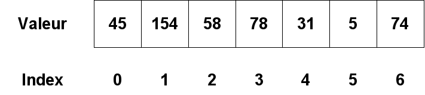

Epreuve pratique n°1 - compte rendu
==============================

## Corrigé

### Exercice 1
Il s'agit d'une banale recherche linéaire.


```python
def indice(element, tableau):
    """ 
    Renvoie l'indice 'element' dans 'tableau' s'il y est présent,
    None sinon.
    """
    for i in range(len(tableau)):
        if tableau[i] == element:
            return i
    return None # facultatif
```


```python
indice(1, [10, 12, 1, 56])
```


    2


```python
indice(1, [1, 50, 1])
```


    0


```python
indice(15, [8, 9, 10, 15])
```


    3


```python
indice(1, [2, 3, 4]) is None
```


    True


### Exercice 2
Il fallait faire le rapprochement avec le tri par insertion vu en première. Quelques remarques importantes:  

* le choix a été fait ici de travailler sur une copie de la liste proposée; on évite ainsi de modifier le paramètre `liste` (bonne pratique);
* `nouvelle_liste` contient un élément de plus que `liste` après la ligne 3: il s'agit de la valeur à insérer;
* la valeur `a_inserer` sera insérée à un indice `i` compris entre `0` et `len(nouvelle_liste) - 2` inclus


```python
def insere(a_inserer, liste):
    nouvelle_liste = liste.copy() # permet d'obtenir une copie de liste
    nouvelle_liste.append(a_inserer)
    i = len(nouvelle_liste) - 2 # index du dernier élément de la partie triée
    while a_inserer < nouvelle_liste[i] and i >= 0:
        nouvelle_liste[i+1] = nouvelle_liste[i] # décale la valeur initiale à droite et ...
        nouvelle_liste[i] = a_inserer # ... insère 'a_inserer' à la place
        i = i - 1
    return nouvelle_liste
```

Consulter le déroulement d'un exemple à [cette adresse](https://pythontutor.com/render.html#code=def%20insere%28a_inserer,%20liste%29%3A%0A%20%20%20%20nouvelle_liste%20%3D%20liste.copy%28%29%20%23%20permet%20d'obtenir%20une%20copie%20de%20liste%0A%20%20%20%20nouvelle_liste.append%28a_inserer%29%0A%20%20%20%20i%20%3D%20len%28nouvelle_liste%29%20-%202%20%23%20index%20du%20dernier%20%C3%A9l%C3%A9ment%20de%20la%20partie%20tri%C3%A9e%0A%20%20%20%20while%20a_inserer%20%3C%20nouvelle_liste%5Bi%5D%20and%20i%20%3E%3D%200%3A%0A%20%20%20%20%20%20%20%20nouvelle_liste%5Bi%2B1%5D%20%3D%20nouvelle_liste%5Bi%5D%0A%20%20%20%20%20%20%20%20nouvelle_liste%5Bi%5D%20%3D%20a_inserer%0A%20%20%20%20%20%20%20%20i%20%3D%20i%20-%201%0A%20%20%20%20return%20nouvelle_liste%0A%20%20%20%20%0Ainsere%283,%20%5B1,%202,%204,%205%5D%29&cumulative=false&curInstr=17&heapPrimitives=nevernest&mode=display&origin=opt-frontend.js&py=3&rawInputLstJSON=%5B%5D&textReferences=false) .


```python
insere(3, [1, 2, 4, 5])
```


    [1, 2, 3, 4, 5]


```python
insere(10, [1, 2, 7])
```


    [1, 2, 7, 10]


```python
insere(1, [2, 3, 4])
```


    [1, 2, 3, 4]


```python
insere(1, [])
```


    [1]


## Analyse des difficultés

Le sujet était issu de la banque session 2022 (*sujet n°8*). Deux principales difficultés ont été identifiées:  

* algorithmes de première non acquis;
* connaissances très confuses de la structure de donnée tableau

Rappel du vocabulaire sur un exemple:  

<figure>
    
    <figcaption>
        Structure de donnée tableau
    </figcaption>
</figure>

Le tableau est la structure de donnée. L'index correspond à la position dans le tableau. Chaque élément du tableau correspond à une valeur (qui peut être un nombre entier, une chaîne de caractère, etc.)

Un tableau est itérable: on peut parcourir ses éléments un à un. La première méthode naturelle pour parcourir un tableau consiste à réaliser une boucle sur l'index:

```python
for i in range(len(tableau)):
    print(tableau[i], end=' ')
    
>>> 45 154 58 78 31 5 74
```

Python permet, par ailleurs, le parcours du tableau en itérant sur les valeurs:

```python
for valeur in tableau:
    print(valeur, end=' ')

>>> 45 154 58 78 31 5 74
```

## Remédiation

Écrire une fonction `max_tab` qui prend un tableau d'entier non vide `tab` comme argument et qui renvoie l'indice de la valeur maximale rencontrée dans le tableau.
