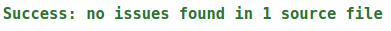
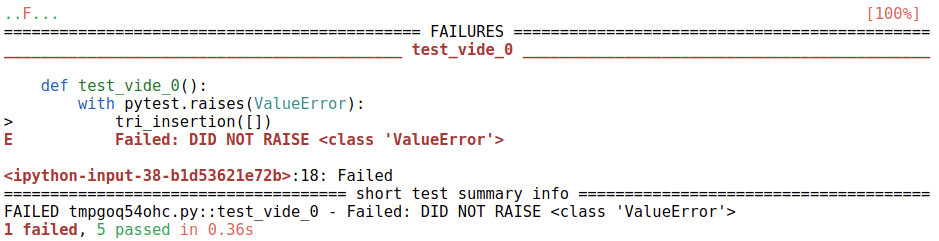

Mise au point des programmes - gestion des bugs
=========================================

## Introduction: les bugs en informatique

Un bug est une toute petite erreur qui peut avoir des conséquences catastrophiques. La gestion des bugs est un des points fondamentaux de l'informatique.

!!! info "A voir"
    Voir [la vidéo](https://youtu.be/qE0QFxNiQLI) de 
    l'informaticien [Gérard Berry](https://fr.wikipedia.org/wiki/G%C3%A9rard_Berry) à ce sujet.

## Eviter les bugs

*Rien ne permet vraiment de garantir qu’un programme ne présente aucun bug. Toutefois, certains principes permettent de limiter les risques*. 

### Commenter le code

Un module, un package, une fonction ou une classe **doit** être documenté. Cette documentation ou spécification sera disponible lorsqu'on utilisera la fonction `help` de python.  

Le moyen le plus simple pour documenter le code est l'utilisation d'une **docstring**.  

!!! info "Définition"
    Une *docstring* est une chaîne de caractères située entre une paire de triple double quotes `""" """`, au début de l'entité qu'elle renseigne.  
    
Dans le cas d'une fonction, on y trouve les conditions portant sur les entrées ou **préconditions** ainsi que ce qu'elle renvoie ou **postcondition**.  

**Exemple**


```python
def max_tab(t):
    """
    renvoie le maximum d'un tableau t;
    t: tableau d'éléments comparables, non vide
    """
    m = t[0]
    for i in range(1, len(t)):
        if t[i] > m:
            m = t[i]
    return m
```


```python
help(max_tab)
```

    Help on function max_tab in module __main__:
    
    max_tab(t)
        renvoie le maximum d'un tableau t;
        t: tableau d'éléments comparables, non vide
    


### Le typage des données

On reprend la fonction `max_tab` précédente avec l'appel:


```python
max_tab(5)
```


    ---------------------------------------------------------------------------

    TypeError                                 Traceback (most recent call last)

    <ipython-input-33-c8d064365998> in <module>
    ----> 1 max_tab(5)
    

    <ipython-input-29-4b5b186e2743> in max_tab(t)
          4     t: tableau d'éléments comparables, non vide
          5     """
    ----> 6     assert len(t) > 0, "Erreur: tableau vide" # précondition
          7     m = t[0]
          8     for i in range(1, len(t)):


    TypeError: object of type 'int' has no len()


On obtient une erreur de type `TypeError`. Il s'agit d'une erreur très courante. 

Certains langages vérifient avant l'exécution les problèmes de typage.  De par sa nature, Python ne le fait pas (du moins pas directement). Cependant, depuis la version 3.5, on peut **annoter** les programmes de manière à bien préciser les types des variables utilisées ainsi que celui du résultat renvoyé.  

D'un point de vue syntaxique, il suffit de rajouter le **type** précédé de:  

* `:` juste après le nom du paramètre ou de la variable;
* `->` si c'est la valeur renvoyée par la fonction.


```python
def max_tab(t: list) -> int:
    """
    renvoie le maximum d'un tableau t;
    t: tableau d'éléments comparables, non vide
    """
    m = t[0]
    for i in range(1, len(t)):
        if t[i] > m:
            m = t[i]
    return m
```


```python
help(max_tab)
```

    Help on function max_tab in module __main__:
    
    max_tab(t: list) -> int
        renvoie le maximum d'un tableau t;
        t: tableau d'éléments comparables, non vide
    


Le module `typing` de la bibliothèque standard permet d'aller encore plus loin dans l'annotation en précisant le type d'objet présent dans le tableau `t`.


```python
from typing import List


def max_tab(t: List[int]) -> int:
    """
    renvoie le maximum d'un tableau t;
    t: tableau d'entiers, non vide
    """
    m = t[0]
    for i in range(1, len(t)):
        if t[i] > m:
            m = t[i]
    return m
```


```python
help(max_tab)
```

    Help on function max_tab in module __main__:
    
    max_tab(t: List[int]) -> int
        renvoie le maximum d'un tableau t;
        t: tableau d'entiers, non vide
    


!!! hint "Remarques"
    * Le type du tableau est ici **List** avec un 'l' majuscule;
    * On a modifié la spécification de la fonction, notamment sa précondition, en précisant qu'on travaillait 
    avec un tableau d'entiers.

!!! warning "Hors programme"
    On peut aller encore plus loin (*non exigible en terminale*) en faisant une vérification des types avec un
    outil externe `mypy`. 
    Utilisation: on copie la fonction précédente dans le fichier `max_tab.py` par exemple et on exécute la
    commande ci-dessous.


```python
!mypy max_tab.py
```



### Les tests

On a vu en 1re qu'une bonne pratique de développement consistait à écrire des procédures de tests suffisamment exhaustifs pour couvrir les cas normaux d'utilisation notamment aux limites ainsi que les cas anormaux.  

On s'intéresse ici aux **tests unitaires**, dont l'objectif est de tester indépendamment chaque fonction. il existe plusieurs outils permettant de réaliser des tests unitaires. On en utilisera deux principalement.  

!!! danger "ATTENTION - Rappel"
    Un test ne garantit jamais la correction d’un programme.  Une réussite du test n’est pas significative, alors qu'un échec établit de manière certaine la présence d’un bug.

#### Les assertions

Une **assertion** échoue si l'expression booléenne qui suit le mot clé `assert` est fausse. L'exception **AssertionError** est alors levée. Si elle est vraie, l'exécution continue.  

**Exemples**


```python
def max_tab(t):
    """
    renvoie le maximum d'un tableau t;
    t: tableau d'éléments comparables, non vide
    """
    assert len(t) > 0, "Erreur: tableau vide" # précondition
    m = t[0]
    for i in range(1, len(t)):
        if t[i] > m:
            m = t[i]
    assert all(t[i] <= m for i in range(len(t))) # postcondition
    return m
```


```python
# Tests
assert max_tab([1,1,1]) == 1
assert max_tab([0]) == 0
assert max_tab([-2,-1,0]) == 0
assert max_tab([1,2,3]) == 3
```

!!! hint "Remarque"
    On peut utiliser également `assert` au sein du code afin de vérifier les préconditions et postconditions.

#### Le module pytest

Le module `pytest` permet de faire des tests plus complets et plus explicites. Dans *Jupyter Notebook* on exécute d'abord la cellule ci-dessous, puis on écrit ses fonctions de tests qui doivent commencer par `test_`.


```python
import ipytest
ipytest.autoconfig()
```


```python
%%ipytest
import pytest
from random import randint
from tri import  tri_insertion


def test_tab_neg_1():
    t = [-1,-1,-1]
    tri_insertion(t)
    assert  t == [-1,-1,-1]
    
def test_inverse_2():
    t = [14,10,5,1]
    tri_insertion(t)
    assert  t == [1,5,10,14]
    
def test_vide_0():
    with pytest.raises(ValueError):
        tri_insertion([])

def test_deja_tri_3():
    t = [1,2,3,4,5]
    tri_insertion(t)
    assert  t == [1,2,3,4,5]

def test_random_4():    
    t = [randint(-20, 20) for _ in range(10)]
    tri_insertion(t)
    assert all(t[i] <= t[i + 1] for i in range(9))
    
def test_en_place_5():
    assert tri_insertion([1,2,3]) is None
    
```



## Quand le bug est là

Quand le bug survient, il faut alors :  

* savoir mettre en évidence le bug et le reproduire;
* comprendre la cause du bug;
* corriger le bug.

C’est ce qu’on appelle la mise au point, ou le débuggage. Parmi les erreurs classiques, on trouve notamment:  

* division par zero : `ZeroDivisionError`
* accès hors des bornes d’une liste : `IndexError`
* erreur de nom de variable : `NameError`
* erreur de nom de méthode ou d’attribut : `AttributeError`
* appel récursif trop profond : `RecursionError`
* modification d’un objet non mutable : `TypeError`
