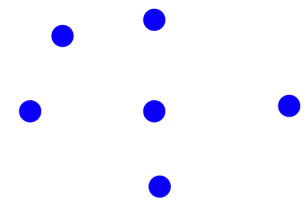
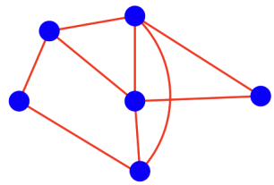
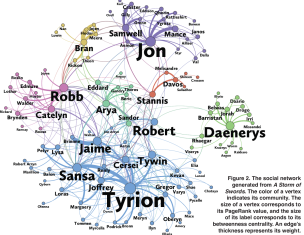
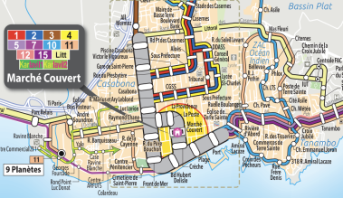
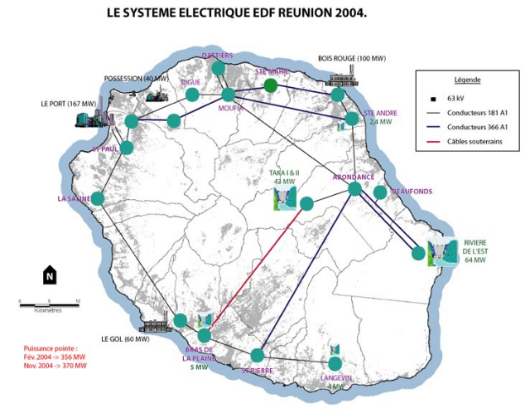
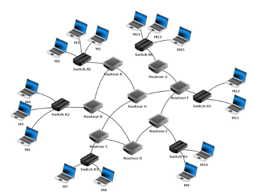
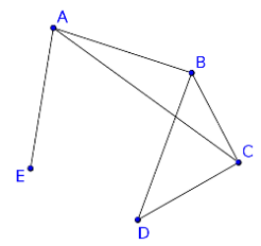
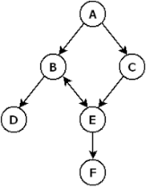
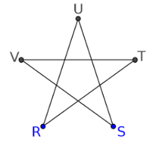

Introduction aux graphes
=====================

## Qu'est-ce qu'un graphe ?

Un graphe est un couple composé d'un ensemble de **sommets** ...  
  
... et d'un ensemble d'**arêtes** qui représentent des relations entre ces sommets.  
  
De façon plus formelle, un graphe est un couple $G=(S, A)$ composé:  

* d'un ensemble fini de sommets $S$, parfois appelés noeuds;
* d'un ensemble fini d'arêtes $A$ reliants des sommets.  

*Remarque*: la notation anglo-saxonne $G=(V, E)$ est souvent rencontrée, $V$ est mis pour *vertice* et $E$ pour *edge*.

## A quoi sert un graphe ?

**Un graphe sert à représenter des relations entre des éléments**. Ses applications sont très nombreuses. Il est particulièrement adapté pour représenter des réseaux.

### Exemple d'un réseau social

  
Ici les sommets sont des personnes et la présence d'une arête indique un lien entre ces personnes.

### Exemple d'un réseau de bus

  
Ici les sommets sont des arrêts de bus et les arêtes représentent la relation "*permet d'accéder à l'arrêt ...*"

### Exemple d'un réseau électrique

  
Ici les sommets sont des postes de transformation haute tension et les arêtes la relation "*alimente ..*"

### Exemple de réseau informatique

  
Ici les sommets sont des machines et les arêtes la relation "*est relié à ...*".

### Exercice d'application directe

Soit un réseau social composé de 6 personnes (A, B, C, D, E et F). Donner un représentation de ce réseau, sachant que les relations entre les divers abonnés sont les suivantes:  

* A est ami avec B, C et D
* B est ami avec A et D
* C est ami avec A, E et D
* D est ami avec tous les autres
* E est ami avec C, D et F
* F est ami avec E et D


```python

```

## Quelques définitions

**Voisinage**  
Deux sommets $u$ et $v$ sont **adjacents** si ils sont reliés par une arête. L'ensemble des sommets adjacents à $u$ constitue les **voisins** de ce dernier.  

**Chemin**  
Soient $u$ et $v$ deux sommets d'un graphe $G$. On dit qu'un **chemin** relie $u$ à $v$ si il existe une suite finie de sommets reliés deux à deux par une arête, menant de $u$ à $v$.  

**Application directe 1**

    
Existe-t-il un chemin entre E et D ?  
D est-il un voisin de E?

**Graphe non orientés / orientés**  
Dans tous les exemples précédents, le parcours des arêtes pouvait se faire dans les deux sens: on parle alors de graphe **non orientés**.  
Lorsque la modélisation nécessite un parcours d'arête dans un sens bien déterminé, on parle de **graphe orienté**. On utilise souvent le terme d'**arc** à la place d'arête.  
Encore une fois, on peut citer en exemple les réseaux sociaux. En effet, par exemple pour Facebook si A est ami avec B alors B est aussi ami avec A alors que sur Twitter A peut suivre B qui ne suit pas forcément A.  
Exemple de représentation   
  

Dans un graphe orienté, il est commode de traiter les voisins en terme de **successeur/prédécesseur**. Ainsi, A est le prédécesseur de C,  D est un successeur de B, etc.  

**Application directe 2**

Représenter le graphe modélisant le réseau routier urbain ayant les caractéristiques suivantes:  

Carefours: A, B, C, D, E, F, G  

* il existe une liaison à double sens entre A et C;
* il existe une liaison à sens unique B->A entre A et B;
* il existe une liaison à sens unique A->D entre A et D;
* il existe une liaison à sens unique B->F entre B et F;
* il existe une liaison à sens unique E->B entre B et E;
* il existe une liaison à double sens entre B et G;
* il existe une liaison à double sens entre D et G;
* il existe une liaison à double sens entre E et F.

## Comment représenter un graphe?

On distingue deux grands types de représentation:  

* utilisation d'une matrice d'adjacence;
* utilisation(s) liste(s) de successeurs / prédécesseurs.

Détaillons ces deux modes de représentation.

### Représentation avec une matrice d'adjacence

Il s'agit d'un tableau à doubles entrées. Ces dernières *représentent les sommets*. À chaque intersection ligne $i$ - colonne $j$ (ligne $i$ correspond au sommet $i$ et colonne $j$ correspond au sommet $j$), on place un **1** s'il existe une arête entre le sommet $i$ et le sommet $j$, et un **0** s'il n'existe pas d'arête entre le sommet $i$ et le sommet $j$.

#### Exemple


|   	| A 	| B 	| C 	| D 	| E 	|
|---	|---	|---	|---	|---	|---	|
| A 	| 0 	| 1 	| 1 	| 0 	| 1 	|
| B 	| 1 	| 0 	| 1 	| 1 	| 0 	|
| C 	| 1 	| 1 	| 0 	| 1 	| 0 	|
| D 	| 0 	| 1 	| 1 	| 0 	| 0 	|
| E 	| 1 	| 0 	| 0 	| 0 	| 0 	|  

En pratique, on va ommettre l'écriture des sommets et écrire la matrice d'adjacence de la manière suivante:  

$$
\begin{pmatrix}
0&1&1&0&1\\
1&0&1&1&0\\
1&1&0&1&0\\
0&1&1&0&0\\
1&0&0&0&0
\end{pmatrix}
$$

#### Application directe 3

Donner la matrice d'adjacence du graphe suivant:  



#### Cas des graphes orientés

On procède de la même manière en faisant attention au sens de parcours des arcs.

#### Application directe 4

Donner la matrice d'adjacence du graphe orienté déjà rencontré précédemment:  


### Représentation par liste d'adjacence

Il s'agit dans ce cas de représenter chaque sommet et à associer chacun d'eux à la liste de ses voisins dans le cas d'un graphe non orienté ou la liste de ses successeurs ou prédécesseurs dans le cas d'un graphe orienté.

#### Exemples

Le graphe non orienté de **l'application directe 3** peut être représenté par sa liste d'adjacence:  

| Sommet 	|     	| Voisins 	|
|:------:	|-----	|---------	|
|    R   	| --> 	| [U, T]  	|
|    S   	| --> 	| [V, U]  	|
|    T   	| --> 	| [R, V]  	|
|    U   	| --> 	| [R, S]  	|
|    V   	| --> 	| [S, T]  	|

Quant au graphe orienté de **l'application directe 4**, on peut le représenter par une liste de successeurs:  

| Sommet 	|     	| Succ   	|
|:------:	|-----	|--------	|
|    A   	| --> 	| [B, C] 	|
|    B   	| --> 	| [D, E] 	|
|    D   	| --> 	| [ ]    	|
|    C   	| --> 	| [E]    	|
|    E   	| --> 	| [B, F] 	|
| F      	| --> 	| [ ]    	|

#### Application directe 5

Représenter le graphe de **l'application directe 1** par une liste d'adjacence et celui de **l'application directe 4** par une liste de prédécesseurs.

## Choix du mode de représentation

Le choix dépend du type de graphe (dense ou pas), des algorithmes. Par ailleurs, on montrera en TP qu'il est possible de passer d'une représentation à l'autre.
