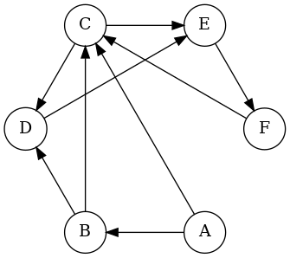

Représentation d'un graphe
=======================

## Un graphe simple

On considère le graphe ci-dessous:  


1. Est-ce un graphe orienté ?
2. Quels sont les voisins de 1 ?
3. Construire sa matrice d’adjacence.
4. Combien peut-on ajouter d’arêtes à ce graphe ?

## Graphe complet

Un graphe est dit **complet** si tous ses sommets sont reliés. On considère les trois graphes complets suivant:  

  

1. Construire un graphe complet à 5 sommets.
2. Construire les matrices d’adjacence des trois graphes ci-dessus.
3. Combient d’arêtes comportent-ils ?
4. En examinant les matrices d’adjacence, déterminer le nombre maximum d’arêtes d’un graphe comportant $n$ sommets.

## Retrouver son chemin

  

Un chemin est **simple s'il n'emprunte pas deux fois le même arc**. Un chemin simple reliant un sommet à lui même et contenant au moins un arc est appelé un **cycle**. 

1. Trouver trois chemins simples menant de A à C.
2. Trouver deux cycles sur ce graphe.

## Modéliser une situation par un graphe

### Tournoi de football

On souhaite organiser un tournoi de football avec 4 équipes (numérotées de 1 à 4). Chaque équipe rencontre une seule fois toutes les autres.  

1. Représenter la situation sous la forme d’un graphe
2. Combien d’arêtes possède-t-il ? En déduire le nombre de matchs au total pour ce tournoi
3. En se référant à l'exercice 2, quelle propriété remarquable possède ce graphe?

### Tournoi de tennis

Un club de tennis doit sélectionner deux joueurs parmi quatre pour représenter le club à un tournoi national. Les quatre joueurs sont notés A, B, C et D. Pour réaliser la séléction le club organise des matchs, chaque joueur rencontrant les trois autres.  
Règlement:  

* Tout match gagné donne un point;
* Tout match perdu enlève un point.

Les joueurs sélectionnés sont les joueurs ayant obtenu le plus grand nombre de points. On donne le résultat sous la forme d’un graphe orienté:  


L'orientation des arcs est telle que $X\longrightarrow Y$ signifie $X$ a battu $Y$.  

Quels sont les deux joueurs sélectionnés ?

### Réunion de famille - niveau de difficulté XXL :)

Michel est invité par **A**ndré à un dîner de famille. Dès son arrivée, il se présente à chacune des onze autres personnes qu'il trouve dans la maison. Les onze premières phrases qu'il entend **successivement** sont les suivantes:  

* **B**éatrice : "Bonjour ! Je suis la mère d'André."
* **C**arole : "Bienvenue ! Je suis la sœur du père d'André."
* **D**aniel : "Salut ! Je suis le fils unique de la sœur de la mère d'André."
* **É**mile : "Bonjour ! Je suis l'unique beau-frère du fils de Karl."
* **F**abienne : "Mère de deux filles, je suis aussi la grand-mère maternelle de Daniel."
* **G**aston : "Salut ! Je suis un des fils de Lucien et un des petits-fils de Fabienne."
* **H**onoré : "Je suis le grand-père paternel de Lucien."
* **I**rène : "Je suis l'unique belle-sœur de Lucien."
* **J**oseph : "Salut ! Je suis le neveu de Lucien et le petit fils de Karl."
* **K**arl: Mon petit-fils m'a parlé de vous.
* **L**ucien : Bienvenue dans ma maison, je vous ai vu a l'instant parler avec mon père.

Et la famille d'ajouter d'une seule voix : "*si vous ne trouvez pas les liens familiaux qui nous unissent, vous n'aurez pas à dîner !*"  

*(d'après F. Droesbeke, les graphes par l'exemple, pp 17-18 ellipses)*

Aider Michel ... en modélisant cette situation par un graphe.  
Remarque: dans cet exercice, le beau-frère de X est le frère du mari/femme de X, et la belle-soeur la soeur du mari/femme de X.

## Codage

On considère le graphe ci-dessous ainsi que sa matrice d'adjacence.  


### Questions de cours

1. Est-ce un graphe orienté ou non orienté?
2. Combien a-t-il de sommets? d'arêtes?
3. Les sommets **d** et **h** sont-ils voisins?

### Implémentation en python

#### Liste d'adjacence

Une façon d’encoder un graphe sous Python est d’utiliser un dictionnaire contenant les listes des voisins de chaque sommet.
Les clés seront les sommets du graphe et leur valeur sera la liste des sommets adjacents.


```python
G = {
    'a': ['b','c'],
    'b': ['a','d', 'e'],
    'c': ['a','d'],
    'd': ['b','c', 'e'],
    'e': ['b','d', 'f', 'g'],
    'f': ['e','g'],
    'g': ['e','f', 'h'],
    'h': ['g']
}
```

1. Ecrire une fonction `sommets` qui prend un graphe en paramètre et qui renvoie la liste de ses sommets.
2. Ecrire une fonction `voisins` qui prend en paramètres un graphe et un sommet et qui renvoie la liste des vosins de ce sommet.
3. Que réalise la fonction `lst_to_mat` ci-dessous? Expliquer notamment la portion de code située entre les lignes 9 et 13.
4. Le résultat de l'appel `lst_to_mat(G)` est-il conforme aux données de l'énoncé?


```python
def sommets(g):
    pass
```


```python
def voisins(g, u):
    pass
```


```python
def lst_to_mat(g):
    """
    renvoie ......
    g: graphe modélisé par un dictionnaire de listes d'adjacences
    """
    sommets = list(g.keys()) # la liste des sommets
    mat = [[0]*len(sommets) for _ in range(len(sommets))] # la matrice d'adjacence
    # Parcours du dictionnaire g (clé+valeurs)
    for sommet, voisins in g.items():
        i = sommets.index(sommet)
        for v in voisins:
            j = sommets.index(v)
            mat[i][j] = 1
    return mat    
```


```python
A = lst_to_mat(G)
```

#### Matrice d'adjacence

**1.** Ecrire une fonction `adj_to_lst` qui prend en paramètre une liste (*de python*) de sommets `l` et une matrice d'adjacence `mat` (*liste de listes*) et qui renvoie un dictionnaire dont les items sont de la forme: `sommet: liste de voisins`.  
*On peut s'inspirer de la fonction* `lst_to_mat`.  

**2.** Donner alors, sous forme de liste d'adjacence, une représentation du graphe dont la matrice d'adjacence est la suivante:  

$$
\begin{pmatrix}
0&1&0&0&0\\
0&0&1&1&1\\
0&1&0&1&0\\
0&0&1&0&0\\
1&1&0&1&0
\end{pmatrix}
$$

On notera les sommets: A, B, C, D et E.


```python
def adj_to_lst(l, mat):
    pass   
            
```


```python
adj_to_lst(['a', 'b', 'c', 'd', 'e', 'f', 'g', 'h'], A)
```


    {'a': ['b', 'c'],
     'b': ['a', 'd', 'e'],
     'c': ['a', 'd'],
     'd': ['b', 'c', 'e'],
     'e': ['b', 'd', 'f', 'g'],
     'f': ['e', 'g'],
     'g': ['e', 'f', 'h'],
     'h': ['g']}


```python
l = ['A', 'B', 'C', 'D', 'E']
mat = [
    [0, 1, 0, 0, 0],
    [0, 0, 1, 1, 1],
    [0, 1, 0, 1, 0],
    [0, 0, 1, 0, 0],
    [1, 1, 0, 1, 0]
]
```


```python
adj_to_lst(l, mat)
```


    {'A': ['B'],
     'B': ['C', 'D', 'E'],
     'C': ['B', 'D'],
     'D': ['C'],
     'E': ['A', 'B', 'D']}


#### Implémentation d'une classe graphe orienté par matrice d'adjacence

On se propose d'encapsuler les opérations réalisables sur les graphes orientés dans une classe `GrapheOriente`.  La construction repose sur l'utilisation d'une matrice d'adjacence.


```python
class GrapheOriente:
    """ Une classe pour représenter les graphes orientés."""
    
    def __init__(self, sommets):
        """ sommets est la liste des sommets du graphe; ceux-ci
            peuvent être des entiers ou des caractères."""
        
        self.s = sommets
        self.mat = [[0]*len(sommets) for _ in range(len(sommets))]
```

**1.** Ajouter une méthode `ajouter_arc` qui prend deux paramètres `s1` et `s2` correspondant à deux sommets (on **s'assurera de leur présence dans la liste de sommets**) qui permet d'ajouter un arc allant de `s1` vers `s2`. Cette méthode ne renvoie rien.


```python
class GrapheOriente:
    """ Une classe pour représenter les graphes orientés."""
    
    def __init__(self, sommets):
        """ sommets est la liste des sommets du graphe; ceux-ci
            peuvent être des entiers ou des caractères."""
        
        self.s = sommets
        self.mat = [[0]*len(sommets) for _ in range(len(sommets))]
    
    def ajouter_arc(self, s1, s2):
        pass
```

**2.** Ajouter une méthode `arc` qui prend en paramètres deux sommets `s1` et `s2` et qui renvoie un booléen correspondant à la présence ou non d'un arc allant de `s1` vers `s2`.


```python
class GrapheOriente:
    """ Une classe pour représenter les graphes orientés."""
    
    def __init__(self, sommets):
        """ sommets est la liste des sommets du graphe; ceux-ci
            peuvent être des entiers ou des caractères."""
        
        self.s = sommets
        self.mat = [[0]*len(sommets) for _ in range(len(sommets))]
    
    def ajouter_arc(self, s1, s2):
        pass
    
    def arc(self, s1, s2):
        pass    
```

**3.** Ajouter une méthode `voisins` qui prend en paramètre un sommet `s1` et qui renvoie la liste de ses voisins.


```python
class GrapheOriente:
    """ Une classe pour représenter les graphes orientés."""
    
    def __init__(self, sommets):
        """ sommets est la liste des sommets du graphe; ceux-ci
            peuvent être des entiers ou des caractères."""
        
        self.s = sommets
        self.mat = [[0]*len(sommets) for _ in range(len(sommets))]
    
    def ajouter_arc(self, s1, s2):
        pass
    
    def arc(self, s1, s2):
        pass
    
    def voisins(self, s1):
        pass
```


```python
g = GrapheOr(['a', 'b', 'c', 'd'])
g.ajouter_arc('a', 'b')
g.ajouter_arc('a', 'd')
g.ajouter_arc('b', 'c')
g.ajouter_arc('d', 'a')
```

**4.** Implémenter une classe `GrapheOriente2` qui utilise un dictionnaire de listes d'adjacence. L'interface restant rigoureusement la même.


```python
class GrapheOriente2:
    """ Une classe pour représenter les graphes orientés."""
    
    def __init__(self, sommets):
        """ sommets est la liste des sommets du graphe; ceux-ci
            peuvent être des entiers ou des caractères."""
        
        pass
```


```python
g = GrapheOriente2(['a', 'b', 'c', 'd'])
g.ajouter_arc('a', 'b')
g.ajouter_arc('b', 'c')
g.ajouter_arc('c', 'd')
g.ajouter_arc('d', 'a')
```
