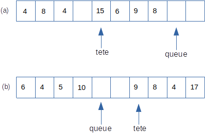

## Exercice 1

Reprendre la structure de pile du cours implémentée avec des `list` *de python* et ajouter à l'interface deux opérations:  

* `vider(p)` qui vide une pile `p`;
* `taille(p)` qui renvoie la taille de la pile `p`.

## Exercice 2 - Notation polonaise inverse

L'*écriture polonaise inverse* des expressions arithmétiques place l'opérateur **après** ses opérandes.  
Cette notation ne nécessite aucune parenthèse, ni aucune règle de priorité. Ainsi l'expression polonaise inverse décrite par la chaîne de caractères  

`1 2 3 * + 4 *`  

désigne l’expression traditionnellement notée $(1+ 2 \times 3)\times 4$.  
La valeur d’une telle expression peut être calculée facilement en utilisant une pile pour stocker les résultats intermédiaires. Pour cela, on parcours un à un les éléments de l'expression et on effectue les actions suivantes:  

* si on trouve un nombre, on l'empile;
* si on trouve un opérateur binaire, on dépile le dernier et l'avant dernier nombre, on leur applique l’opérateur, et on empile résultat.

Si l'expression était bien écrite, il y a bien toujours deux nombres sur la pile lorsque l’on voit un opérateur, et à la fin du processus il **reste exactement un nombre sur la pile, qui est le résultat**.  

Écrire une fonction prenant en paramètre une chaîne de caractères représentant une expression en notation polonaise inverse composée d’additions et de de multiplications de nombres entiers et renvoyant la valeur de cette expression.  

*On supposera que les éléments de l'expression sont séparés par des espaces. Attention, cette fonction ne doit pas renvoyer de résultat si l'expression est mal écrite*.

## Exercice 3 - Chaînes bien parenthésées

On considère une chaîne de caractères incluant à la fois des parenthèses rondes `(` et `)` et des parenthèses carrées `[` et `]` . La chaîne est bien parenthésée si chaque ouvrante est associée à une unique fermante de même forme, et réciproquement.  

Écrire une fonction prenant en paramètre une chaîne de caractères contenant, entre autres, les parenthèses décrites et qui renvoie `True` si la chaîne est bien parenthésée et `False` sinon.

## Exercice 4 - File bornée


On propose ici une autre réalisation possible d'une file bornée à partir d'un tableau.  La file sera repérée par deux index `tete` et `queue`. On enfile par la queue et défile par la tête.  

Soit `MAXFILE` la capacité de la file. On prévoit un tableau de taille `MAXFILE+3` car on souhaite stocker également:

* la position de la tête (index 0);  
* la position de la queue (index 1);  
* la longueur effective de la file (index 3)  

La position de la queue indique l'endroit où sera enfilée la prochaine donnée.  
La figure (a) ci-dessous montre l'état d'une file `f` de ce type et de capacité maximale 7, dans laquelle figurent déjà 4 éléments. A partir de cette situation et après les opérations:  

```python
defiler(f)
defiler(f)
enfiler(f, 4)
enfiler(f, 17)
enfiler(f, 10)
```
on se trouve dans la situation (b).




```python
MAXFILE = 8 # Capacité de la pile

def creer_file(n=MAXFILE):
    return [3, 3, 0] + [None] * n

def est_vide(f):
    return f[2] == 0

def est_pleine(f):
    return f[2] == len(f) - 3

def enfiler(f, val):
    # A compléter
    pass

def defiler(f):
    # A compléter
    pass


```

1. A partir des informations disponibles:  

    * dire combien d'opérations sont autorisées sur cette structure;
    * rédiger leur spécification.
 
2. Prévoir les réponses de l'interpréteur python après les séquences de commandes ci-dessous (*qui se suivent!*).

3. Proposer une implémentation pour `enfiler` et `defiler`.

Séquence 1
```python
f1 = creer_file()
est_vide(f1)
```  

Séquence 2
```python
enfiler(f1, 5)
est_vide(f1)
```

Séquence 3
```python
enfiler(f1, -10)
enfiler(f1, 25)
enfiler(f1, -35)
while not est_vide(f1):
    print(defiler(f1), end=' ')
```

Séquence 4
```python
f2 = creer_file(3)
enfiler(f2, 10)
enfiler(f2, 100)
enfiler(f2, 1000)
enfiler(f2, 50)
```


```python

```
