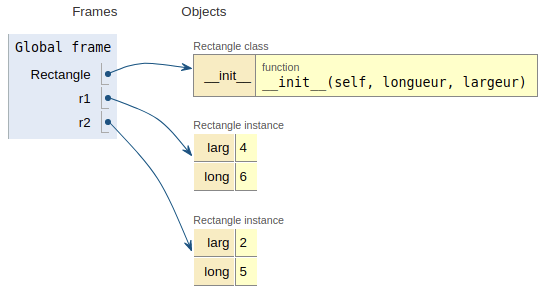

Vocabulaire de la programmation objet
================================

## Introduction

En python on ne manipule que des objets. On en a rencontré de plusieurs sortes depuis la classe de première. Le type d'un objet peut être obtenu avec la fonction ... `type`!
```python
ch = 'bonjour'
print(type(ch))
<class 'str'>

l = 3.1
print(type(l))
<class 'float'>
```
Même si les types d'objets natifs de Python sont très puissants, on pourra souvent être amené à en créer d'autres.  

Les paragraphes qui suivent ont pour objectif de:  

* se familiariser avec tout le vocabulaire nécessaire à la compréhension de la construction des objets;
* présenter les bases permettant de créer ses propres classes d'objets.  

## Voyage en première classe avec les objets

### Descritption d'une classe

!!! info "Définition"
    Une classe est une structure qui peut contenir des variables et des définitions de fonctions. 

On peut faire l'analogie avec une usine ayant des plans de construction et qui pourra donc construire des **objets**. 

Dans le cas le plus simple, en python on définit une classe avec le mot clé `class` suivi d'un nom de classe (*qu'on écrit avec une première lettre en majuscule, par convention*) puis des `:` annonçant l'arrivée d'un bloc.

Construisons notre première classe. Il s'agit d'une classe permettant de construire des objets de type `Rectangle`.


```python
class Rectangle:
    """ Une classe pour décrire les rectangles"""
    
    def __init__(self, longueur, largeur):
        self.long = longueur
        self.larg = largeur
```

Une bonne habitude est de fournir une documentation. On trouve ensuite une définition de fonction `__init__` qui sera détaillée plus loin.  

### Création d'un objet 
Pour construire un **objet** de type `Rectangle`, on fait suivre le nom de la classe de la liste d'arguments attendus par `__init__` sauf `self`.  


```python
Rectangle(2, 6)
```


    <__main__.Rectangle at 0x7f70f92fd220>


L'interpréteur nous informe qu'un objet a été créé. Néanmoins, construire un objet de cette façon n'est pas très utile. On va plutôt affecter l'objet créé à une variable.


```python
r1 = Rectangle(6, 4)
r2 = Rectangle(5, 2)
```

La classe permet de créer des objets. Ce processus de création d'objet est appelé **instanciation** et l'objet créé est une **instance** de la classe.

A ce stade, voici la situation relevée avec [Pythontutor](http://pythontutor.com/visualize.html#code=class%20Rectangle%3A%0A%20%20%20%20%22%22%22%20Une%20classe%20pour%20d%C3%A9crire%20les%20rectangles%22%22%22%0A%20%20%20%20%0A%20%20%20%20def%20__init__%28self,%20longueur,%20largeur%29%3A%0A%20%20%20%20%20%20%20%20self.long%20%3D%20longueur%0A%20%20%20%20%20%20%20%20self.larg%20%3D%20largeur%0A%0Ar1%20%3D%20Rectangle%286,%204%29%0Ar2%20%3D%20Rectangle%285,%202%29&cumulative=false&curInstr=11&heapPrimitives=nevernest&mode=display&origin=opt-frontend.js&py=3&rawInputLstJSON=%5B%5D&textReferences=false).  



Chaque objet `Rectangle` créé possède ses **propres variables** `larg` et `long`. Ce sont les **attributs** de l'objet. On dit aussi *attributs d'instance*.

On peut accéder aux attributs *faisant partie de l'interface* de l'objet avec la notation `objet.attribut`. 


```python
print(r1.larg)
```

    4


Les attributs des objets sont mutables en python. Néanmoins, on évitera de recourir à cette propriété et on privilégiera l'interaction avec les objets via des *méthodes* (voir ci-dessous).

### Manipuler les données

Supposons que l'on veuille calculer l'aire ou la diagonale du rectangle correspondant à l'objet `r1`. On peut utiliser les attributs de `r1`.


```python
from math import sqrt

print("A = ", r1.larg * r1.long)
print("d = ", sqrt(r1.larg**2 + r1.long**2))
```

    A =  24
    d =  7.211102550927978


Cependant, cela ne correspond pas au style de la programmation orientée objet. C'est la classe qui doit se charger de définir les traitements possibles sur les objets. Cela se fait par le biais de **méthodes**.  

!!! info "Définition"
    Une méthode est fonction rattachée à une classe.  

On peut compléter la classe rectangle.


```python
class Rectangle:
    """ Une classe pour décrire les rectangles"""
    
    def __init__(self, longueur, largeur):
        self.long = longueur
        self.larg = largeur
        
    def surface(self):
        return self.long * self.larg
    
    def diagonale(self):
        return sqrt(self.larg**2 + self.long**2)
```


```python
r1 = Rectangle(6, 4)
print("A =", r1.surface(), "; d =", r1.diagonale())
```

    A = 24 ; d = 7.211102550927978


Une méthode destinée à manipuler les objets se définit dans la classe comme une fonction ordinaire. L'interpréteur le confirme.


```python
Rectangle.surface
```


    <function __main__.Rectangle.surface(self)>


Par contre, on doit **impérativement** définir comme premier paramètre `self`. Il s'agit d'une **référence** vers l'objet sur lequel on opère.  

!!! tip "Remarque"
    `self` est juste une convention adoptée par la communauté python, on aurait pu nommer ce paramètre autrement.
    
Lors de l'appel de la méthode sur l'objet, on ne fait pas apparaître `self`. En réalité, quand on écrit `r1.surface()`, c'est un raccourci pour `Rectangle.surface(r1)` où `r1` est associé à `self`.

### Méthodes spéciales

Lors de la création d'un objet, python appelle *automatiquement* deux méthodes spéciales. L'une d'entre elle `__init__` est chargée d'initialiser les attributs de l'objet. Son premier paramètre est aussi `self`.  

Il existe d'autres méthodes spéciales, reconnaissables à leur syntaxe: elles commencent et se terminent par un double *souligné* (*underscore* en anglais) `__`. Elles ne sont pas spécifiquement au programmes de NSI mais seront quelques fois rencontrées dans des exercices.  
A titre d'exemple, montrons une utilisation de la méthode `__str__` qui est automatiquement appelé par `print`.


```python
# Affichage de l'objet r1
print(r1)
```

    <__main__.Rectangle object at 0x7f70e36f0490>


Ce n'est pas très explicite, on va définir la méthode `__str__`.


```python
class Rectangle:
    """ Une classe pour décrire les rectangles"""
    
    def __init__(self, longueur, largeur):
        self.long = longueur
        self.larg = largeur
        
    def surface(self):
        return self.long * self.larg
    
    def diagonale(self):
        return sqrt(self.larg**2 + self.long**2)
    
    def __str__(self):
        return f'Rect({self.long} X {self.larg})'
```


```python
r2 = Rectangle(8,3)
print(r2)
```

    Rect(8 X 3)

