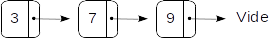
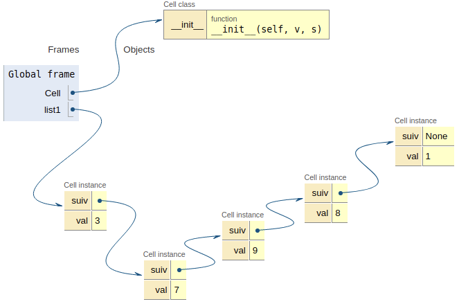
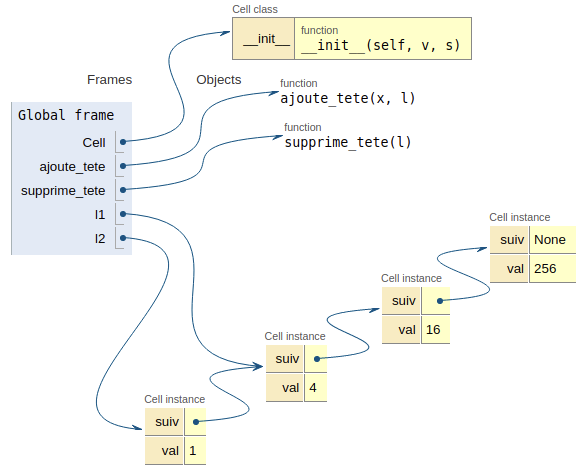
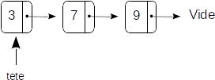
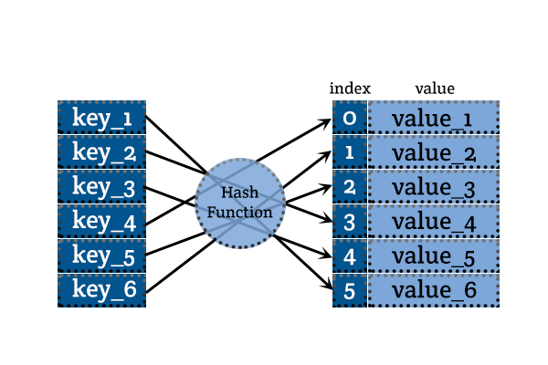

Structure de données linéaires 2: les listes
===================================

## Repère historique  
[John McCarthy](https://fr.wikipedia.org/wiki/John_McCarthy), prix Turing en 1971, créa en 1958 le langage [Lisp](https://fr.wikipedia.org/wiki/Lisp) qui signifie **LIS**t **P**rocessor.  Les listes constituent le fondement de Lisp.


## Introduction

!!! info "Définitions"
    Une liste est une collection finie d’éléments qui se suivent. C’est une structure de données **linéaire**. 
    Une liste qui ne contient aucun élément est une **liste vide**.  
    
Les doublons sont possibles. On formalisera cette définition dans un premier temps, avant de donner des implémentations possibles des opérations fondamentales sur les listes.  

Enfin, on fera une comparaison entre l'opération de recherche d'un élément dans une liste chainée et dans un dictionnaire.

## Comment formaliser une liste ?

Supposons une liste composée de trois éléments, ici des entiers: $\ell = [3, 7, 9]$. Une façon de décrire cette liste consiste à voir $\ell$ comme l'association:  

* d'un premier élément 3 qu’on nomme élément de tête;
* et d'une liste $\ell_1 = [7, 9]$ des éléments qui suivent (liste qu’on nomme souvent *reste*).  

Cette description de $\ell$ est aussi valable pour $\ell_1$ qui est constituée:  

* d’un élément de tête : 7,
* et d’un reste : $\ell_2 = [9]$.

De la même façon que précédemment, la liste $\ell_2$ est constituée:  

* d’un élément de tête : 9,
* et d’un reste : $\ell_3 = []$.  

La liste $\ell_3$ étant vide, elle ne possède pas d’élement de tête, et ne peut donc pas être décomposée
comme nous venons de le faire à trois reprises.  

!!! info "Définition"
    Une liste $\ell$ d'éléments d'un ensemble $E$, est:  
    
    * soit une liste vide;
    * soit un couple $(x,L)$ formé d'un élément de tête $x\in E$ et d'une liste $L$ d'éléments de $E$: 

Cette définition est récursive.

## Implémentation avec des listes chainées

Une liste peut être implémentée de différentes façons. Python, par exemple, utilise des *tableaux dynamiques redimensionnables* pour son type `list`. On va voir ici d'autres réalisations possibles à base de **listes chainées**.

### La base: une cellule

Dans cette réalisation concrète d'une liste, les éléments sont chainés entre eux.  

  

Chaque élément, qu'on nomme ici **cellule**, contient une valeur et une **référence** (*qui peut être vue comme l'adresse mémoire*) vers l'élément suivant.  
On va représenter une cellule par une **classe** `Cell`.


```python
class Cell:
    """ Une classe pour les listes chainées"""
    
    def __init__(self, v, s):
        self.val = v
        self.suiv = s
```

Une cellule est initialisée avec une valeur et une référence vers la cellule suivante. Si on considère que la liste vide est réalisée avec l'instruction `None`, la construction de la liste ci-dessus est alors facile:


```python
list1 = Cell(3, Cell(7, Cell(9, None)))
```

### Opérations sur les listes

#### Construire une liste


```python
list1 = Cell(3, Cell(7, Cell(9, Cell(8, Cell(1, None)))))
```

On peut visualiser le résultat dans [Pythontutor](http://pythontutor.com/visualize.html#code=class%20Cell%3A%0A%20%20%20%20%22%22%22%20Une%20classe%20pour%20les%20listes%20chain%C3%A9es%22%22%22%0A%20%20%20%20%0A%20%20%20%20def%20__init__%28self,%20v,%20s%29%3A%0A%20%20%20%20%20%20%20%20self.val%20%3D%20v%0A%20%20%20%20%20%20%20%20self.suiv%20%3D%20s%0A%0Alist1%20%3D%20Cell%283,%20Cell%287,%20Cell%289,%20Cell%288,%20Cell%281,%20None%29%29%29%29%29&cumulative=false&curInstr=22&heapPrimitives=nevernest&mode=display&origin=opt-frontend.js&py=3&rawInputLstJSON=%5B%5D&textReferences=false).

<figure>
    
</figure>

#### Déterminer si la liste est vide


```python
def estvide(l):
    return l is None
```


```python
estvide(list1)
```


    False


#### Ajouter ou supprimer la tête


```python
def ajoute_tete(x, l):
    """ renvoie une liste composée de l'élément x et dont le reste est l"""
    return Cell(x, l)

def supprime_tete(l):
    """renvoie une liste formée du reste de l"""
    return l.suiv    
```

On peut visualiser l'exemple  

```python
l1 = Cell(4, Cell(16, Cell(256, None)))
l2 = ajoute_tete(1, l1)
```

sur [Pythontutor](http://pythontutor.com/visualize.html#code=class%20Cell%3A%0A%20%20%20%20%22%22%22%20Une%20classe%20pour%20les%20listes%20chain%C3%A9es%22%22%22%0A%20%20%20%20%0A%20%20%20%20def%20__init__%28self,%20v,%20s%29%3A%0A%20%20%20%20%20%20%20%20self.val%20%3D%20v%0A%20%20%20%20%20%20%20%20self.suiv%20%3D%20s%0A%0Adef%20ajoute_tete%28x,%20l%29%3A%0A%20%20%20%20%22%22%22%20renvoie%20une%20liste%20compos%C3%A9e%20de%20l'%C3%A9l%C3%A9ment%20x%20et%20dont%20le%20reste%20est%20l%22%22%22%0A%20%20%20%20return%20Cell%28x,%20l%29%0A%0Adef%20supprime_tete%28l%29%3A%0A%20%20%20%20%22%22%22renvoie%20une%20liste%20form%C3%A9e%20du%20reste%20de%20l%22%22%22%0A%20%20%20%20return%20l.suiv%0A%0Al1%20%3D%20Cell%284,%20Cell%2816,%20Cell%28256,%20None%29%29%29%0Al2%20%3D%20ajoute_tete%281,%20l1%29&cumulative=false&curInstr=24&heapPrimitives=nevernest&mode=display&origin=opt-frontend.js&py=3&rawInputLstJSON=%5B%5D&textReferences=false).

<figure>
    
</figure>

!!! bug "Attention aux effets de bords"
    Dans l'exemple ci-dessus, si la valeur de $\ell_1$ change, alors la liste $\ell_2$ sera affectée aussi !! 
    Si on veut éviter cela, il faudra travailler sur des copies de la liste $\ell$ dans les fonctions. 

#### Obtenir la longueur de la liste

Une première possibilité est coder une fonction récursive:  

* si la liste est vide, sa longueur est nulle;
* sinon sa longueur vaut 1 plus la longueur de la liste suivante (*rappel: une liste est un élément suivi d'une liste, le reste*). 


```python
def longueur(l):
    """ renvoie la longueur d'une liste l"""
    
    if l is None:
        return 0
    else:
        return 1 + longueur(l.suiv)
```


```python
list1 = Cell(3, Cell(7, Cell(9, Cell(8, Cell(1, None)))))
longueur(list1)
```


    5


??? question "A faire"
    Coder une version itérative de la fonction longueur.  
    
    ```python
    def longueur_iter(l):
    """ Version itérative de la fonction 'longueur' """
    
    # Supprimer l'instruction pass et proposer votre code
    pass
    ```

#### Accéder au n-ième élément

On souhaite accéder (avoir la valeur) du n-ième élément d'une liste `lst` avec une fonction `nieme(n, lst)`. On procèdera encore de manière récursive:  

* si $n=0$, on renvoie simplement la valeur `lst.val`;
* sinon, on cherche l'élément d'index $n-1$ dans la liste suivante.  

Deux préconditions doivent être vérifiées: la liste ne noit pas être vide et l'index $n$ ne doit pas être négatif.  

??? question "A faire"
    
    ```python
    def nieme(n, lst):
    """ renvoie le nième élément de la liste lst;
    n: entier naturel,
    lst: liste non vide
    """
    
    assert n >= 0 and l is not None, "Erreur: accès impossible"
    # Compléter avec votre code
    ```

#### Concaténer deux listes  
A voir en exercice

### Encapsulation dans une classe

Une pratique courante consiste à créer une classe `Liste`. Les instances auront un attribut `tete` qui indique la tête de la liste ou `None` si la liste est vide. Les méthodes seront bâties à partir des fonctions précédentes.  

**Un objet de type Liste**  



```python
class Liste:
    """ Une classe fournissant des listes chainées"""
    
    def __init__(self):
        self.tete = None
        
    def estvide(self):
        return self.tete is None
    
    def ajoute_tete(self, x):
        """ ajoute l'élément x à la liste courante"""
        self.tete =  Cell(x, self.tete)

    def supprime_tete(self):
        """renvoie une liste formée du reste de la liste courante"""
        self.tete = self.tete.suiv
    
    def taille(self):
        """ renvoie la longueur d'une liste l"""
        def longueur(l):
            if l is None:
                return 0
            else:
                return 1 + longueur(l.suiv)
        return longueur(self.tete)
    
    def acces_nieme(self, n):
        """ renvoie le n-ième élément de la liste courante, les 
            éléments étant indexés à partir de zéro.
        """
        def nieme(n, lst):
            assert n >= 0 and lst is not None, "Erreur: accès impossible"
            if n == 0:
                return lst.val
            else:
                return nieme(n - 1, lst.suiv)
        return nieme(n, self.tete)
```

!!! question "A faire"
    Voir application en exercice.

## Rechercher un élément: comparaison dictionnaire / liste

Lors de la recherche d'un élément dans un dictionnaire, sa clé est d'abord passée à une fonction (*fonction de hashage*) qui calcule un index permettant sa localisation. La complexité de cette opération est constante ($O(1)$).  
.  
Lors de la recherche dans une liste, on doit parcourir **séquentiellement** celle-ci, jusqu'à trouver l'élément. Dans le pire des cas, la complexité de cette opération est en $O(n)$.
