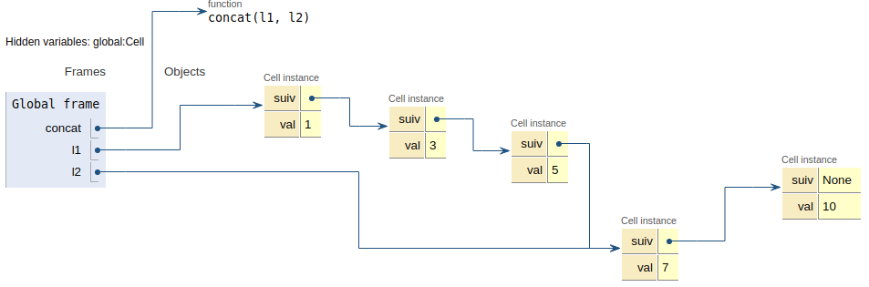
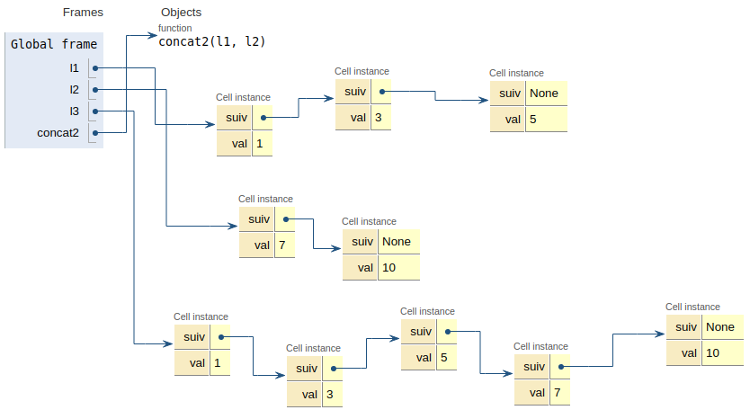
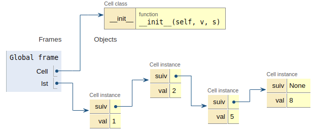
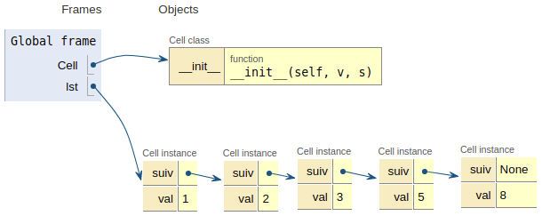

Structures linéaires 2 : Exercices - listes
=================================

## Problème 1 - La concaténation de deux listes chainées

On reprend la structure de liste chainée vue en cours, avec des cellules.


```python
class Cell:
    """ Une classe pour les listes chainées"""
    
    def __init__(self, v, s):
        self.val = v
        self.suiv = s
```

L'objectif de cet exercice est de coder une fonction permettant de **concaténer** (*mettre bout à bout*) deux listes.

### Solution autorisant les effets de bords

Soient deux listes chainées `l1` et `l2`.


```python
l1 = Cell(1, Cell(3, Cell(5, None)))
l2 = Cell(7, Cell(10, None))
```

Une première idée pour résoudre le problème posé est de trouver la dernière cellule de `l1` et de la chaîner à `l2`.  

1. Compléter la fonction `dernier` ci-après de manière à renvoyer la dernière cellule d'une liste `l` passée en paramètre. Tester votre code.


```python
def dernier(l):
    """ renvoie la dernière cellule de l"""
    assert l is not None
    cellule_courante = l
    # A compléter avec votre code
    return cellule_courante
```


```python
# Cellule de tests - A EXECUTER
assert dernier(l1).val == 5
assert dernier(l2).val == 10
```

2. Coder une fonction `concat` qui prend en paramètres deux listes `l1` et `l2` et qui procède à leur concaténation, c'est-à-dire qui place `l2` au bout de `l1`. La fonction ne renvoie rien. *Coup de pouce: pensez à réutiliser la fonction* `dernier`.


```python
def concat(l1, l2):
    """ renvoie la concaténation de l1 et l2"""
    # Supprimer l'instruction 'pass' et compléter avec votre code.
    pass
```


```python
# Cellule de tests - A EXECUTER
assert l1.val == 1
assert dernier(l1).val == 10
```

3. Quel(s) est(sont) le(s) problème(s) avec cette façon de procéder ? En cas de difficulté, penser à utiliser pythontutor en vue d'obtenir un résultat proche de la figure suivante.  


### Structure interdisant les effets de bords non souhaités

Afin d'éviter les problèmes identifiés précédémment, on choisit de travailler sur des copies des listes passées en paramètre. Le code d'une fonction copie est donnée ci-dessous. 


```python
def copie_rec(l):
    """ construit récursivement une nouvelle liste qui est la copie de l,
    et la renvoie."""
    
    if l is None: 
        return None
    else:
        return Cell(l.val, copie_rec(l.suiv))
```

Coder une fonction `concat2` qui prend deux listes `l1` et `l2` en paramètres et qui renvoie une **nouvelle** liste résultant de la concaténation de `l1` et `l2`.  Tester.

Ci-dessous, une vue de la situation àprès un appel `l3 = concat2(l1, l2)`.




```python
def concat2(l1, l2):
    # A compléter
    pass
```


```python
# TESTS - A EXECUTER
l1 = Cell(1, Cell(3, Cell(5, None)))
l2 = Cell(7, Cell(10, None))
l3 = concat2(l1, l2)

assert l3.val == l1.val
assert dernier(l3).val == dernier(l2).val
assert l3 is not l1
```

## Exercice 1 - Recherche séquentielle dans une liste chaînée

Ecrire une fonction `trouve(x, lst)` qui renvoie l'index de la première occurence de `x` dans la liste chaînée `lst` ou `None` si non trouvé. On donnera deux versions: récursive et itérative. Tester.


```python
# récursif
def trouve(x, lst):
    pass

# itératif
def trouve2(x, lst):
    pass
```


```python
# TESTS
```

## Exercice 2 - Insertion dans une liste triée

Ecrire une fonction `inserer(x, lst)` qui prend en paramètres un entier `x` et une liste chaînée `lst` d'entiers, supposée triée par ordre croissant et qui renvoie **une nouvelle liste** dans laquelle `x` a été inséré *à sa place*. Ainsi, si `lst` est la liste suivante  



l'appel `insert(3, lst)` renverra



!!! hint "Coup de pouce"
    Pensez à revoir l'exercice 5 (optionnel) du chapitre 1. On pourra réutiliser la fonction `copie_rec` du 
    problème 1.


```python
def insert(x, lst):
    pass
```


```python
# Tests
```

### Exercice 3 - Listes identiques

Ecrire une fonction `identiques(l1, l2)` qui renvoie un booléen indiquant si les listes `l1` et `l2` sont identiques c'est-à-dire contiennent les mêmes éléments, dans le même ordre.


```python
def identiques(l1, l2):
    pass
```


```python
# Tests
```

## Problème 4 - Création d'une classe Pile avec une liste chaînée

L'interface de la structure de données `Pile` comporte (*rappels !*) les opérations suivantes:  

* est_pile_vide;
* empiler;
* dépiler;

On se propose de donner une réalisation possible à base de cellules, en adoptant le paradigme objet.


```python
class Cell:
    """ Une classe pour les listes chainées"""
    
    def __init__(self, v, s):
        self.val = v
        self.suiv = s
```

On crée une classe `Pile` qui sera initialisée à `None` (pile vide). Compléter les méthodes de cette classe.


```python
class Pile:
    """ Une classe pile à base de liste chaînée"""
    
    def __init__(self):
        self.tete = None
        
    def est_pile_vide(self):
        pass
    
    def empiler(self, x):
        pass
        
    def depiler(self):
        assert not self.est_pile_vide()
        # A compléter
```


```python
# TESTS - A EXECUTER
p = Pile()
p.empiler(10)
p.empiler(20)
p.empiler(5)

assert p.tete.val == 5
assert p.tete.suiv.val == 20

p.depiler()
assert p.tete.val == 20
```


