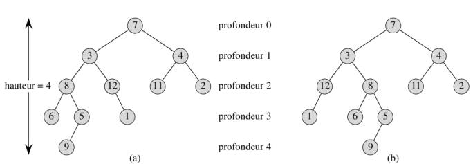
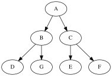

Arbres
======

## Structures arborescentes

La structure de liste chaînée rencontrée précédemment est intéressante lorsqu'on a besoin d'un **accès séquentiel** aux éléments. En revanche, elle est peu adaptée à des accès arbitraires. Dans ce cas de figure, une structure **arborescente** peut être envisagée. Il s'agit d'une autre famille de structures chaînées qui permet de structurer les informations stockées de **manière hiérarchique**. Les applications sont très nombreuses; on peut citer par exemple:  

* arborescence du système de fichier d'un ordinateur;
* expression arithmétique;
* structure des pages web;
* arbre généalogique;
* etc.

## Arbres binaires 

### Terminologie

Un arbre est une structure de données particulière, composée de **noeuds** et d'un ensembles de lignes appelées **arcs**. Un noeud est représenté par un cercle contenant son nom. Un arc relie deux noeuds distincts.  

Dans un arbre **binaire** chaque noeud possède 0, 1 ou 2 **fils** au maximum.  

  

Dans cet arbre, `B` et `C` sont les fils de `A`. On peut dire aussi que `A` est le **père** de `B` et `C`.  

Un arbre qui ne comporte pas de noeud est un **arbre vide**.  Si l'arbre n'est pas vide, il comporte:  

* un noeud particulier appelé **racine**;
* deux sous ensembles de noeuds appelés **sous arbre gauche** et **sous arbre droit**.

!!! info "Remarque"
    La racine est reliée à la racine des sous arbres (*sauf s'il est vide*).  

Un noeud qui a deux sous arbres vides est **une feuille**.  
Dans l'exemple ci-dessus:  

* `A` est la racine;
* `D`, `E` et `F` sont des feuilles.  

La **taille** $N$ d'un arbre correspond au nombre de noeuds. Par exemple, la taille de l'arbre présenté en introduction est $N=6$.  

La **profondeur** ou **niveau** d'un noeud $x$ est le nombre d'arcs rencontrés de la racine à $x$. On convient que la profondeur de la racine vaut 0.  

!!! info "Remarque"
    On peut donner une définition récursive de la profondeur d'un noeud $x$.  
    
    * Si $x$ est la racine, $prof(x)=0$;
    * sinon, $prof(x)=1+prof(Pere(x))$
    
La **hauteur** $h$ d'un arbre est **la profondeur maximale** d'un quelconque noeud de l'arbre.  



### Encadrement de la hauteur

La hauteur d'un arbre de taille $N$ vérifie une double inégalité:  

$$\left\lfloor \log_2N\right\rfloor \leq h \leq N -1$$  

La borne supérieure correspond à un arbre dont chaque noeud ne présente qu'une branche, dans ce cas $h=N-1$ (Fig. 1). La borne inférieure correspond à un arbre ou chaque niveau est complet, dans ce cas $h=\left\lfloor \log_2N\right\rfloor$ (Fig. 2).  
La quantité $\left\lfloor \log_2N\right\rfloor$ correspond au nombre bit nécessaire pour écrire $N$ en binaire, diminué de 1.

 (Fig. 1)

 (Fig. 2)


## Une représentation possible en python

### Utilisation d'une classe

De la même façon qu'on a construit les listes chaînées avec des *cellules*, on va utiliser une **classe Noeud** pour décrire un arbre. Un noeud comporte une information ou *valeur*, une référence vers le sous arbre gauche et une référence vers le sous arbre droit.


```python
class Noeud:
    """ Une classe pour modéliser les noeuds d'un arbre"""
    
    def __init__(self, v, fg=None, fd=None):
        self.val = v
        self.gauche = fg
        self.droit = fd        
```

Ainsi, on va représenter l'arbre donné en introduction (*dans le paragraphe Définitions*) par un objet que l'on va instancier de la manière suivante:


```python
arb1 = Noeud('A', 
             Noeud('B', Noeud('D')), 
             Noeud('C', Noeud('E'), Noeud('F'))
            )
```


```python
print(arb1.val)
print(arb1.gauche.val)
```

    A
    B


### Taille d'un arbre

La taille d'un arbre vide vaut 0. S'il n'est pas vide, sa taille est:  

$1 + \mathrm{taille\ sous\ arbre\ gauche + taille\ sous\ arbre\ droit}$

!!! info "Remarque"
    La présence du 1 s'explique par la prise en compte de la racine.

Une telle définition incite naturellement à écrire un algorithme récursif pour évaluer la taille d'un arbre. L'implémentation en python est immédiate:


```python
def taille(arb):
    """ Renvoie la taille de l'arbre passé en paramètre"""
    
    if arb is None:
        return 0
    else:
        return 1 + taille(arb.gauche) + taille(arb.droit)
```


```python
assert taille(arb1) == 6
```

### Hauteur d'un arbre

Par convention, la hauteur d'un arbre vide est fixée à $-1$ (voir [Wikipedia](https://en.wikipedia.org/wiki/Tree_%28data_structure%29)). Si l'arbre n'est pas vide, sa hauteur vaut:  

$1 + \mathrm{max(hauteur\ sous\ arbre\ gauche,\ hauteur\ sous\ arbre\ droit)}$  

!!! info "Remarque"
    Avec une telle convention, un arbre avec un seul noeud aura une hauteur nulle.
    
Comme précédemment, une réalisation naturelle fait appel à un algorithme récursif dont l'implémentation en python est la suivante:


```python
def hauteur(arb):
    """ Renvoie la hauteur de l'arbre 'arb'"""
    
    if arb is None:
        return -1
    else:
        return 1 + max(hauteur(arb.gauche), hauteur(arb.droit))
```


```python
assert hauteur(arb1) == 2
```
