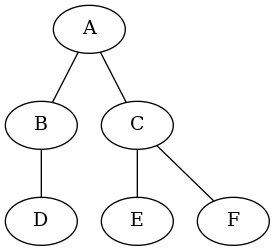
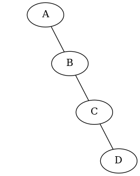
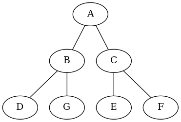

Arbres
======

## Structures arborescentes

La structure de liste chaînée rencontrée précédemment est intéressante lorsqu'on a besoin d'un **accès séquentiel** aux éléments. En revanche, elle est peu adaptée à des accès arbitraires. Dans ce cas de figure, une structure **arborescente** peut être envisagée. Il s'agit d'une autre famille de structures chaînées qui permet de structurer les informations stockées de **manière hiérarchique**. Les applications sont très nombreuses; on peut citer par exemple:  

* arborescence du système de fichier d'un ordinateur;
* expression arithmétique;
* structure des pages web;
* arbre généalogique;
* etc.

## Arbres binaires 

### Terminologie

Un arbre est une structure de données particulière, composée de **nœuds** et d'un ensembles de lignes appelées **arêtes**. Un nœud est représenté par un cercle contenant son nom. Un arête relie deux nœuds distincts.  

Dans un arbre **binaire** chaque nœud possède 0, 1 ou 2 **fils** au maximum.  

  

Dans cet arbre, `B` et `C` sont les fils de `A`. On peut dire aussi que `A` est le **père** de `B` et `C`.  

Un arbre qui ne comporte pas de nœud est un **arbre vide**.  Si l'arbre n'est pas vide, il comporte:  

* un nœud particulier appelé **racine**;
* deux sous ensembles de nœuds appelés **sous arbre gauche** et **sous arbre droit**.

!!! info "Remarque"
    La racine est reliée à la racine des sous arbres (*sauf s'il est vide*).  

Un nœud qui a deux sous arbres vides est **une feuille**.  
Dans l'exemple ci-dessus:  

* `A` est la racine;
* `D`, `E` et `F` sont des feuilles.  

La **taille** $N$ d'un arbre correspond au nombre de nœuds. Par exemple, la taille de l'arbre présenté en introduction est $N=6$.  

La **profondeur** ou **niveau** d'un nœud $x$ est le nombre d'arêtes rencontrés de la racine à $x$. On convient que la profondeur de la racine vaut 0.  

!!! info "Remarque"
    On peut donner une définition récursive de la profondeur d'un nœud $x$. Soit $\mathrm{prof}(x)$ la fonction donnant la profondeur du nœud $x$: 
    
    * si $x$ est la racine, $\mathrm{prof}(x)=0$;
    * sinon, $\mathrm{prof}(x)=1+\mathrm{prof}(\mathrm{Pere}(x))$ où $\mathrm{Pere}(x)$ est une fonction renvoyant le noeud père du noeud $x$.
    
La **hauteur** d'un nœud $x$ est le nombre maximal d'arêtes rencontrés menant $x$ à une feuille. La hauteur $h$ d'un arbre est la hauteur de sa racine.  


### Encadrement de la hauteur

La hauteur d'un arbre de taille $N$ vérifie une double inégalité:  

$$\left\lfloor \log_2N\right\rfloor \leq h \leq N -1$$  

La borne supérieure correspond à un arbre dont chaque noeud ne présente qu'une branche, dans ce cas $h=N-1$ (Fig. 1). La borne inférieure correspond à un arbre ou chaque niveau est complet, dans ce cas $h=\left\lfloor \log_2N\right\rfloor$ (Fig. 2).  
La quantité $\left\lfloor \log_2N\right\rfloor$ correspond au nombre bit nécessaire pour écrire $N$ en binaire, diminué de 1.

 (Fig. 1)

 (Fig. 2)

!!! bug "Attention convention"
    Certains auteurs donnent la racine avec une profondeur de 1! Avec ce choix, l'arbre vide a une hauteur de 0 et plus généralement la hauteur est encadrée par $\left\lfloor \log_2(N+1)\right\rfloor \leq h \leq N$. Il s'agira de lire attentivement le sujet pour connaître la convention adoptée.

## Une représentation possible en python

### Utilisation d'une classe

De la même façon qu'on a construit les listes chaînées avec des *cellules*, on va utiliser une **classe Noeud** pour décrire un arbre. Un noeud comporte une information ou *valeur*, une référence vers le sous arbre gauche et une référence vers le sous arbre droit.


```python
class Noeud:
    """ Une classe pour modéliser les noeuds d'un arbre"""
    
    def __init__(self, v, fg, fd):
        self.val = v
        self.gauche = fg
        self.droit = fd        
```

Ainsi, on va représenter l'arbre donné en introduction (*dans le paragraphe Définitions*) par un objet que l'on va instancier de la manière suivante:


```python
arb1 = Noeud('A', 
             Noeud('B', None, Noeud('D', None, None)), 
             Noeud('C', Noeud('E', None, None), Noeud('F', None, None))
            )
```


```python
print(arb1.val)
print(arb1.gauche.val)
```

    A
    B

