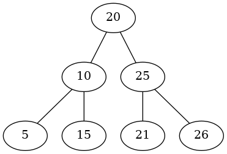
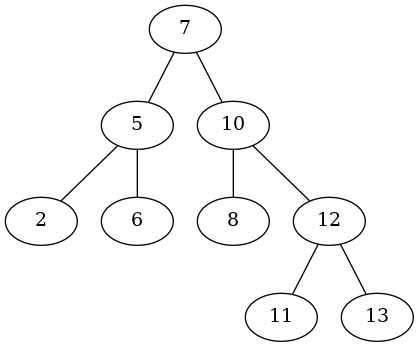

Algorithmes sur les arbres binaires de recherche (ABR)
======================================================

Lorsque l'on souhaite effectuer des opérations de recherche, d'insertion ou de suppression d'éléments ordonnés d'une collection, avec la même efficacité, on utilise une structure arborescente.  
La structure fondamentale est *l'arbre binaire de recherche*.

## Définition

!!! info "ABR"
    Un arbre binaire de recherche est un arbre binaire tel que pour tout nœud $\mathcal{N}$ de l'arbre:  
    
    * les valeurs de tous les nœuds du sous arbre gauche de $\mathcal{N}$ sont inférieures ou égale à la valeur de $\mathcal{N}$;
    * les valeurs de tous les nœuds du sous arbre droit de $\mathcal{N}$ sont supérieures à la valeur de $\mathcal{N}$;

**Exemples**

  

## La recherche

Supposons que nous souhaitons rechercher un élément $x$ dans un arbre binaire de recherche $\mathcal{A}$. On compare $x$ avec la valeur associée à la racine $r$ de $\mathcal{A}$. Si $x$ est à la racine, nous en avons terminé. Sinon, si $x$ est plus petit que la valeur de la racine, $x$ ne peut être trouvé que dans le sous arbre gauche $fils_G$; si $x$ est plus grand que la valeur de la racine, il ne peut être trouvé que dans le sous arbre droit $fils_D$. On peut donc exprimer l'opération *Rechercher* par le le biais de l'algorithme suivant:  

!!! example "Algorithme 1"
    **RechercheABR**  
    *Entrées*: une valeur $x$ et la racine $r$ d’un ABR $\mathcal{A}$   
    *Sortie*: VRAI ou FAUX suivant que $x$ ait été trouvé ou pas  
    
    Si $r$ est vide:  
    $\qquad$Renvoyer  FAUX  
    Si $x=r.val$:  
    $\qquad$Renvoyer VRAI  
    Sinon  
    $\qquad$Si $x<r.val$:  
    $\qquad\qquad$Renvoyer RechercheABR($x,r.fils_G$)  
    $\qquad$Sinon  
    $\qquad\qquad$Renvoyer RechercheABR($x,r.fils_D$)

On admettra que l'algorithme **RechercheABR** est correct et a une complexité en temps en $\mathcal{O}(h)$ si $h$ est la hauteur de l'arbre.

## L'insertion

Soit une valeur $x$ à insérer dans un arbre $\mathcal{A}$. Si $\mathcal{A}$ est vide alors l'insertion est triviale: il suffit de renvoyer un nœud qui a pour valeur $x$, sans fils gauche ni droit. Si $\mathcal{A}$ n'est pas vide et si sa racine a pour valeur $x$, on ne fait rien.  
Dans le cas d'un arbre non vide et dont la racine n'est pas $x$, alors il faudra insérer $x$ dans le sous arbre gauche $fils_G$ si $x$ est plus petit que la valeur de la racine ou dans le sous arbre droit s'il est plus grand.  En définitive, on obtient l'agorithme récursif suivant:  

!!! example "Algorithme 2"
    **InsertionABR**  
    *Entrées*: une valeur $x$ et la racine $r$ d’un ABR $\mathcal{A}$   
    *Sortie*: un ABR $\mathcal{A}$ dans lequel $x$ a été inséré.   
    
    Si $r$ est vide:  
    $\qquad$Renvoyer Nœud($x$, vide, vide)   
    Sinon Si $x<r.val$:  
    $\qquad r.fils_G=$ InsertionABR($x, r.fils_G$)   
    Sinon Si $x>r.val$:  
    $\qquad r.fils_D=$ InsertionABR($x,r.fils_D$)  
    Renvoyer $r$

On admettra que l'algorithme **InsertionABR** est correct et que sa complexité en temps est en $\mathcal{O}(h)$ où $h$ est la hauteur de l'arbre.
