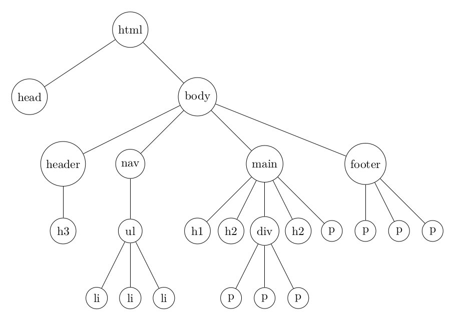
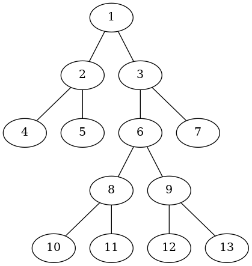
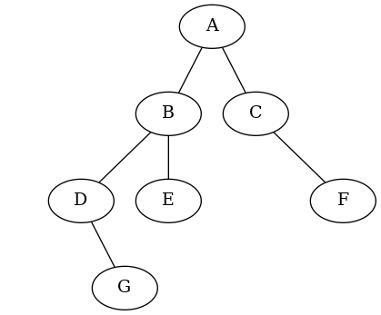

Arbres T NSI
===========

## Terminologie - parcours et calculs simples

**Données**  

*Pour les tests, on pourra utiliser les déclarations présentes dans les deux cellules suivantes. Par ailleurs, on choisit la convention où* **la racine a une profondeur de 0**.


```python
class Noeud:
    """ Une classe pour modéliser les noeuds d'un arbre"""
    
    def __init__(self, v, fg=None, fd=None):
        self.val = v
        self.gauche = fg
        self.droit = fd 
```


```python
# Un arbre pour les tests
arb1 = Noeud('1',
             Noeud('2', Noeud('4'), Noeud('5')),
             Noeud('3', Noeud('6', 
                             Noeud('8', Noeud('10'), Noeud('11')),
                             Noeud('9', Noeud('12'), Noeud('13'))),
                  Noeud('7'))
)
```

## Exercice 1

Soit la structure suivante modélisant un document HTML:  
    


Est-ce un arbre? un arbre binaire ? Justifier la réponse.

## Exercice 2

Dessiner toutes les formes que peut prendre un arbre binaire à 3 nœuds.

## Exercice 3



1. Quelles sont la taille et la hauteur de cet arbre ?
2. Combien a-t-il de feuilles?
3. Quelle est la hauteur du nœud `6`?
2. Dans un parcours infixe, donner l'ordre des noeuds visités.
3. On souhaite écrire une fonction `nb_feuille` qui prend en paramètre un arbre binaire `a` (instance de la classe `Noeud` décrite en introduction de cette fiche) et qui renvoie son nombre de feuille. On choisit un algorithme récursif.  
    * Compléter la cellule ci-dessous.
    * Vérifier alors le résultat de la question 2.


```python
def nb_feuille(a):
    """ renvoie le nombre de feuilles de l'arbre binaire a """
    if ...:
        return 1
    elif a.gauche is None:
        return ...
    elif a.droit is None:
        return ...
    else:
        return ...
```

## Exercice 4

Que réalise la fonction `mystere` ci-dessous ?


```python
def mystere(a, n):
    if a is not None:
        if n == 0:
            print(a.val, end=' ')
        else:
            mystere(a.gauche, n - 1)
            mystere(a.droit, n - 1)
```

## Exercice 5

Soit l'arbre de la figure suivante.  

  

1. Créer une instance `arb2` de la classe `Noeud` qui pourrait décrire cet arbre.
2. Quelle est sa hauteur?
3. Donner les noeuds visités lors d'un parcours postfixe.
4. Compléter la fonction récursive `affiche` qui décrit un parcours postfixe d'un arbre en affichant:  
    * un point `.` et ne renvoyant rien pour un arbre vide;
    * une parenthèse ouvrante ` (`, le sous arbre gauche, le sous arbre droit, la valeur et enfin une parenthèse fermante ` )`. *A titre d'exemple pour l'arbre présenté ici*, `affiche(arb2)` *fournit*: `( ( (. (..G )D ) (..E )B ) (. (..F )C )A )`.

5. Dessiner l'arbre $\mathcal{A}$ dont l'affichage avec la fonction `affiche` produirait `( (. (..C )B )(..D )A )`. *Conseil: commencez par les feuilles*.


```python
arb2 = Noeud('A',
            Noeud('B', 
                  Noeud('D', None, Noeud('G', None, None)), 
                  Noeud('E', None, None)),
            Noeud('C', None, Noeud('F', None, None))
            )
```


```python
def affiche(a):
    """ Affiche un arbre binaire a"""
    
    if a is None:
        ...
    else:
        print(' (', end='')
        affiche(...)        
        affiche(...)
        print(..., end='')
        print(' )', end='')
```


```python
# TESTS
#affiche(arb2)
```

## Exercice 6

Ecrire une fonction `peigne` qui prend en paramètre un entier naturel $h$ et un entier $val$ et qui renvoie un arbre de hauteur $h$ où chaque nœud n'a **pas de sous arbre droit**. Vérifier le résultat avec la fonction `affiche` de l'exercice précédent. On utilisera un algorithme récursif en tenant compte des indications suivantes:

* le peigne de hauteur nulle est le nœud racine et n'a pas de sous arbre;  
* le peigne de hauteur $h$ est le nœud racine dont le sous arbre gauche est un peigne de hauteur $h-1$ et qui n'a pas de sous arbre droit.  

La valeur des nœuds vaudra $val, val-1,val-2,\cdots, val-h$ de la racine jusqu'à la feuille.


```python
# A compléter

def peigne(h, val):
    """ """
    if h == 0:
        return ...
    else:
        return ...
```
