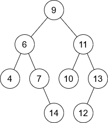
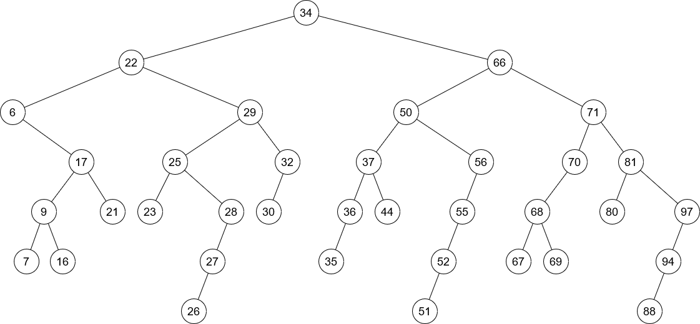

Exercices ABR
=============

## Exercice 1

L'arbre binaire suivant est-il un ABR ? Justifier.  



## Exercice 2

Sur l’arbre fourni ci-dessous, ajouter un nœud de clé égale à 33, puis un autre de clé égale à 95.  



## Exercice 3

Créer un nouvel Arbre Binaire de Recherche (ABR) dont les clés suivantes sont insérées progressivement : 32-16-8-35-33.

## Exercice 4

Même question en modifiant la place du 35 : 35-32-16-8-33.

L'ordre d'apparition des clés est-elle importante avec ce principe d'insertion ?  

Vérifier vos réponses sur [ce site](https://www.cs.usfca.edu/~galles/visualization/BST.html)

## Exercice 5

Implémenter les algorithmes de recherche et d'insertion du cours en python.

## Exercice 6

Comme pour les listes chaînées, proposer une classe `ABR` dont l'interface propose les méthodes `chercher` et `inserer`. On pourra ré-utiliser les fonctions de recherche et d'insertion de l'exercice précédent.


```python
# TESTS

abr = None # abr est un arbre vide
abr = inserer(15, abr)
abr = inserer(20, abr)
abr = inserer(7, abr)
abr = inserer(3, abr)
```
