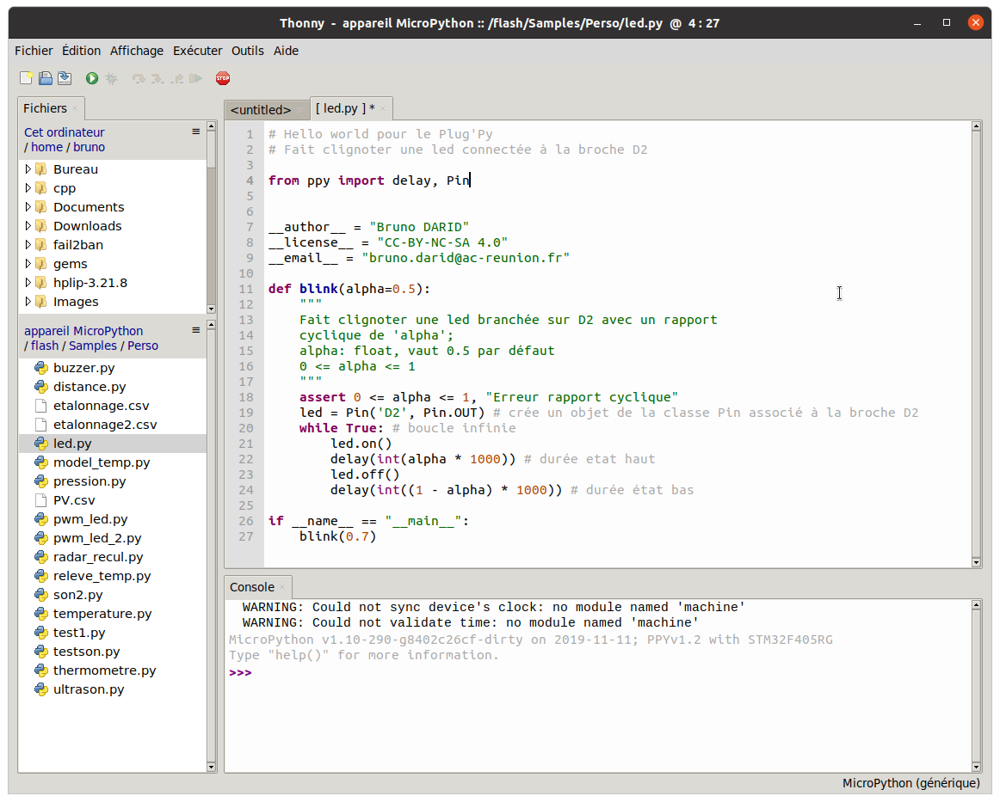

Hello World
=========

Il est coutume de commencer l'apprentissage d'un nouveau langage de programmation par le code d'affichage de la phrase *Hello World*. La déclinaison dans le monde des microcontrôleurs est le clignotement d'une led.

## Le montage

On connecte une led sur la broche `D2` du boîtier (connecteur SIL) en série avec une résistance de $220\ \Omega$.  


## Dialogue via un terminal REPL

Après avoir établi une connexion avec le Plug'Py, on va tester via l'interpréteur (REPL) quelques instructions, en python, destinées à allumer puis éteindre une led.  
On peut le faire avec `PuTTY` ou `Thonny`  


**Commentaires du code**  

L'essentiel des fonctionnalités de la carte réside dans le module `ppy`. Par conséquent, on importera presque systématiquement ce module avec `import ppy` ou uniquement quelques fonctions ou classes par `from ppy import ...`.

Avant de pouvoir utiliser une broche du microcontroleur en sortie ou en entrée, il faut créer un *objet* de la classe `Pin` qui référence cette broche. La syntaxe est la suivante:

```python
ma_led = Pin('D2', Pin.OUT)
```

Les instructions `ma_led.on()` et `ma_led.off()` permettent de placer un niveau haut ou bas de tension sur la broche référencée par `ma_led`. Enfin, `delay(...)` provoque une attente (la valeur en milliseconde doit être placée en paramètre).

## Ecriture d'un script

Afin de sauvegarder son travail, on peut naturellement enregistrer son code dans un fichier sur la carte (avec les recommandations déjà faites sur le lieu de stockage).  


