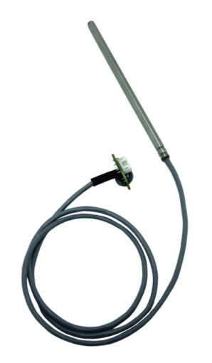
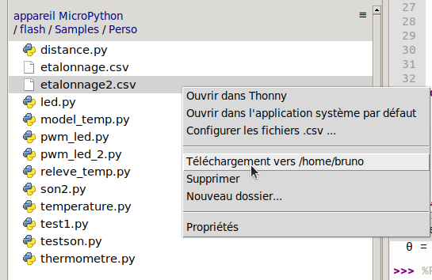
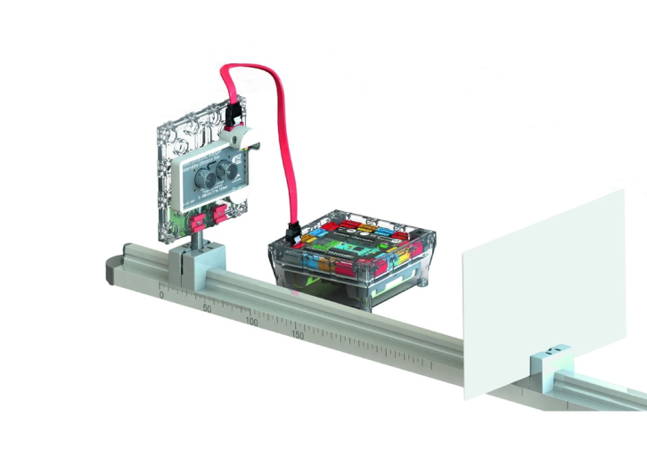
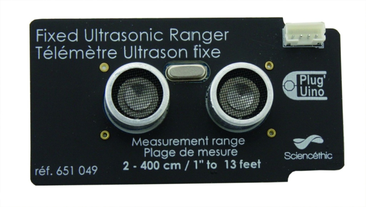
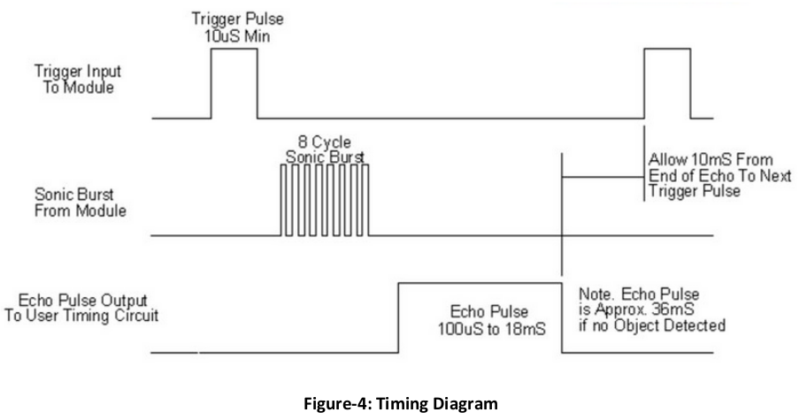
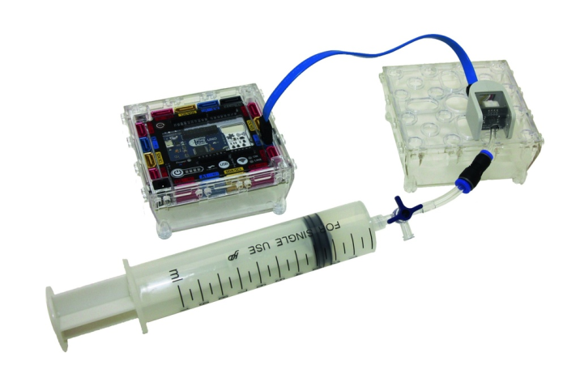
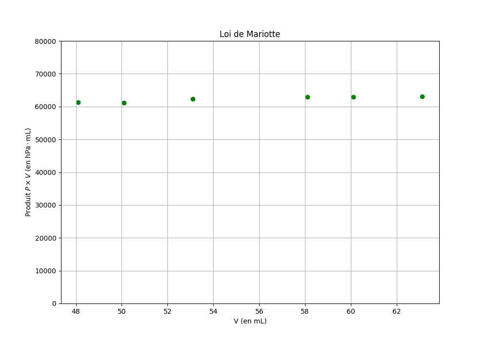

Mise en œuvre de capteurs
=========================

## Capteur de température
### Courbe d'étalonnage d'une CTN

Il s'agit d'utiliser le Plug'Uino Py pour mesurer la résistance d'une CTN (module 651 054), en faisant varier la température. Les résultats seront sauvegardés dans un fichier *csv*.  



Après avoir branché le capteur fourni par Sciencethic sur la broche `A0` et ouvert l'éditeur `Thonny`, on crée un fichier `releve_temp.py` dont le contenu est le suivant:  

**Script** `releve_temp.py`

```python
# Relevé R=f(θ) d'une CTN
# Par défaut l'acquisition se fait toutes les 30 secondes. Pour changer cette valeur
# modifier la constante DELAI (valeur en seconde)

__author__ = 'Bruno DARID'
__license__ = 'CC-BY-NC-SA 4.0'
__email__ = 'bruno.darid@ac-reunion.fr'

import os
from ppy import ADC, Pin, delay


# Quelques 'constantes'
DELAI = 30
MSG = """==== Acquisition toutes les 30 sec ou paramétrage personnel ====
1) A l'invite, entrer la temperature lue au thermomètre
2) Pour quitter --> ctrl + C
"""

def lecture(entree):
    """ Réalise une conversion A/N sur 'entree' et renvoie sa valeur """
    
    return entree.read()

def acquisition(nom_fichier, entree):
    """ Demande une lecture sur 'entree' et écrit la valeur dans 'nom_fichier'.csv
    nom_fichier: chaine correspondant au nom du fichier SANS EXTENSION.
    """
    
    with open(nom_fichier + '.csv', 'w') as f:
        while True:
            temp = input('Nouvelle valeur de temperature: ')
            n = lecture(entree) # demande une conversion
            f.write(str(10_000 * (4095 / n - 1)) + ';' + temp + '\n') # Diviseur de tension avec Rctn et R1=10k sur entrée A0
            delay(DELAI * 1000) # delay attend des millisecondes

def main():
    print(MSG)
    os.chdir('/flash/Samples/Perso') # Se déplacer dans le rép. de travail perso
    entree_A0 = ADC(Pin('A0', Pin.IN)) # On suppose que le capteur est branché sur A0
    acquisition('etalonnage', entree_A0) # le fichier sera nommé 'etalonnage.csv'
    
if __name__ == "__main__":
    main()
```

#### Commentaires de code
La fonction `aquisition`mérite une attention particulière. Elle a pour objectif de commander une lecture et d'écrire le résultat dans un fichier. Les opérations d'entrée/sortie sur les fichiers sont généralement effectuées avec la fonction `open` à qui on fournit le nom du fichier et le mode d'accès. Typiquement, on utilise une déclaration comme:  
```python
f = open(mon_fichier, 'r')
...
f.close()
```

ou  

```python
f = open(mon_fichier, 'w')
...
f.close()
```

Ici, on utilise une construction un peu plus sûre, formée de la manière suivante:  

```python
with open(nom_fichier + '.csv', 'w') as f:
```
qui fermera le fichier quoi qu'il arrive, même si une erreur s'est produite. Il s'agit de concepts (très) avancés du langage (`Exception` et `Context manager`) qui ne seront pas abordés ici.

!!! info "Remarque"
    La relation de la ligne 34 vient du diviseur de tension formé par une résistance $R_1=10\ \mathrm{k\Omega}$ et $R_{CTN}$ sur l'entrée `A0`

La fonction `main` ne pose pas de problème de compréhension particulier.

### Exploitation
#### Tracé d'une courbe d'étalonnage

L'implémentation Micropython de la carte ne permet pas le tracé $R=f(\theta)$, la librairie `matplotlib` n'étant pas présente! A titre indicatif, on peut récupérer le fichier *csv* avec `Thonny` (*clic droit sur le fichier, puis téléchargement*).  



Avec l'installation python de l'ordinateur ou sur [basthon](https://nsiboisdo.bdrd.fr/basthon/), on peut facilement tracer $R=f(\theta)$, par exemple avec le code suivant:  

```python
import matplotlib.pyplot as plt

# A décommenter, si l'installation le permet
#%matplotlib widget

with open('etalonnage2.csv', 'r') as f:
    mesures = [ligne.strip().split(';') for ligne in f] # Récupération de chaque ligne
    R = [float(point[0]) for point in mesures]
    theta = [float(point[1]) for point in mesures]
    
fig, ax = plt.subplots(figsize=(10,7))
ax.set(xlabel=r'$\theta$(°C)',
       ylabel=r'R ($\Omega$)',
       ylim=(0,25_000),
       title="Courbe d'étalonnage d'une CTN"
      )
ax.grid()
ax.scatter(theta, R, color='green', marker='o')
# A décommenter si l'installation le nécessite
#fig.show()
```

On obtient alors la courbe d'étalonnage:  


#### Modélisation

Pour modéliser la CTN on utilise la relation de Steinhart-Hart (*source* [Wikipedia](https://fr.wikipedia.org/wiki/Relation_de_Steinhart-Hart)):  

$$\dfrac{1}{T}=A + B\times \ln(R) + C\times(\ln(R))^3$$

avec :  

* $T$ sa température (en kelvins);
* $R$ sa résistance électrique (en ohms);
* $A, B$ et $C$ les coefficients de Steinhart-Hart qui caractérisent chaque thermistance.

Il s'agit de calculer les trois coefficients à partir de trois mesures de température. L'implémentation micropython de la carte **n'intègre pas les librairies de calculs** `numpy` ou `sympy`, on programmera directement la résolution de ce problème comme indiqué sur la page de [Wikipedia](https://fr.wikipedia.org/wiki/Relation_de_Steinhart-Hart).  

**Script** `model_temp.py`

```python
# Calcule les éléments du modèle de Steinhart-Hart;
# Application: affichage de la température

from math import log as ln
from ppy import ADC, Pin


def model_steinhart():
    """ Calcule le modèle de Steinhart-Hart et renvoie un tuple (A, B, C) tel que:
    1/T = A + B*ln(R) + C*(ln(R))**3
    """
    
    with open('/flash/Samples/Perso/etalonnage2.csv', 'r') as f:
        releve = [ligne.strip().split(';') for ligne in f] # Récupération de chaque ligne
        releve = [[float(valeur[0]), float(valeur[1])] for valeur in releve] # Conversion en flottant
    
    # On récupere 3 pts dans notre relevé
    R = [releve[i][0] for i in (0, len(releve) // 2, -1)] # on prend 1 pt au début, milieu et à la fin   
    T = [releve[i][1] + 273.15 for i in (0, len(releve) // 2, -1)] 
    # Quelques changements de variables
    # Détails --> https://fr.wikipedia.org/wiki/Relation_de_Steinhart-Hart
    Y1, Y2, Y3 = 1 / T[0], 1 / T[1], 1 / T[2]
    L1, L2, L3 = ln(R[0]), ln(R[1]), ln(R[2])

    a = ((L2 - L3) / (L1 - L2)) * ((L2)**3 - (L1)**3) + ((L2)**3 - (L3)**3)
    b = Y2 - Y3 - ((L2 - L3) / (L1 - L2)) * (Y1 - Y2)

    C = b / a
    B = (Y1 - Y2 - ((L1)**3 - (L2)**3) * C) / (L1 - L2)
    A = Y1 - L1 * B - (L1)**3 * C
    return A, B, C


def main():
    A, B, C = model_steinhart() # Récupération des coefficients du modèle
    entree_A0 = ADC(Pin('A0', Pin.IN))
    v = entree_A0.read() # lecture d'une valeur
    R = 10_000 * (4095 / v - 1) # La CTN est inclus dans un diviseur de tension avec R=10K
    T = 1 / (A + B * ln(R) + C * ln(R)**3)
    print('\u03B8 = {} °C'.format(round(T - 273.15, 1))) # Affichage au dixième près
    
if __name__ == "__main__":
    main()
```

**Exécution du programme: thermomètre**  


## Capteur à ultrasons

On utilise le module *Sciencethic 651 049*  



Vu que le module HC-SR04 est monté dans une coque plastique, il nous est impossible d'avoir accès à ses bornes et donc de visualiser les signaux émis et reçus.

### Documentation du HC-SR04



Avant de proposer une utilisation, il est toujours intéressant de consulter la documentation associée à ce type de capteur. on peut trouver une copie [à cette adresse](http://www.handsontec.com/pdf_files/hc-sr04-User-Guide.pdf). La page 6 est particluièrement intéressante.  



Sans surprise on y apprend que la durée du signal présent dur la broche 'ECHO' est proportionnelle à la distance entre l'émetteur et l'obstacle.

### Une activité possible

On met en œuvre ici le principe du radar de recul des voitures. Le module ultrason est branchée sur la sortie `A0` du microcontrolleur. Voici un exemple de script.  
**Script** `radar_recul.py` 

```python
# Principe du radar de recul
# Utilisation du module 'Télémètre' réf. Sciencethic 651 049
# on simule l'alarme en envoyant un son sur la sortie A0, par
# l'intermédiaire d'un convertisseur numérique/analogique (DAC)

__author__ = 'Bruno DARID'
__license__ = 'CC-BY-NC-SA 4.0'
__email__ = 'bruno.darid@ac-reunion.fr'

from lib.USRanger import USRanger
from ppy import Pin, delay, DAC
from math import sin, pi


def alarme(sortie, off=False):
    """ Produit d'un son sinusoidal de freq = 600 Hz;
    sortie: instance de DAC
    off: booleen, si off=True, alors on coupe le son.
    """
    
    if off:
        sortie.write(0)
    else:
        buf = bytearray(100) # tableau d'octets pour un buffer
        for i in range(100):
            # Remplissage du buffer contenant la fonction sinus
            buf[i] = 128 + int(127 * sin(2 * pi * i / 100))
        # voir documentation pour la syntaxe de write_timed
        sortie.write_timed(buf, 600 * len(buf), mode=DAC.CIRCULAR)

def main():
    # Affectation des broches: télémètre sur D2 et son sur A0
    module = USRanger(Pin('D2', Pin.OUT))
    sortie_son = DAC(Pin('A0', Pin.OUT))
    
    while True:
        # Il vaudrait mieux effectuer une moyenne sur quelques mesures
        # plutot qu'une seule !
        mesures = []
        for i in range(20):
            # Utilisation de la librairie pour la mesure de d
            mesures.append(module.mesureCentimeters())
            delay(10) # conformément à la documentation
        dist = sum(mesures) / len(mesures)
        # Prise de décision suivant la valeur de la distance
        if dist < 20:
            alarme(sortie_son)
        else:
            alarme(sortie_son, off=True)


if __name__ == "__main__":
    main()
```

### Commentaires de code
#### Production de son
On utilise les fonctionnalités du convertisseur numérique analogique. On créé d'abord le tableau de valeurs à envoyer vers le DAC, puis on réalise effectivement l'écriture.

```python
buf = bytearray(100) # tableau d'octets pour un buffer
for i in range(100):
    # Remplissage du buffer contenant la fonction sinus
    buf[i] = 128 + int(127 * sin(2 * pi * i / 100))
```

Le tableau d'octet créé va contenir une période d'un sinus. On a choisi ici arbitrairement de *découper* l'intervalle $\left[0\cdots 2\pi\right[$ en 100 points.

```python
sortie.write_timed(buf, 600 * len(buf), mode=DAC.CIRCULAR)
```

La méthode `write_timed` de la classe DAC est documentée [ici](https://docs.micropython.org/en/latest/library/pyb.DAC.html?highlight=write_timed#pyb.DAC.write_timed). Les paramètres utilisés ici sont les données `buf` à écrire sur la broche désignée par `sortie`. La fréquence du signal est transmise par `600 * len(buf)` que l'on peut interpréter comme 600 signaux `buf` à écrire par seconde. Enfin, le mode `CIRCULAR` est à prendre au sens *en continu*. 

#### La fonction prinpale main

L'algorithme est trivial: on réalise une boucle infinie dans laquelle on mesure la distance avec l'obstacle, si celle-ci est inférieure à 20 cm, on déclenche l'alarme. 

!!! tip "Remarque"
    On quitte la boucle infinie avec la séquence de touches ++ctrl+c++. L'interpréteur stoppe le script en levant une **exception** `KeyboardInterrupt`.

## Capteur de pression

On utilise le module réf. 651 055 de Sciencethic connecté à l'entrée analogique `A3`.  



### Quelques remarques préliminaires

Il est impossible d'accéder à la documentation du capteur utilisé. Sciencethic ne fournit qu'une référence interne et **ne mentionne aucun composant**! En effectuant quelques recherches on y apprend que:  

* c'est un capteur de pression absolue (-1000;+2000 hPa) (source *fiche de TP "Mariotte"* de la rubrique Téléchargement du site de Sciencethic);
* le signal de sortie est un *Signal 0-5 V proportionnel à la pression* (source [https://www.sciencethic.com/shop/651066-capteur-arduino-tm-pression-pour-mariotte-4858?page=2&category=556#attr=](https://www.sciencethic.com/shop/651066-capteur-arduino-tm-pression-pour-mariotte-4858?page=2&category=556#attr=));
* la relation de proportionnalité est du type `pression = (valeur lue / Nmax) * 3010` (source ligne 140 du script `Loi de Mariotte-PlugUino-Py.py` présent dans le dossier `TP` de la carte).  

La suite de ce document repose sur ces hypothèses ...   

Enfin, la liaison entre le module capteur et la seringue **semble fragile**.

### Activité possible

On choisit ici de vérifier que le produit $P\times V$ reste constant pour une quantité d'air (qu'on assimile à un GP) donnée à une température donnée.  

Le script ci-dessous permet la récupération et la sauvegarde de la pression et du volume dans un fichier `csv`.  

**Script** `pression.py`  

```python
# Relevé de la pression en fonction du volume d'air emprisonné dans une seringue.
# La sauvegarde se fait dans un fichier csv

__author__ = 'Bruno DARID'
__license__ = 'CC-BY-NC-SA 4.0'
__email__ = 'bruno.darid@ac-reunion.fr'

import os
from ppy import ADC, Pin


# Quelques 'constantes'
MSG = """==== Relevé de la pression en fonction du volume ====
1) A l'invite, entrer le volume d'air présent dans la seringue
2) Pour quitter --> ctrl + C
"""

def lecture(entree):
    """ Réalise une conversion A/N sur 'entree' et renvoie sa valeur """

    return entree.read()

def acquisition(nom_fichier, entree):
    """ Demande une valeur de volume et mesure la pression correspondante. Les résultats sont
    écrits dans 'nom_fichier'.csv
    nom_fichier: chaine correspondant au nom du fichier SANS EXTENSION.
    entree: instance de classe ADC, désigne la broche sur laquelle est branchée le module
    """

    with open(nom_fichier + '.csv', 'w') as f:
        while True:
            v = input('Nouvelle valeur de volume (mL): ')
            volume = float(v)
            n = lecture(entree) # demande une conversion
            f.write(str(n * 3010 / 4095) + ';' + str(volume + 3.1) + '\n') # Sauvegarde 'Pression ; 
            # Volume' dans le fichier csv.
            # On a tenu compte du volume de 3.1 mL (tuyau avant capteur)
            # 3010 est le facteur de proportionnalité entre P et la tension d'entrée

def main():
    print(MSG)
    os.chdir('/flash/Samples/Perso') # Se déplacer dans le rép. de travail perso
    entree_A3 = ADC(Pin('A3', Pin.IN)) # On suppose que le capteur est branché sur A3
    acquisition('PV', entree_A3)
    

if __name__ == "__main__":
    main()

```

#### Commentaires de code

La structure de la fonction `aquisition` est quasiment identique à celle de l'activité sur la CTN. Seuls les résultats à sauvegarder changent.  
La ligne `os.chdir('/flash/Samples/Perso')` est utile si on veut que le fichier à sauvegarder soit situé dans `Perso`.

### Exploitation des résultats

Le tracé du graphe $P\cdot V=f(V)$ ne peut se faire avec l'interpréteur Micropython. On utilisera un serveur de notebook Jupyter (*par exemple* [https://nsiboisdo.bdrd.fr/basthon/](https://nsiboisdo.bdrd.fr/basthon/)).  

**Exemple de code python**  

```python
import matplotlib.pyplot as plt
import numpy as np

# A décommenter, si l'installation le permet
#%matplotlib widget

with open('PV.csv', 'r') as f:
    mesures = [ligne.strip().split(';') for ligne in f] # Récupération de chaque ligne
    P = np.array([float(point[0]) for point in mesures])
    V = np.array([float(point[1]) for point in mesures])
    
fig, ax = plt.subplots(figsize=(10,7))
ax.set(xlabel=r'V (en mL)',
       ylabel=r'Produit $P\times V\ (\mathrm{en\ hPa\cdot mL})$',
       title='Loi de Mariotte',
       ylim=(0, 80_000)
      )
ax.grid()
ax.scatter(V, P * V, color='green', marker='o')
# A décommenter si l'installation le nécessite
#fig.show()
```

**Exécution**  


