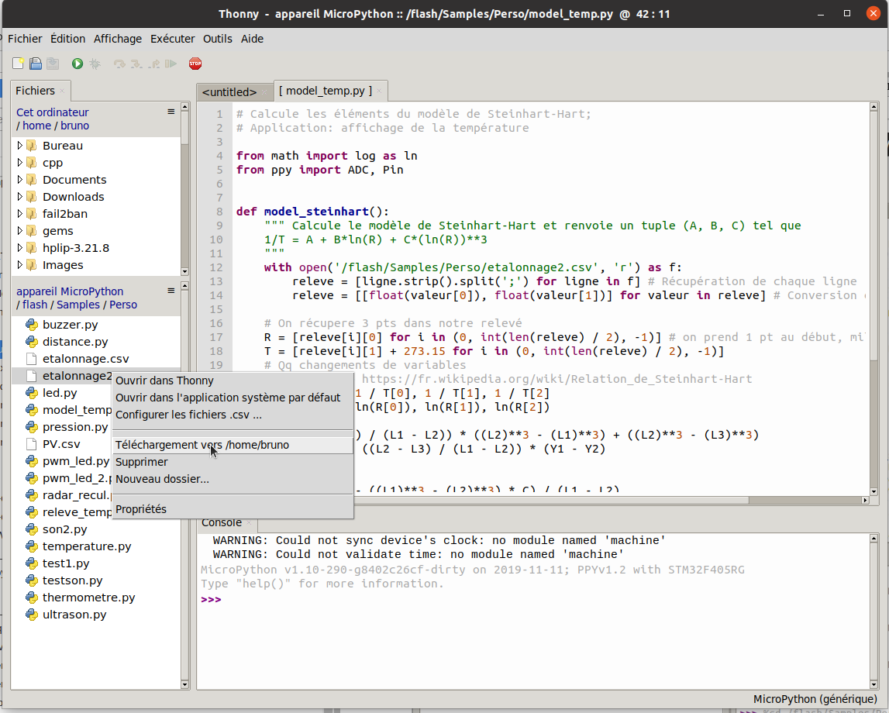

Mise en œuvre de capteurs
=========================

## Capteur de température
### Courbe d'étalonnage d'une CTN

Il s'agit d'utiliser le Plug'Uino Py pour mesurer la résistance d'une CTN, en faisant varier la température. Les résultats seront sauvegardés dans un fichier *csv*.

Après avoir branché le capteur fourni par Sciencethic sur la broche `A0` et ouvert l'éditeur `Thonny`, on crée un fichier `releve_temp.py` dont le contenu est le suivant:


```python
# Relevé R=f(θ) d'une CTN
# Par défaut l'acquisition se fait toutes les 30 secondes. Pour changer cette valeur
# modifier la constante DELAI (valeur en seconde)

import os
from ppy import ADC, Pin, delay

__author__ = 'Bruno DARID'
__license__ = 'CC-BY-NC-SA 4.0'
__email__ = 'bruno.darid@ac-reunion.fr'

# Quelques 'constantes'
DELAI = 30
MSG = """==== Acquisition toutes les 30 sec ou paramétrage personnel ====
1) A l'invite, entrer la temperature lue au thermomètre
2) Pour quitter --> ctrl + C
"""

def lecture(entree):
    """ Réalise une conversion A/N sur 'entree' et renvoie sa valeur """
    
    return entree.read()

def acquisition(nom_fichier, entree):
    """ Demande une lecture sur 'entree' et écrit la valeur dans 'nom_fichier'.csv
    nom_fichier: chaine correspondant au nom du fichier SANS EXTENSION.
    """
    
    with open(nom_fichier + '.csv', 'w') as f:
        while True:
            temp = input('Nouvelle valeur de temperature: ')
            n = lecture(entree) # demande une conversion
            f.write(str(10_000 * (4095 / n - 1)) + ';' + temp + '\n') # Diviseur de tension avec Rctn et R1=10k sur entrée A0
            delay(DELAI * 1000) # delay attend des millisecondes

def main():
    print(MSG)
    os.chdir('/flash/Samples/Perso') # Se déplacer dans le rép. de travail perso
    entree_A0 = ADC(Pin('A0', Pin.IN)) # On suppose que le capteur est branché sur A0
    acquisition('etalonnage', entree_A0)
    
if __name__ == "__main__":
    main()

```

!!! info "Remarque"
    La relation de la ligne 33 vient du diviseur de tension formé par une résistance $R_1=10\ \mathrm{k\Omega}$ et $R_{CTN}$ sur l'entrée `A0`

### Exploitation
#### Tracé d'une courbe d'étalonnage

L'implémentation Micropython de la carte ne permet pas le tracé $R=f(\theta)$, la librairie `matplotlib` n'étant pas présente! A titre indicatif, on peut récupérer le fichier *csv* avec `Thonny` (*clic droit sur le fichier, puis téléchargement*).  



Avec l'installation python de l'ordinateur ou sur [basthon](https://nsiboisdo.bdrd.fr/basthon/), on peut facilement tracer $R=f(\theta)$, par exemple avec le code suivant:  

```python
import matplotlib.pyplot as plt

# A décommenter, si l'installation le permet
#%matplotlib widget

with open('etalonnage2.csv', 'r') as f:
    mesures = [ligne.strip().split(';') for ligne in f] # Récupération de chaque ligne
    R = [float(point[0]) for point in mesures]
    theta = [float(point[1]) for point in mesures]
    
fig, ax = plt.subplots(figsize=(10,7))
ax.set(xlabel=r'$\theta$(°C)',
       ylabel=r'R ($\Omega$)',
       ylim=(0,25_000),
       title="Courbe d'étalonnage d'une CTN"
      )
ax.grid()
ax.scatter(theta, R, color='green', marker='o')
# A décommenter si l'installation le nécessite
#fig.show()
```

On obtient alors la courbe d'étalonnage:  


#### Modélisation

Pour modéliser la CTN on utilise la relation de Steinhart-Hart (*source* [Wikipedia](https://fr.wikipedia.org/wiki/Relation_de_Steinhart-Hart)):  

$$\dfrac{1}{T}=A + B\times \ln(R) + C\times(\ln(R))^3$$

avec :  

* $T$ sa température (en kelvins);
* $R$ sa résistance électrique (en ohms);
* $A, B$ et $C$ les coefficients de Steinhart-Hart qui caractérisent chaque thermistance.

Il s'agit de calculer les trois coefficients à partir de trois mesures de température. L'implémentation micropython de la carte **n'intègre pas les librairies de calculs** `numpy` ou `sympy`, on programmera directement la résolution de ce problème comme indiqué sur la page de [Wikipedia](https://fr.wikipedia.org/wiki/Relation_de_Steinhart-Hart).  

**Script** `model_temp.py`


```python
# Calcule les éléments du modèle de Steinhart-Hart;
# Application: affichage de la température

from math import log as ln
from ppy import ADC, Pin


def model_steinhart():
    """ Calcule le modèle de Steinhart-Hart et renvoie un tuple (A, B, C) tel que:
    1/T = A + B*ln(R) + C*(ln(R))**3
    """
    
    with open('/flash/Samples/Perso/etalonnage2.csv', 'r') as f:
        releve = [ligne.strip().split(';') for ligne in f] # Récupération de chaque ligne
        releve = [[float(valeur[0]), float(valeur[1])] for valeur in releve] # Conversion en flottant
    
    # On récupere 3 pts dans notre relevé
    R = [releve[i][0] for i in (0, int(len(releve) / 2), -1)] # on prend 1 pt au début, milieu et à la fin   
    T = [releve[i][1] + 273.15 for i in (0, int(len(releve) / 2), -1)] 
    # Quelques changements de variables
    # Détails --> https://fr.wikipedia.org/wiki/Relation_de_Steinhart-Hart
    Y1, Y2, Y3 = 1 / T[0], 1 / T[1], 1 / T[2]
    L1, L2, L3 = ln(R[0]), ln(R[1]), ln(R[2])

    a = ((L2 - L3) / (L1 - L2)) * ((L2)**3 - (L1)**3) + ((L2)**3 - (L3)**3)
    b = Y2 - Y3 - ((L2 - L3) / (L1 - L2)) * (Y1 - Y2)

    C = b / a
    B = (Y1 - Y2 - ((L1)**3 - (L2)**3) * C) / (L1 - L2)
    A = Y1 - L1 * B - (L1)**3 * C
    return A, B, C


def main():
    A, B, C = model_steinhart() # Récupération des coefficients du modèle
    entree_A0 = ADC(Pin('A0', Pin.IN))
    v = entree_A0.read() # lecture d'une valeur
    R = 10_000 * (4095 / v - 1) # La CTN est inclus dans un diviseur de tension avec R=10K
    T = 1 / (A + B * ln(R) + C * ln(R)**3)
    print('\u03B8 = {} °C'.format(round(T - 273.15, 1))) # Affichage au dixième près
    
if __name__ == "__main__":
    main()

```

**Exécution du programme: thermomètre**  


