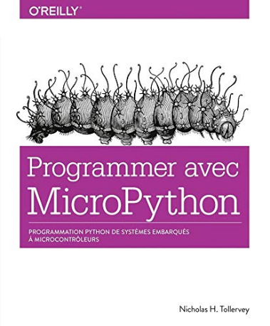
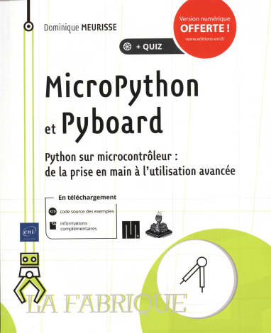

Conclusions
===========

## Points forts du kit

Le boitier incorporant la carte ainsi que les connecteurs sata semblent robustes et devraient résister aux chocs. Les capteurs sont bien protégés si on exclus la faiblesse entre le capteur de pression et la seringue.  
Par ailleurs, les entrées sont protégées électriquement et l'utilisateur n'a pas à se soucier de conversions de niveau logique 3V-5V.  
Enfin, la présence de l'interpréteur Micropython est également un avantage. L'élève retrouve un langage utilisé dans d'autres disciplines. 

## Points faibles

La principale faiblesse de ce kit se situe au niveau de sa documentation. Celle-ci est soit absente (caractéristiques des capteurs utilisés) soit de très mauvaise qualité (les codes python fourni en exemple sont très mal écrits, ne respectant en rien les règles élémentaires énoncées dans la PEP8).  
Un autre problème est constaté au niveau de la mise à jour du micro-programme (firmware) de la carte. Cette MAJ doit être possible via un fichier binaire distribué par Sciencethic. Il n'existe aucune trace de ce fichier sur le site du vendeur. Pour information, la version de micropython installée (1.11) date de 2019. Au 10 novembre 2021, la version 1.17 est disponible ...

## Quelques références

 

Le livre de Dominique Meurisse (Ed. ENI) est disponible dans Magistère / Bibliothèque en ligne. Enfin, [la documentation officielle de Micropython pour pyboard](https://docs.micropython.org/en/latest/) est une source incontournable.

---

*Bruno DARID* novembre 2021.
